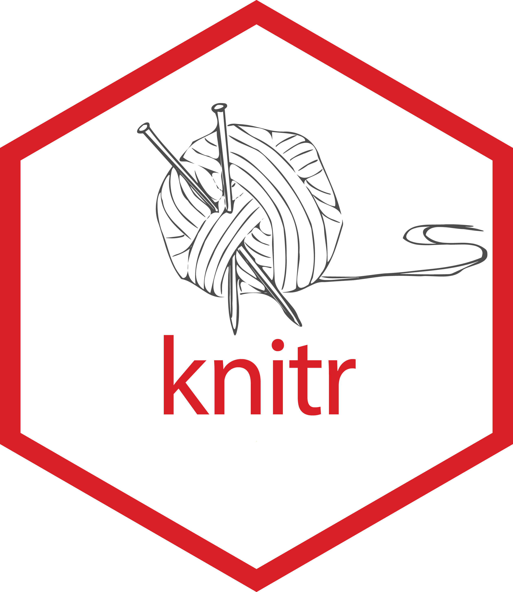
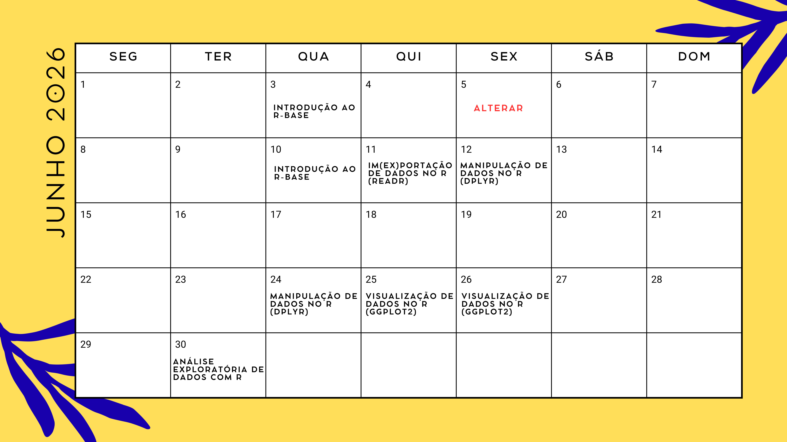
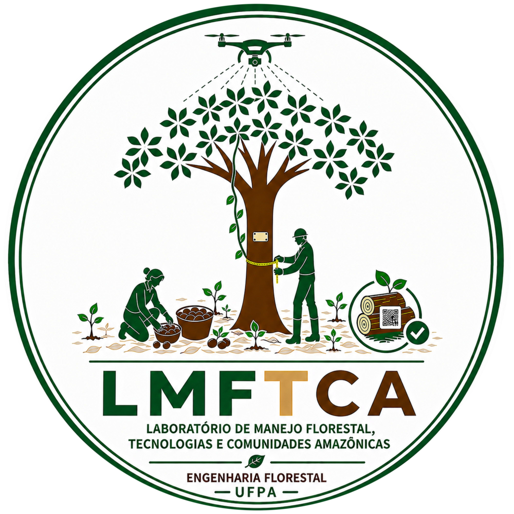

class: title-slide, center, middle
background-image: url(fig/slide-title/ufpa.png), url(fig/slide-title/PPGBC.png), url(fig/slide-title/PPGCTIF.png), url(fig/slide-title/LMFTCA_TCB2.png), url(fig/slide-title/capa.png)
background-position: 10% 10%, 90% 90%, 10% 90%, 90% 10%
background-size: 150px, 180px, 150px, 150px, cover

```{r setup, include=FALSE}
knitr::opts_chunk$set(
	error = FALSE,
	fig.align = "center",
	fig.showtext = TRUE,
	message = FALSE,
	warning = FALSE,
	cache = FALSE,
	collapse = TRUE,
	dpi = 600
)
```

```{r packages, include=FALSE}
# remotes::install_github("dill/emoGG")
# remotes::install_github("hadley/emo")
library(ggplot2)
library(dplyr)
library(ggimage)
library(kableExtra)
library(readr)
#library(emo)
```

```{css, echo=FALSE}
.with-logo::before {
	content: '';
	width: 120px;
	height: 120px;
	position: absolute;
	bottom: 1.3em;
	right: -0.5em;
	background-size: contain;
	background-repeat: no-repeat;
}

.logo-ufpa::before {
	background-image: url(fig/slide-title/ufpa.png);
}
```

```{r xaringan-logo, echo=FALSE}
library(xaringanExtra)

use_logo(
  image_url = "fig/slide-title/LMFTCA_vert.png",
  position = css_position(top = "1.3em", right = "-1.5em"),
  width = "150px",
  height = "150px")


use_scribble() # para escrever nos slides
use_share_again()
use_progress_bar()
#use_animate_all(style = c("slide_down"))

use_extra_styles(
  hover_code_line = TRUE,         #<<
  mute_unhighlighted_code = TRUE  #<<
)
xaringanExtra::use_editable(expires = 1)
#.can-edit[Você pode editar este título de slide]
#.can-edit.key-firstSlideTitle[Change this title and then reload the page]
use_clipboard()
```


<!-- title-slide -->
<!--# .font120[Inventário Florestal <br> (FL03039 - EF)] -->
# Estatística Computacional com R <br> (PPGBC/UFPA e PPGCTIF/UFOPA)

## ᨒ <br>   `r anicon::faa("pagelines", animate="horizontal", colour="green")` Programação da Disciplina `r anicon::faa("pagelines", animate="horizontal", colour="green")` <br> ᨒ

##### 〰〰〰〰〰〰🌱〰〰〰〰〰〰
##### ᨒ
##### .font120[**Prof. Dr. Deivison Venicio Souza**]
##### Universidade Federal do Pará (UFPA)
##### Faculdade de Engenharia Florestal
##### Laboratório de Manejo Florestal, Tecnologias e Comunidades Amazônicas
##### E-mail: deivisonvs@ufpa.br
<br>
##### 1ª versão: 12/outubro/2022 <br> (Atualizado em: `r format(Sys.Date(),"%d/%B/%Y")`) <br> Altamira, Pará

---

layout: true
class: with-logo logo-ufpa
<div class="my-header"></div>
<div class="my-footer"><span>Prof. Dr. Deivison Venicio Souza (E-mail: deivisonvs@ufpa.br)&emsp;&emsp;&emsp;&emsp;&emsp; <div3>Estatística Computacional com R</div3>/ <div2>Programação da disciplina</div2> </div>

---

## 👋 Olá, sejam bem vindos!
<br>
### **Sobre o facilitador**

.pull-left[
.font60[
1. .green[Graduação (Titulação: ano 2008)]
    - Universidade Federal Rural da Amazônia (UFRA); e
    - Título: Bacharel em Engenharia Florestal.
    
2. .green[Mestrado (Titulação: ano 2011)]
    - Universidade Federal Rural da Amazônia (UFRA);
    - Programa de Pós-graduação em Ciências Florestais (PPGCF); e
    - Área de Concentração: Manejo de Ecossistemas Florestais.

3. .green[Especialização (Titulação: ano 2019)]
    - Universidade Federal do Paraná (UFPR);
    - Área: Big Data e Data Science
    
4. .green[Doutorado (Titulação: ano 2020)]
    - Universidade Federal do Paraná (UFPR);
    - Programa de Pós-graduação em Engenharia Florestal (PPGEF); e
    - Área de Concentração: Manejo Florestal.
]
]

.pull-right[
```{r echo = FALSE, out.width='70%', fig.align='center', fig.cap='', dpi=600}

```
]

---

## 👋 Olá, sejam bem vindos!
<br>
### **Interesses atuais**

.pull-left[
.font60[
1. .green[Linguagem de programação]
    - R
    - Python

2. .green[Modelagem preditiva aplicada à ciência florestal]
    - Métodos Tradicionais e Aprendizado de máquina
    
3. .green[Visão computacional e Inteligência Artificial]
    - Reconhecimento de espécies baseado em imagens (aéreas e terrestres)
    - Deep Learning/Convolutional Neural Networks/Transfer Learning
    - Estimativa de biomassa e carbono
    - Monitoramento da saúde da arborização urbana
    
4. .green[Sistemas Interativos de Visualização e Análise de Dados]
    - Dashboard (Estático e Dinâmico)
    - Aplicação Web (Reconhecimento de espécies)
    - Aplicativo Mobile (Próximos passos...)
]
]

.pull-right[
### **Websites e contatos**

.font80[
`r icons::simple_icons("github")` GitHub: https://github.com/DeivisonSouza

<span class="iconify" data-icon="fa-brands:orcid" data-inline="false"></span>


<div itemscope itemtype="https://schema.org/Person"><a itemprop="sameAs" content="https://orcid.org/0000-0002-2975-0927" href="https://orcid.org/0000-0002-2975-0927" target="orcid.widget" rel="me noopener noreferrer" style="vertical-align:top;">https://orcid.org/0000-0002-2975-0927</a></div>

```{r, echo=FALSE, out.width='20%', fig.align='center', fig.cap=''}
knitr::include_graphics('fig/slide-title/ORCID.png')
```

Email: deivisonvs@ufpa.br
]
]

---

## 👋 Olá, sejam bem vindos!
<br>

### 🕵 **Projetos de Pesquisa/Extensão Finalizados** (com fomento)

.font90[
<br>
✔️ 1) Sistema de Visão Computacional para Reconhecer Espécies no Manejo Florestal Madeireiro na Amazônia Brasileira. (**Financiador**: Centro de Indústrias Produtoras e Exportadoras de Madeira do Estado de Mato Grosso - CIPEM) - ([https://cipem.org.br/](https://cipem.org.br/))
<br><br>

✔️ 2) Projeto Ipa’wã (Copaíba): Etnomapeamento e inventário de copaibais nativos na TI Xipaya (Aldeias Tukamã, Tukayá e Kaarimã). (**Financiador**: Fundo Brasileiro para a Biodiversidade - FUNBIO) - ([https://www.funbio.org.br/](https://www.funbio.org.br/)) (Parceria entre Associação Indígena Pyjahyry Xipaia – AIPHX e UFPA)
]

---

## 👋 Olá, sejam bem vindos!
<br>

### 🕵 **Projetos de Pesquisa/Extensão em Andamento** (com/sem fomento)

.font90[
<br>
✔️ 1) DeepWood: Reconhecimento de Espécies Florestais Baseado em Imagens de Madeira e Aprendizado Profundo (Portaria/UFPA N. 130/2024). (**Sem Financiador**) - (**Parceria**: Laboratório de Anatomia e Qualidade da Madeira LANAQM/UFPR e LMFTCA/UFPA)
<br><br>

✔️ 2) Apoio ao Fortalecimento da Gestão Territorial e Ambiental da Terra Indígena Xipaya (TI Xipaya) - (Portaria/UFPA N. 95/2025). (**Financiador**: Indigenous Peoples Assistance Facility - IPAF) (**Parceria**: Associação Indígena Pyjahyry Xipaia e LMFTCA/UFPA) - **Proponente**: AIPHX
]

---

## 👋 Olá, sejam bem vindos!
<br>

### 💻 **Siga nossas redes sociais e de parceiros...**
<br>

👉 **Laboratório de Manejo Florestal, Tecnologias e Comunidades Amazônicas - LMFTCA**

✔️ *Instagram LMFTCA*: [@lmftca_ufpa](https://www.instagram.com/lmftca_ufpa/)

✔️ *Site do LMFTCA*:
[https://www.lmftca.com.br/](https://www.lmftca.com.br/)
<br><br>

👉 **Instituto Juma**

✔️ *Instagram IJ*: [@instituto.juma](https://www.instagram.com/instituto.juma/)

✔️ *Site do IJ*:
[https://institutojuma.org/](https://institutojuma.org/)


<!-- Slide 7 -->
---

## 📚 Ementa da disciplina
<br>
.shadow4[
.font80[
**Módulo 1 – Introdução ao R-base e Motivação**

&nbsp;&nbsp;&nbsp;&nbsp; 1.1 - Motivação Para Usar Linguagem de Programação;

&nbsp;&nbsp;&nbsp;&nbsp; 1.2 - Sintaxe da Linguagem R, RGui e o IDE Rstudio;

&nbsp;&nbsp;&nbsp;&nbsp; 1.3 - Estrutura de Dados;

&nbsp;&nbsp;&nbsp;&nbsp; 1.4 - Indexação no R;

&nbsp;&nbsp;&nbsp;&nbsp; 1.5 - Construção de Funções no R; e

&nbsp;&nbsp;&nbsp;&nbsp; 1.6 - Operadores Aritméticos, Relacionais e Lógicos

]
]

---

## 📚 Ementa da disciplina

<br>

.shadow4[
.font80[
**Módulo 2 – Importação, Exportação, Manipulação e Visualização de Dados (Framework Tidyverse)**

&nbsp;&nbsp;&nbsp;&nbsp; 2.1 - Importação e Exportação de Dados (Pacote readr);

&nbsp;&nbsp;&nbsp;&nbsp; 2.2 - Importação de Dados Usando a Interface Gráfica do RStudio;

&nbsp;&nbsp;&nbsp;&nbsp; 2.3 - Manipulação de Dados (Pacote dplyr);

&nbsp;&nbsp;&nbsp;&nbsp; 2.4 - Visualização de Dados (Pacote ggplot2); e

&nbsp;&nbsp;&nbsp;&nbsp; 2.5 - Combinação de Gráficos (Pacote Patchwork).
]
]

<br>

.pull-bottom[
<center>


&nbsp;&nbsp;&nbsp;

&nbsp;&nbsp;&nbsp;

&nbsp;&nbsp;&nbsp;


</center>
]


---

## 📚 Ementa da disciplina

<br>

.shadow4[
.font80[
**Módulo 3 – Análise Exploratória de Dados**

&nbsp;&nbsp;&nbsp;&nbsp; 3.1 - Funções do R-base para Estatística Descritiva;

&nbsp;&nbsp;&nbsp;&nbsp; 3.2 - Pacotes em R para Estatística Descritiva; e

&nbsp;&nbsp;&nbsp;&nbsp; 3.3 - Estudos de Caso: Iris Flower e Milsa
]
]

<br>

.pull-bottom[
<div style="display:flex; align-items:center; justify-content:space-around;">

<div style="width:30%; text-align:center;">

<br>
<small><b>Iris Flower</b></small>
</div>

<div style="width:85%; text-align:center;">

<span style="font-size:22px; font-weight:bold;">DataExplorer</span>
&nbsp;&nbsp;&nbsp;
<span style="font-size:22px; font-weight:bold;">GGally</span>

<br><br>

<span style="font-size:22px; font-weight:bold;">SmartEDA</span>
&nbsp;&nbsp;&nbsp;
<span style="font-size:22px; font-weight:bold;">psych</span>

<br><br>

<span style="font-size:22px; font-weight:bold;">summarytools</span>

</div>

</div>
]

---

## 📚 Ementa da disciplina

<br><br>

.shadow4[
.font80[
**Módulo 4 – Produção de Relatórios Dinâmicos**

&nbsp;&nbsp;&nbsp;&nbsp; 4.1 - Markdown: Linguagem de Marcação;

&nbsp;&nbsp;&nbsp;&nbsp; 4.2 - R Markdown: Componentes Básicos e Formatos de Saída; e

&nbsp;&nbsp;&nbsp;&nbsp; 4.3 - Estudo de Caso: Elaboração de Relatório Estatístico com R Markdown.
]
]

<br>
.pull-bottom[
<center>


&nbsp;&nbsp;&nbsp;

&nbsp;&nbsp;&nbsp;

</center>
]

<!-- Slide 2 -->
---

## Cronograma .black[.font70[(**Horário: 07h30min - 13h50min**)]]

```{r, echo = FALSE, out.width='80%', fig.align='center', fig.cap='', dpi=600}

```

---

## Cronograma .black[.font70[(**Horário: 07h30min - 13h50min**)]]

```{r, echo = FALSE, out.width='80%', fig.align='center', fig.cap='', dpi=600}

```

<!-- Slide 10 -->
---
## 📑 Plano de Ensino
<br><br>

O plano de ensino da disciplina pode ser acessado em:

[Plano de Ensino - Estatística Computacional com R](https://raw.githubusercontent.com/DeivisonSouza/Estatistica-Computacional-Com-R/master/Slides/fig/part0/PE.pdf)

---
## 📖 Bibliografia básica

<br>

- **Mayer et al. (2023)**. *Estatística Computacional com R*.
  <http://cursos.leg.ufpr.br/ecr/index.html>
- **Morettin & Singer (2022)**. *Estatística e Ciência de Dados*.
  <https://www.ime.usp.br/~jmsinger/MAE5755/cdados2020set30.pdf>
- **Peng (2015)**. *Exploratory Data Analysis with R*.
  <https://leanpub.com/exdata>
- **Xie, Allaire & Grolemund (2021)**. *R Markdown: The Definitive Guide*.
  <https://bookdown.org/yihui/rmarkdown/>
- **Morettin & Bussab (2017)**. *Estatística Básica*. 9. ed.
  <https://www.amazon.com.br/Estat%C3%ADstica-B%C3%A1sica-Wilton-Bussab/dp/8547220224>

---

## 📖 Bibliografia complementar

<br>

- **Damiani et al. (2021)**. *Ciência de Dados em R*. <https://livro.curso-r.com/>
- **Guerra et al. (2021)**. *Ciência de Dados com R – Introdução*. <http://sillasgonzaga.com/material/cdr/>
- **Torgo (2006)**. *Introdução à Programação em R*. <https://cran.r-project.org/>
- **Wickham, Navarro & Pedersen (2023)**. *ggplot2: Elegant Graphics for Data Analysis*. <https://ggplot2-book.org/>

<!--Slide XX -->
---
layout: false
name: etim
class: inverse, middle, center
background-image: url(fig/slide-title/sec.png)
background-size: cover

## .font200[Obrigado!]

```{r, echo=FALSE, out.width='20%', fig.align='center', fig.cap='', dpi=600}

```

👨🏻‍👩🏻‍👦🏻‍👦🏻 [@lmftca_ufpa](https://www.instagram.com/lmftca_ufpa/)

🌎 [https://www.lmftca.com.br/](https://www.lmftca.com.br/)
