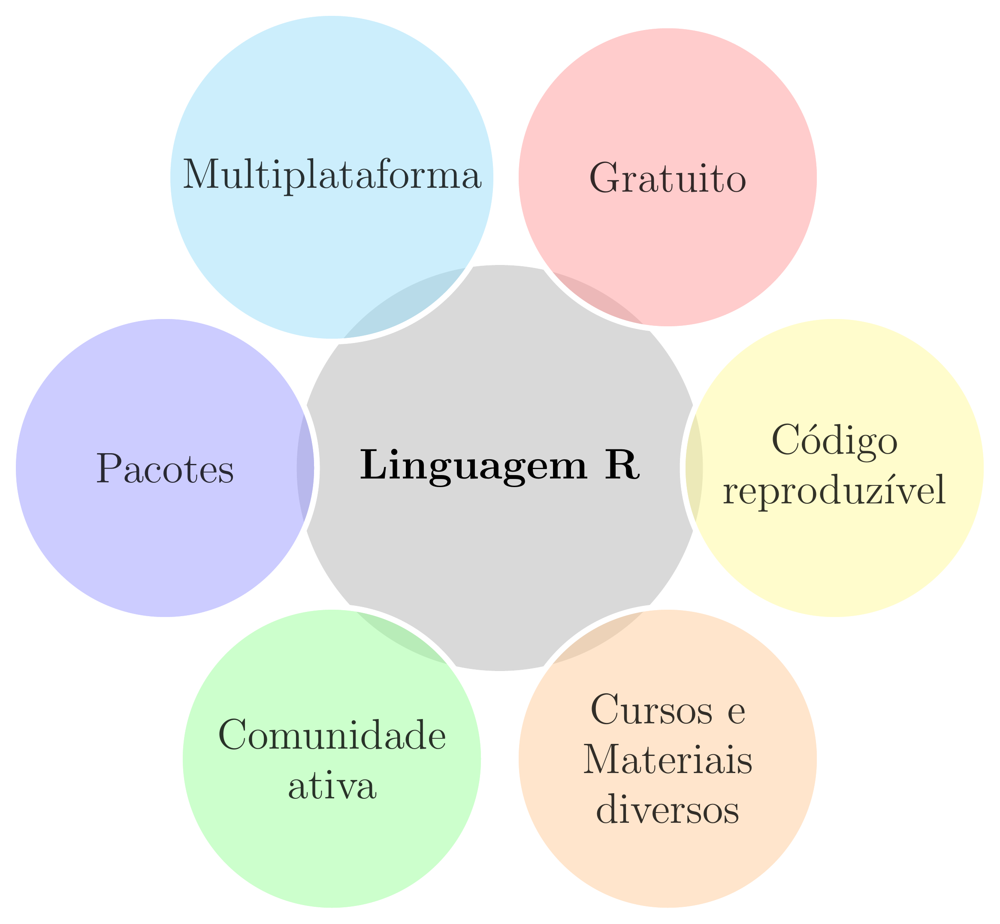
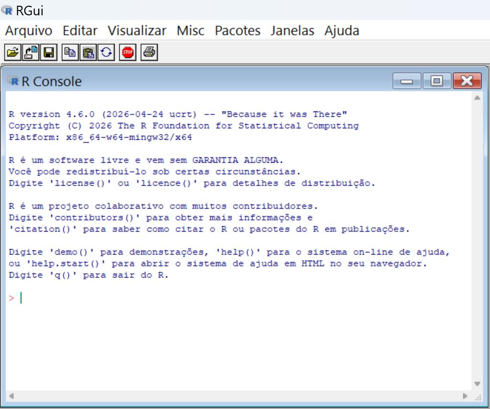
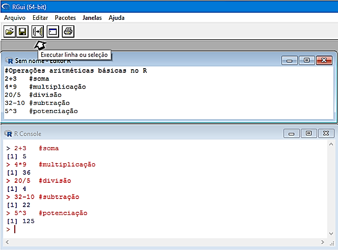
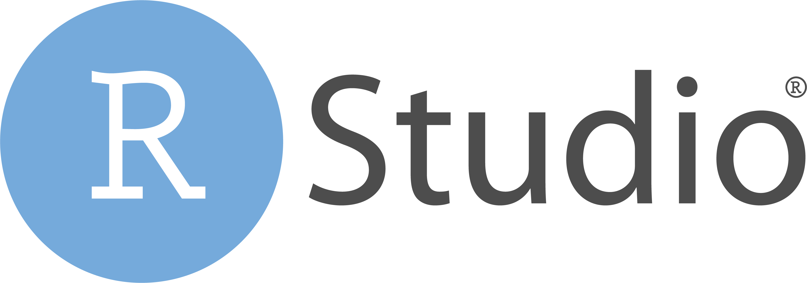
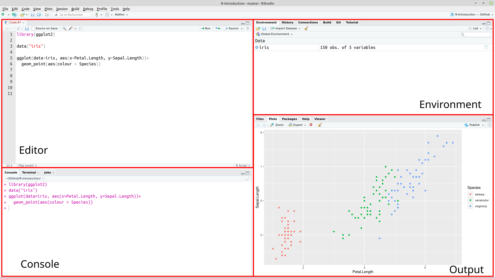
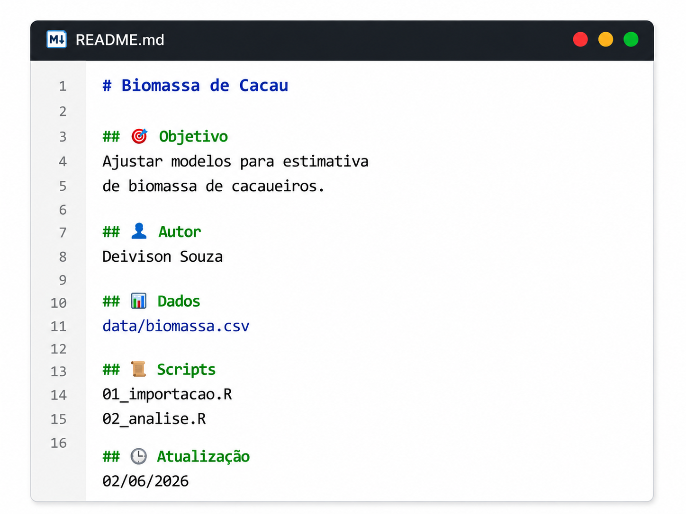

class: title-slide, center, middle
background-image: url(../assets/capa/capa.png)
background-position: center
background-size: cover
background-repeat: no-repeat

<div class="logo-lmftca"></div>
<div class="logo-ppgctif"></div>
<div class="logo-ppgbc"></div>

```{r setup, include=FALSE}
knitr::opts_chunk$set(
	error = FALSE,
	fig.align = "center",
	fig.showtext = TRUE,
	message = FALSE,
	warning = FALSE,
	cache = FALSE,
	collapse = TRUE,
	dpi = 600
)
```

```{r packages, include=FALSE}
# remotes::install_github("dill/emoGG")
library(ggplot2)
library(dplyr)
library(ggimage)
library(kableExtra)
```

```{r xaringan-logo, echo=FALSE}
library(xaringanExtra)

use_scribble()
use_share_again()
use_progress_bar()

use_extra_styles(
  hover_code_line = TRUE,
  mute_unhighlighted_code = TRUE
)

use_editable(expires = 1)
use_clipboard()
```

```{r icon, echo=FALSE}
#remotes::install_github("mitchelloharawild/icons")
#remotes::install_github('emitanaka/anicon')
#library(icons)
#download_fontawesome()
#download_simple_icons()
```

<!-- title-slide -->
# Estatística Computacional com R <br> (PPGBC/UFPA e PPGCTIF/UFOPA)

## ᨒ <br> `r anicon::faa("pagelines", animate="horizontal", colour="green")` Introdução ao R `r anicon::faa("pagelines", animate="horizontal", colour="green")`
###### (Instalação, Sintaxe e Projetos)

##### 〰〰〰〰〰〰🌱〰〰〰〰〰〰
##### ᨒ
##### .font120[**Prof. Dr. Deivison Venicio Souza**]
##### Universidade Federal do Pará (UFPA)
##### Faculdade de Engenharia Florestal
##### Laboratório de Manejo Florestal, Tecnologias e Comunidades Amazônicas
##### E-mail: deivisonvs@ufpa.br
<br>
##### 1ª versão: 14/outubro/2022 <br> (Atualizado em: `r format(Sys.Date(),"%d/%B/%Y")`)

---

layout: true
class: with-logo logo-lmftca-fixed
<div class="my-header"></div>
<div class="my-footer">
<span>
Prof. Dr. Deivison Venicio Souza (deivisonvs@ufpa.br)
&emsp;&emsp;
<div2>Estatística Computacional com R</div2>
&bull;
<div3>Introdução ao R (Módulo 1)</div3>
&bull;
<div4>Instalação, Sintaxe e Projetos</div4>
</span>
</div>

---

## Objetivos
<br>
Ao final do **Módulo 1 - Introdução ao R-base** espera-se que os discentes possam alcançar conhecimentos para...

* Compreender a importância da linguagem R e do RStudio;
* Conhecer a sintaxe básica da linguagem R;
* Criar objetos, usar atribuição, comentários e funções;
* Utilizar a documentação integrada do R;
* Organizar análises por meio de Projetos no RStudio;
* Compreender documentação e reprodutibilidade; e
* Aplicar boas práticas em projetos R.

---

## Conteúdo

<br>

### Parte 1 — Conhecendo o R e o RStudio

[1- A linguagem R: Origem](#R)

[2 - A linguagem R: multiplas facetas](#pqR)

[3 - Por que utilizar o R?](#pqR)

[4 - RGui: download, instalação e interface](#RGui)

[5 - RStudio: download, instalação e interface](#Rstudio)

--

.pull-right-4[
.pull-down[

### Parte 2 — Sintaxe da Linguagem R

[1 - R é uma Linguagem de Expressão](#expressao)

[2 - R é Case Sensitive](#casesensitive)

[3 - Operador de Atribuição](#atribuicao)

[4 - Comentários](#comentarios)

[5 - Funções](#funcoes)

[6 - Ajuda e Documentação](#ajuda)

]
]

---

## Conteúdo

.pull-left-4[

### Parte 3 — Projetos no RStudio

[1 - O que é um Projeto (.Rproj)?](#projeto)

[2 - Por que utilizar Projetos?](#pqprojeto)

[3 - Criando um Projeto no RStudio](#criando)

[4 - Estrutura Recomendada](#estrutura)

[5 - Documentando um projeto (README.md)](#documentando)

[6 - Reprodutibilidade](#reprodutibilidade)

[7 - Registrando o Ambiente Computacional](#registrando)

[8 - Boas Práticas](#boaspraticas)

]

---

layout: false
name: conc
class: inverse, top, right
background-image: url(../assets/capa/sec.png)
background-size: cover

<br><br><br>

.right[.font150[**.green[Módulo 1] <br> Introdução ao R básico**]]

<br><br>

.right[.font150[**.green[Parte 1] - Conhecendo o R e o IDE Rstudio**]]

---

layout: true
class: with-logo logo-lmftca-fixed
<div class="my-header"></div>
<div class="my-footer">
<span>
Prof. Dr. Deivison Venicio Souza (deivisonvs@ufpa.br)
&emsp;&emsp;
<div2>Estatística Computacional com R</div2>
&bull;
<div3>Introdução ao R (Módulo 1)</div3>
&bull;
<div4>Instalação, Sintaxe e Projetos</div4>
</span>
</div>

---
name: R
## Linguagem de Programação R - Origem
<br><br>

.font90[
.alert[
- Linguagem de programação **livre**, **gratuita** e de **código aberto**;
- Desenvolvida em 1993 por **Ross Ihaka** e **Robert Gentleman**;
- Criada na Universidade de **Auckland** (Nova Zelândia);
- Baseada na **linguagem S**; e
- Amplamente usada em estatística, ciência de dados e pesquisa científica.
]
]

---

name: R
## Linguagem de Programação R - Múltiplas Facetas
<br><br>

.font90[
.alert[
📊 **Análise estatística**

🗂️ **Manipulação de dados**

📈 **Visualização gráfica**

🌐 **Aplicações web e dashboards**

📝 **Relatórios dinâmicos**

🎓 **Apresentações profissionais**
]
]

<br>

.pull-left-7[
```{r echo=FALSE, out.width='30%', fig.align='center', fig.cap='', dpi=600}
knitr::include_graphics("https://tidyverse.tidyverse.org/articles/tidyverse-logo.png")
```
]

.pull-left-7[
```{r echo=FALSE, out.width='30%', fig.align='center', fig.cap='', dpi=600}
knitr::include_graphics("https://ggplot2.tidyverse.org/logo.png")
```
]

.pull-left-7[
```{r echo=FALSE, out.width='30%', fig.align='center', fig.cap='', dpi=600}
knitr::include_graphics("https://blog.efpsa.org/wp-content/uploads/2019/04/pic1.png")

```

]

.pull-left-7[
```{r echo=FALSE, out.width='30%', fig.align='center', fig.cap='', dpi=600}
knitr::include_graphics("https://pkgs.rstudio.com/rmarkdown/reference/figures/logo.png")
```
]

.pull-left-7[
```{r echo=FALSE, out.width='30%', fig.align='center', fig.cap='', dpi=600}
knitr::include_graphics("https://user-images.githubusercontent.com/163582/45438104-ea200600-b67b-11e8-80fa-d9f2a99a03b0.png")

```
]

---
name: pqR
## Por que usar a linguagem R?

```{r, echo=FALSE, out.width='50%', fig.align='center', fig.cap='', dpi=600}

```

---
name: RGui
## RGui - Download e instalação
<br>

.pull-left[
**1º Passo**: Acesse o site oficial do R:

🔗 https://cloud.r-project.org/

<br><br>

💡 Seleciona automaticamente o melhor servidor para download.

]

<br>

.pull-right[
👉 **CRAN (Comprehensive R Archive Network)**
<br>
- Repositório oficial da linguagem R;
- Disponibiliza instaladores para Windows, Linux e macOS;
- Hospeda milhares de pacotes desenvolvidos pela comunidade;
- Oferece documentação e materiais de apoio.
]

---

## RGui - Download e instalação
<br>

**2⁰ Passo**: Na página inicial, selecione o sistema operacional do seu computador:

1. Download R for Windows;
2. Download R for Linux; ou
3. Download R for MacOS.
<br>

**3º Passo**: Clique em .green[Install R for the first time].

**4º Passo**: Faça o download da versão mais recente do R. (R-4.6.0 for Windows)

**5º Passo**: Execute o arquivo baixado. Siga as etapas do instalador, mantendo as configurações padrão.
<br><br>

.center[
✅ **Pronto! O R foi instalado com sucesso e está pronto para uso.**
]

---

## RGui - Interface
<br>

.pull-left-13[
- Ao iniciar o RGui, é exibido o .red[R Console].
- O símbolo .red[>] representa o prompt de comando.

.alert[
#### Experimente:

<span class="code-pill">getwd()</span>
<span class="code-pill">help()</span>
<span class="code-pill">q()</span>
]
]

.pull-right-13[
```{r, echo=FALSE, out.width='80%', fig.align='center', fig.cap='R Console'}

```
]

---

## RGui - R Editor
<br>

.pull-left-13[
- O RGui possui um .green[R Editor] para criação e edição de scripts.
- Acesse: **Arquivo → Novo script** ou **Arquivo → Abrir script**.
- O código é executado no .red[R Console] usando **Ctrl + R**.
]


.pull-right-13[
```{r, echo=FALSE, out.width='80%', fig.align='center', fig.cap='R editor'}

```
]

---
name: Rstudio
## IDE RStudio - download e instalação
<br>

👉 O .green[RStudio] é um ambiente integrado de desenvolvimento (IDE) amplamente utilizado por usuários da linguagem R.

**1⁰ Passo**: Acessar o site oficial: https://www.rstudio.com;

**2⁰ Passo**: Products $\rightarrow$ RStudio;

**3⁰ Passo**: Selecionar **RStudio Desktop**;

**4⁰ Passo**: Escolher a versão **Open Source** e clicar em **Download RStudio Desktop**;

**5⁰ Passo**: Executar o instalador baixado e concluir a instalação.
<br><br>

.alert[
💡 O R deve estar instalado previamente para o funcionamento do RStudio.
]

```{r, echo=FALSE, out.width='20%', fig.align='center', fig.cap=''}

```

---

## IDE RStudio - Interface

```{r, echo=FALSE, out.width='80%', fig.align='center', fig.cap=''}

```

---

## IDE RStudio - Interface (Painéis)
<br>

**Editor**: Painel de desenvolvimento dos códigos R.

**Environment**: Painel onde aparecerão todos os objetos criados no R.

**Console**: Painel para rodar os códigos R e receber outputs.

**Plots**: Painel de saída gráfica.

**History**: Painel que mostra um histórico dos comandos executados na sessão corrente.

**Help**: Painel que mostra a documentação de funções de pacotes, quando solicitada.

**Files**: Painel para identificar arquivos no diretório de trabalho.

**Packages**: Painel que mostra os pacotes instalados. É possível identificar os pacotes carregados na sessão corrente.

---

layout: false
name: conc
class: inverse, top, right
background-image: url(../assets/capa/sec.png)
background-size: cover

<br><br><br>

.right[.font150[**.green[Módulo 1] <br> Introdução ao R-Base**]]

<br><br>

.right[.font150[**.green[Parte 2] - Sintaxe da linguagem R**]]

---

layout: true
class: with-logo logo-lmftca-fixed
<div class="my-header"></div>
<div class="my-footer">
<span>
Prof. Dr. Deivison Venicio Souza (deivisonvs@ufpa.br)
&emsp;&emsp;
<div2>Estatística Computacional com R</div2>
&bull;
<div3>Introdução ao R (Módulo 1)</div3>
&bull;
<div4>Instalação, Sintaxe e Projetos</div4>
</span>
</div>

---
name: expressao
## R é uma Linguagem de Expressão
<br>

👉 Em R, toda instrução é avaliada para produzir um **valor** ou um **objeto**.

- **Objetos:** armazenam dados, funções, modelos, gráficos e outros resultados.
- **Avaliação:** cada comando é processado e retorna um resultado.
- **Concisão:** Permite combinar operações de forma simples e eficiente.
<br>

.alert[
💡 Um **objeto** é qualquer elemento armazenado na memória do R.
]

<br>

.alert[
**Exemplo**: `mean(c(10, 20, 30))` cria um vetor e retorna sua média.
]

---
name: casesensitive
## R é Case Sensitive

.pull-left[

### Conceito

👉 Letras .blue[maiúsculas] e .blue[minúsculas] possuem significados diferentes.

.alert[
`a` ≠ `A`

`altura` ≠ `Altura`
]

<br>

⚠️ Diferenças de capitalização podem gerar erros do tipo *"object not found"*.

]

--

.pull-right[

### Recomendação

💡 Adote o padrão .blue[snake_case]:

- Apenas letras minúsculas;
- Palavras separadas por `_`.

<br>

.alert[
`altura_arvore`

`volume_total`

`media_dap`
]
]

---
name: atribuicao
## Operador de Atribuição
<br>

.pull-left[

👉 Em R, utiliza-se .blue[`<-`] para atribuição de valores.

.alert[
.blue[`<-`] → Atribuição

.blue[`==`] → Comparação
]
]


.pull-right[
```{r, eval=FALSE}
# atribuição (cria/modifica um objeto)
dap <- 20    

# comparação (retorna TRUE ou FALSE)
dap == 20
```
]

<br>

.alert[
💡 .blue[`<-`] atribui valores; .blue[`==`] faz perguntas.
]

---
name: comentarios
## Comentários

<br>

.pull-left[
👉 Comentários servem para **documentar e explicar o código**.

👉 O R ignora comentários durante a execução.

<br>

.alert[
O símbolo .blue[`#`] indica um comentário.
]
]

--

.pull-right[
```{r, eval=FALSE}
# Armazena os DAPs das árvores
dap <- c(12.5, 15.8, 18.2, 20.1)

# Calcula a média
mean(dap)
```
]

<br>

--

.alert[
💡 Um código bem comentado hoje economiza tempo no futuro!
]

---
name: funcoes
## Funções
<br>

.pull-left[
👉 Grande parte das tarefas em R é realizada por meio de funções.

👉 Funções executam tarefas específicas.

.alert[
**Estrutura geral**:
`nome_da_funcao(argumentos)`
]

]

--

.pull-right[
**Exemplo**
<br>
```{r}
sqrt(25)
sum(c(10, 20, 30))
```

]

<br>

.alert[
💡 Funções recebem **argumentos** e retornam **resultados**.
]

---
name: FunsMat
## Funções - Alguns Exemplos
<br>

| Função                 | Descrição                        |
|------------------------|----------------------------------|
| sqrt()                 | Raiz quadrada                    |
| abs()                  | Valor absoluto                   |
| sin(); cos(); tan()    | Funções trigonométricas          |
| asin(); acos(); atan() | Funções trigonométricas inversas |
| exp()                  | Exponencial                      |
| log10()                | Logarítmo na base 10             |
| log()                  | Logarítmo natural                |
| factorial              | Fatorial                         |

---

## Funções - Alguns Exemplos
<br>

.font80[
| **Funções**                             | **Ação**                                      |
| :-------------------------------------: | :-------------------------------------------: |
| q()                                     | Fechar o programa                             |
| rm(nome do objeto)                      | Remover um objeto qualquer                    |
| ls()                                    | Listar os objetos na janela de trabalho atual |
| help(nome da função) ou ?nome da função | Solicitar ajuda sobre o uso de uma função     |
| save.image()                            | Salvar                                        |
| Ctrl + L                                | Limpar a tela do R console                    |
| history(max.show, nrow = 3)             | Listar os últimos 3 comandos executados       |
| getwd()                                 | Mostrar o diretório de trabalho               |
| setwd("diretório desejado")             | Mudar o diretório de trabalho                 |
| install.packages("nome do pacote")      | Instalar um pacote específico                 |
]

---

## Funções - Alguns Exemplos
<br>

.font80[
| **Funções**               | **Ação**                                       |
| :-----------------------: | :--------------------------------------------: |
| library("nome do pacote") | Carregar um pacote específico                  |
| dir()                     | Lista os arquivos existentes no diretório      |
| getOption("OutDec")       | Verificar o separador decimal definido         |
| options("OutDec=")        | Mudar o separador decimal para vírgula         |
| round(5.9845, digits=2)  | Função para arredondamento de casas decimais   |
| data()                    | Lista de conjuntos de dados disponíveis no R             |
| ?nomedodataset            | Obter informações detalhadas sobre um conjunto de dado |
| class(nome do objeto)     | Verifica a classe de um objeto específico      |
| search()                  | Lista todos os pacotes carregados              |
]

---
name: ajuda
## Ajuda e Documentação
<br>

.pull-left[

👉 O R possui um sistema de ajuda integrado.

.alert[
**Comandos úteis:**

`?funcao`

`help(funcao)`

`example(funcao)`
]

]

--

.pull-right[

**Exemplos**

```{r, eval=FALSE}
?mean

help(mean)

example(mean)
```
]

<br>

.alert[
💡 Consulte a documentação sempre que tiver dúvidas sobre uma função.
]

---

## O que aprendemos?
<br><br>

✅ R é uma linguagem de expressão

✅ R é case sensitive

✅ Utilizamos `<-` para atribuição

✅ Comentários iniciam com `#`

✅ Funções seguem o padrão `funcao(argumentos)`

✅ A documentação pode ser acessada com `?`

---

layout: false
name: conc
class: inverse, top, right
background-image: url(../assets/capa/sec.png)
background-size: cover

<br><br><br>

.right[.font150[**.green[Módulo 1] <br> Introdução ao R-Base**]]

<br><br>

.right[.font150[**.green[Parte 3] - Projetos no RStudio**]]

---

layout: true
class: with-logo logo-lmftca-fixed
<div class="my-header"></div>
<div class="my-footer">
<span>
Prof. Dr. Deivison Venicio Souza (deivisonvs@ufpa.br)
&emsp;&emsp;
<div2>Estatística Computacional com R</div2>
&bull;
<div3>Introdução ao R (Módulo 1)</div3>
&bull;
<div4>Instalação, Sintaxe e Projetos</div4>
</span>
</div>

---
name: projeto
## O que é um Projeto (.Rproj)?
<br>

👉 Um projeto reúne todos os arquivos de uma análise em um único local.

.alert[
Dados + Scripts + Resultados + Relatórios
]
<br>

.pull-left[

### Um projeto pode conter:
.font80[
- Dados;
- Scripts em R;
- Figuras;
- Tabelas;
- Relatórios;
- Apresentações.
]
]

---
name: pqprojeto
## Por que utilizar Projetos?
<br>

.pull-left[

### Sem Projeto

❌ Arquivos espalhados

❌ Uso de caminhos absolutos (`setwd()`)

❌ Código menos reproduzível

❌ Maior dificuldade para compartilhar análises

]

.pull-right[

### Com Projeto

✅ Arquivos organizados

✅ Uso de caminhos relativos

✅ Diretório raiz definido pelo `.Rproj`

✅ Código mais reproduzível

✅ Compartilhamento facilitado

]

<br>

.alert[
💡 Projetos tornam as análises mais organizadas, reproduzíveis e fáceis de manter.
]

---
name: criando
## Criando um Projeto no RStudio
<br>

### Passos

1. **File** → **New Project**
2. **New Directory**
3. **New Project**
4. **Directory name**: Forneça um nome
5. **Browser**: Escolha o local
6. Clique em **Create Project**

<br>

.alert[
💡 O RStudio criará automaticamente o arquivo `.Rproj`, que definirá o diretório raiz do projeto.
]

---
name: estrutura
## Estrutura Recomendada
<br>

👉 **Boa prática**: .blue[Seja organizado!] Mantenha os dados, códigos e resultados em diretórios separados.
<br>

.pull-left[
<br>

```text
📁 Projeto
├── 📂 data
├── 📂 script
├── 📂 output
│   ├── 📂 figure
│   ├── 📂 table
│   └── 📂 reports
└── Ⓡ Projeto.Rproj (diretório raiz)
```
]

--

.pull-left[
<br>

| Diretório | Finalidade |
|---------|---------|
| `data` | Dados utilizados na análise |
| `script` | Scripts em R |
| `figure` | Figuras e gráficos |
| `table` | Tabelas geradas |
| `reports` | Relatórios e documentos finais |
]

---
name: documentando
## Documentando o Projeto: README.md

<br>

👉 **README.md**: arquivo de documentação que descreve o projeto e orienta sua utilização.

.pull-left[
```text
📁 Projeto
├── 📄 README.md
├── 📂 data
├── 📂 script
├── 📂 output
│   ├── 📂 figure
│   ├── 📂 table
│   └── 📂 reports
└── Ⓡ Projeto.Rproj (diretório raiz)
```
]

.pull-right[
.font90[
#### Informações básicas

- Título do projeto;
- Objetivo(s);
- Autor(es);
- Estrutura de diretórios;
- Dados utilizados;
- Principais scripts; e
- Data da última atualização.
]
]

.alert[
💡 Não basta organizar o projeto com **.Rproj**, é importante documentá-lo com **README.md**.
]

---

## Criando um README.md

.pull-left[

### Como criar?

1. **File → New File → Text File**

ou

2. **File → New File → R Markdown**

<br>

Salvar como:

```text
README.md
ou
README.Rmd
```

]

.pull-right[

### Onde salvar?

```text
📁 Projeto
├── 📄 README.md
├── 📂 data
├── 📂 script
├── 📂 output
│   ├── 📂 figure
│   ├── 📂 table
│   └── 📂 reports
└── Ⓡ Projeto.Rproj
```

]

.alert[
💡 O **README.md** é o primeiro arquivo que deve ser lido para compreender o projeto.
]

---

## Exemplo de README.md

.pull-left[

```markdown
# Biomassa de Cacau

## 🎯 Objetivo
Ajustar modelos para estimativa
de biomassa de cacaueiros.

## 👤 Autor
Deivison Souza

## 📊 Dados
data/biomassa.csv

## 📜 Scripts
01_importacao.R
02_analise.R

## 🕒 Atualização
02/06/2026
```

]

.pull-right[
<br><br>
```{r echo=FALSE, out.width='90%', fig.align='center'}

```

]

---
name: reprodutibilidade
## Reprodutibilidade

.pull-left[

### Componentes

```text
📊 Dados
     +
💻 Código
     +
📖 Documentação
     +
⚙️ Ambiente
Computacional
     =
🔬 Resultados
Reproduzíveis
```

]

.pull-right[

### Boas Práticas

✅ Utilizar Projetos (`.Rproj`)

✅ Utilizar caminhos relativos

✅ Manter os dados brutos intactos

✅ Criar um `README.md`

✅ Registrar versões dos pacotes

]

<br>

.alert[
💡 Uma análise é **reproduzível** quando produz os **mesmos resultados** a partir dos **mesmos dados e procedimentos**.
]

---
name: registrando
## Registrando o Ambiente Computacional

.pull-left[

### O que é?

👉 O pacote **renv** permite registrar o ambiente computacional usado em um projeto.

<br>

### O que é registrado?

✅ Versão do R

✅ Pacotes e versões

✅ Dependências do projeto

]

--

.pull-right[

### Por que é importante?

👉 O mesmo código pode produzir resultados diferentes em computadores distintos.

<br>

.pull-left[
```text
💻 Computador A
R 4.6.0
dplyr 1.1.4
```
]

.pull-right[
```text
💻 Computador B
R 5.0.0
dplyr 2.0.0
```
]
]

.alert[
💡 Diferenças nas versões do R e dos pacotes podem afetar a reprodutibilidade das análises.
]


---

## Utilizando o renv

.pull-left[

### Como criar?

1. Instalar o pacote:

```r
install.packages("renv")
```

2. Inicializar o projeto:

```r
renv::init()
```

O arquivo criado será:

```text
renv.lock
```

]

.pull-right[

### Onde salvar?

```text
📁 Projeto
├── 📄 README.md
├── 📄 renv.lock
├── 📂 data
├── 📂 script
├── 📂 output
│   ├── 📂 figure
│   ├── 📂 table
│   └── 📂 reports
└── Ⓡ Projeto.Rproj
```

]

.alert[
💡 O arquivo `renv.lock` registra o ambiente computacional do projeto, aumentando sua reprodutibilidade.
]


---

## Boas Práticas

.pull-left[

### 📁 Organização

✅ Um projeto para cada análise (.Rproj)

✅ Dados, scripts e resultados separados

✅ Utilizar caminhos relativos

✅ Evitar o uso de `setwd()`

]

.pull-right[

### 🔬 Reprodutibilidade

✅ Documentar o projeto com `README.md`

✅ Preservar os dados brutos

✅ Registrar o ambiente computacional

✅ Compartilhar dados e scripts

]

<br>

.alert[
💡 Um projeto bem estruturado deve ser **compreendido**, **executado** e **reproduzido** por qualquer pessoa.
]

---
layout: false
name: duvidas
class: inverse, middle, center
background-image: url(../assets/capa/sec.png)
background-size: cover

# .black[Dúvidas?]

<br>

## 💡 .black[Mensagem]

Dominar a **sintaxe do R** e utilizar **Projetos no RStudio** são passos fundamentais para criar análises **organizadas** e **reproduzíveis**.

<br>

## 🎯 .black[Próximo passo]

Explorar as principais **estruturas de dados** em R e aprender como armazenar informações de forma eficiente.

<br><br>

💬 Perguntas, comentários ou sugestões?


<!--Slide XX -->
---
layout: false
name: etim
class: inverse, middle, center
background-image: url(../assets/capa/sec.png)
background-size: cover

## .font200[Obrigado!]

```{r, echo=FALSE, out.width='20%', fig.align='center', fig.cap='', dpi=600}
knitr::include_graphics('../assets/logos/LMFTCA.png')
```

👨🏻‍👩🏻‍👦🏻‍👦🏻 [@lmftca_ufpa](https://www.instagram.com/lmftca_ufpa/)

🌎 [https://www.lmftca.com.br/](https://www.lmftca.com.br/)

