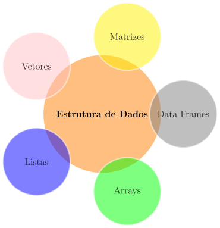
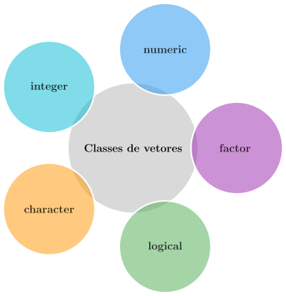

class: title-slide, center, middle
background-image: url(../assets/capa/capa.png)
background-position: center
background-size: cover
background-repeat: no-repeat

<div class="logo-lmftca"></div>
<div class="logo-ppgctif"></div>
<div class="logo-ppgbc"></div>

```{r setup, include=FALSE}
knitr::opts_chunk$set(
	error = FALSE,
	fig.align = "center",
	fig.showtext = TRUE,
	message = FALSE,
	warning = FALSE,
	cache = FALSE,
	collapse = TRUE,
	dpi = 600
)
```

```{r packages, include=FALSE}
# remotes::install_github("dill/emoGG")
library(ggplot2)
library(dplyr)
library(ggimage)
library(kableExtra)
```

```{r xaringan-logo, echo=FALSE}
library(xaringanExtra)

use_scribble()
use_share_again()
use_progress_bar()

use_extra_styles(
  hover_code_line = TRUE,
  mute_unhighlighted_code = TRUE
)

use_editable(expires = 1)
use_clipboard()
```

```{r icon, echo=FALSE}
#remotes::install_github("mitchelloharawild/icons")
#remotes::install_github('emitanaka/anicon')
#library(icons)
#download_fontawesome()
#download_simple_icons()
```

<!-- title-slide -->
# Estatística Computacional com R <br> (PPGBC/UFPA e PPGCTIF/UFOPA)

## ᨒ <br> `r anicon::faa("pagelines", animate="horizontal", colour="green")` Introdução ao R `r anicon::faa("pagelines", animate="horizontal", colour="green")`
###### (Estrutura de Dados no R)

##### 〰〰〰〰〰〰🌱〰〰〰〰〰〰
##### ᨒ
##### .font120[**Prof. Dr. Deivison Venicio Souza**]
##### Universidade Federal do Pará (UFPA)
##### Faculdade de Engenharia Florestal
##### Laboratório de Manejo Florestal, Tecnologias e Comunidades Amazônicas
##### E-mail: deivisonvs@ufpa.br
<br>
##### 1ª versão: 14/outubro/2022 <br> (Atualizado em: `r format(Sys.Date(),"%d/%B/%Y")`)

---

layout: true
class: with-logo logo-lmftca-fixed
<div class="my-header"></div>
<div class="my-footer">
<span>
Prof. Dr. Deivison Venicio Souza (deivisonvs@ufpa.br)
&emsp;&emsp;
<div2>Estatística Computacional com R</div2>
&bull;
<div3>Introdução ao R (Módulo 1)</div3>
&bull;
<div4>Estrutura de Dados no R</div4>
</span>
</div>

---

## Objetivos

<br><br>

Ao final desta aula, espera-se que os discentes sejam capazes de:

* Compreender o papel das estruturas de dados na linguagem R;
* Criar e manipular vetores, matrizes, arrays, listas e data frames;
* Reconhecer as características e aplicações de cada estrutura;
* Utilizar funções básicas para construção de estruturas de dados; e
* Relacionar estruturas de dados a problemas práticos de análise de dados.

---

## Conteúdo

<br>

### Parte 4 — Estrutura de dados

<br>

.pull-left[
**[1. Vetores](#vet)**

- Classes
- Criação de vetores
- `c()`, `seq()`, `rep()` e `scan()`
- Factors e níveis
]

.pull-right[
**[2. Matrizes](#mat)**

- Propriedades
- Função `matrix()`
- Nomeando dimensões
- Imagens em escala de cinza
]

---

## Conteúdo

<br>

### Parte 4 — Estrutura de dados

<br>

.pull-left-17[
**[3. Arrays](#arrays)**

- Propriedades
- Função `array()`
- Nomeando dimensões
- Imagens RGB
]

.pull-center-17[
**[4. Listas](#list)**

- Propriedades
- Função `list()`
]

.pull-right-17[
**[5. Data frames](#df)**

- Propriedades
- Função `data.frame()`
]

---

layout: false
class: inverse, top, right
background-image: url(../assets/capa/sec.png)
background-size: cover

<br>

.right[
.font100[
**.green[Módulo 1]** - Introdução ao R
]
]

<br><br>

.right[
.font150[
**.green[Parte 4]** <br>
Estrutura de Dados em R
]
]

<br><br>

.right[
.font180[
**Vetores**
]
]

---

layout: true
class: with-logo logo-lmftca-fixed
<div class="my-header"></div>
<div class="my-footer">
<span>
Prof. Dr. Deivison Venicio Souza (deivisonvs@ufpa.br)
&emsp;&emsp;
<div2>Estatística Computacional com R</div2>
&bull;
<div3>Introdução ao R (Módulo 1)</div3>
&bull;
<div4>Estrutura de Dados no R</div4>
</span>
</div>

---

## Estrutura de dados em R

- O R pode armazenar dados em diferentes estruturas, cada uma adequada para uma finalidade específica.

```{r echo=FALSE, out.width='40%', fig.align='center', fig.cap='', dpi=600}

```

---
name: comparando
## Comparando as estruturas de dados

<br>

| Estrutura | Dimensão | Tipo de dados | Exemplo |
|:--|:--:|:--:|:--|
| **Vetor** | 1D | Homogêneo | DAP de árvores |
| **Matriz** | 2D | Homogêneo | Imagem em escala de cinza |
| **Array** | 3D ou mais | Homogêneo | Imagem RGB |
| **Data Frame** | 2D | Heterogêneo | Inventário florestal |
| **Lista** | Flexível | Heterogêneo | Resultado de análises |

<br>

.alert[
💡 Em R, cada estrutura possui uma forma específica de armazenar e organizar os dados.
]

---
name: vet
## Estrutura de dados em R
<br>

### Vetores

.pull-left-4[
- São a estrutura de dados mais básica do R;
- Possuem apenas uma dimensão (1D);
- Todos os elementos devem pertencer à mesma classe;
- Servem de base para a construção de estruturas mais complexas.
]

--

.pull-right-4[
.center[**Principais classes de vetores**]
```{r echo=FALSE, out.width='75%', fig.align='center', fig.cap='', dpi=600}

```
]

---

## Estrutura de dados em R
<br>

### Classes de Vetores

| Classe | Tipo de armazenamento | Exemplo | Aplicação |
|:---|:---|:---|:---|
| **integer** | integer | `c(1L, 2L, 3L)` | Quantidade de árvores |
| **numeric** | double | `c(12.5, 15.8, 20.1)` | DAP, altura, volume |
| **character** | character | `c("Ipê", "Mogno")` | Nome das espécies |
| **logical** | logical | `c(TRUE, FALSE)` | Sim/Não |
| **factor** | integer | `factor(c("Alta","Baixa"))` | Classes ou categorias |

<br>

.alert[
💡 Além da classe do objeto, é importante compreender o tipo de armazenamento dos dados.
]

---
name: id
## Integer × Double

.pull-left[

### Integer (.blue[Números inteiros])

```{r eval=FALSE}
x <- c(1L, 2L, 3L)

class(x)    # Classe
typeof(x)   # Tipo interno
```

```text
[1] "integer"
[1] "integer"
```

]

.pull-right[

### Double (.blue[Números reais])

```{r eval=FALSE}
y <- c(12.5, 15.8, 20.1)

class(y)    # Classe
typeof(y)   # Tipo interno
```

```text
[1] "numeric"
[1] "double"
```

]

<br>

.alert[
💡 Em R, números são armazenados como **double** por padrão. Use **L** para criar valores **integer**.
]

---

## Factor: Como o R armazena categorias?

.pull-left[

```{r eval=FALSE}
especie <- factor(c("Mogno",
                    "Teca",
                    "Ipê"))

class(especie)
typeof(especie)
```

```text
[1] "factor"
[1] "integer"
```

]

.pull-right[

.pull-left[

### O usuário vê:

```text
Mogno
Teca
Ipê
```

]

.pull-right[

### O R armazena:

```text
2  
3 
1
```

]
]

<br>

.alert[
💡 Fatores representam categorias, mas são armazenados internamente como números inteiros.
]

<br>

.alert[
💡 Por padrão, o R atribui códigos inteiros aos níveis do fator em ordem alfabética.
]

---

## Estrutura de dados em R
<br>

### Como criar vetores?

Existem diversas formas de criar vetores na linguagem R.

.pull-left[

### Mais utilizadas

- `c()` (*concatenação*)
- `seq()` (*sequência*)
- `rep()` (*replicação*)

]

.pull-right[

### Entrada manual

- `scan()`

]

<br>

.alert[
💡 A função `c()` é a forma mais utilizada de criar vetores no R.
]

---

## Estrutura de dados em R
<br>

### Vetores - .black[Função c()]

.pull-left[

**Classe "character"**

```{r eval=FALSE}
especie <- c("Acapu",
             "Mogno",
             "Cedro",
             "Ipê")

class(especie)
```

```text
[1] "character"
```

]

.pull-right[

**Classe "factor"**

```{r eval=FALSE}
especie <- factor(c("Mogno",
                    "Teca",
                    "Ipê",
                    "Mogno"))

class(especie)
```

```text
[1] "factor"
```

]

<br>

.alert[
💡 **Factor** informa ao R que os valores representam **categorias**, e não textos livres (**character**).
]

---

## Estrutura de dados em R
<br>

### Vetores - .black[Função c()]

.pull-left[

**Classe "integer"**

```{r eval=FALSE}
idade <- c(5L,
           8L,
           12L,
           15L)

class(idade)
```

```text
[1] "integer"
```

]

.pull-right[

**Classe "numeric"**

```{r eval=FALSE}
diametro <- c(23.0,
              27.0,
              33.6,
              42.6)

class(diametro)
```

```text
[1] "numeric"
```

]

<br>

.alert[
💡 Vetores **integer** armazenam números inteiros. Vetores **numeric** armazenam números reais.
]

---

## Estrutura de dados em R
<br>

### Vetores - .black[Classe "logical"]

```{r eval=FALSE}
cipo <- c(TRUE,
          FALSE,
          FALSE,
          TRUE)

class(cipo)
```

```text
[1] "logical"
```

<br>

Exemplo:

```text
TRUE  → Presença de cipó

FALSE → Ausência de cipó
```

<br>

.alert[
💡 Vetores da classe **logical** representam condições do tipo "sim" ou "não".
]

---

## Estrutura de dados em R
<br>

### Factor: níveis não ordenados

.pull-left[
Em vetores da classe **factor**, os níveis (*levels*) são, por padrão, organizados em **ordem alfabética**.
]

.pull-right[
👉 **Níveis de risco de queda de árvores**

```{r eval=TRUE, collapse=FALSE}
risco <- factor(
  x = c("Critico",
        "Baixo",
        "Moderado")
)

levels(risco)
```
]

<br>

.alert[
💡 A ordem alfabética nem sempre representa a hierarquia real das categorias.
]

---

## Estrutura de dados em R
<br>

### Factor: níveis ordenados

.pull-left[

A **ordem dos níveis** pode ser definida usando o argumento `levels`.

<br>

Hierarquia desejada:

```text
Baixo < Moderado < Critico
```

]

.pull-right[
👉 **Níveis de risco de queda de árvores**

```{r eval=TRUE, collapse=FALSE}
risco <- factor(
  x = risco,
  levels = c("Baixo",
             "Moderado",
             "Critico"),
  ordered = TRUE
)

levels(risco)
```

]

<br>

.alert[
💡 O argumento `levels` permite definir a **ordem das categorias** em um fator.
]

---

## Estrutura de dados em R
<br>

### Vetores - .black[Função seq() (sequence)]
<br>

.alert[
.center[.blue[seq(]**from** = ?, **to** = ?, **by** = ?, **length.out** = ?, **along.with** = ?.blue[)]]
<br>

.font90[
**from** = valor inicial da sequência.

**to** = valor final da sequência.

**by** = valor incremental da sequência.

**length.out** = quantidade de elementos da sequência.

**along.with** = cria uma sequência com o mesmo comprimento de um vetor.
]
]

---

## Estrutura de dados em R
<br>

### Vetores - .black[Função seq() (sequence)]

.pull-left[

```{r seq1, echo=TRUE, eval=FALSE}
# Sequência de 1 a 10
seq(10)

# Sequência de 1 a 10
seq(1:10)

# Sequência de 1 a 10, com incremento 1
seq(from = 1, to = 10, by = 1)

# Sequência de -2 a 10, com incremento 2
seq(from = -2, to = 10, by = 2)
```

]

.pull-right[

```{r, echo=FALSE, collapse=FALSE}
seq(10)
seq(1:10)
seq(from = 1, to = 10, by = 1)
seq(from = -2, to = 10, by = 2)
```

]

<br>

.alert[
💡 O argumento `by` controla o incremento entre os elementos da sequência.
]

---

## Estrutura de dados em R
<br>

### Vetores - .black[Função seq() (sequence)]

.pull-left[

```{r seq2, echo=TRUE, eval=FALSE}
# Sequência de 5 números entre 0 e 1
seq(from = 0, to = 1, length.out = 5)

# Sequência do tamanho do vetor
especie <- c("Acapu", "Mogno", "Cedro", "Ipe")

seq(along.with = especie)
```

]

.pull-right[

```{r, echo=FALSE, collapse=FALSE}
seq(from = 0, to = 1, length.out = 5)

especie <- c("Acapu", "Mogno", "Cedro", "Ipe")

seq(along.with = especie)
```

]

<br>

.alert[
💡 Use `length.out` para definir a quantidade de elementos e `along.with` para gerar uma sequência do tamanho do vetor.
]

---

## Estrutura de dados em R
<br>

### Vetores - .black[Função rep() (replicate)]

<br>

.alert[
.center[
.blue[rep(]**x**, **times** = 1, **length.out** = NA, **each** = 1.blue[)]
]

<br>

.font90[
**x** = O objeto (vetor, lista, número) que você deseja repetir.

**times** = Quantidade de repetições da sequência inteira.

**each** = Quantidade de repetições de cada elemento individual em sequência.

**length.out** = Define o tamanho total final desejado para o vetor.
]
]

---

## Estrutura de dados em R
<br>

### Vetores - .black[Função rep() - Argumento: `times`]

.pull-left[

```{r rep1, echo=TRUE, eval=FALSE, collapse=FALSE}
# Repete o vetor 2 vezes
rep(x = c("Mogno", "Ipê"), times = 2)

# Repete o vetor 3 vezes
rep(x = c("Mogno", "Ipê"), times = 3)
```

]

.pull-right[

```{r, echo=FALSE, collapse=FALSE}
rep(x = c("Mogno", "Ipê"), times = 2)

rep(x = c("Mogno", "Ipê"), times = 3)
```

]

<br>

.alert[
💡 O argumento `times` repete o vetor inteiro.
]

---

## Estrutura de dados em R
<br>

### Vetores - .black[Função rep() - Argumentos: `each` e `times`]

.pull-top[
```{r rep2, echo=TRUE, eval=FALSE}
# Repete cada espécie 2x
rep(x = c("Mogno", "Ipê"), each = 2)

# Repete cada espécie 2x, vetor 3x
rep(x = c("Mogno", "Ipê"), each = 2, times = 3)
```
]

.pull-bottom[
```{r, echo=FALSE, collapse=FALSE}
rep(x = c("Mogno", "Ipê"), each = 2)

rep(x = c("Mogno", "Ipê"), each = 2, times = 3)
```
]

<br>

.alert[
💡 O argumento `each` repete cada elemento, enquanto `times` repete o vetor.
]

---

## Estrutura de dados em R
<br>

### Vetores - .black[Função rep() - Argumento: `length.out`]

.pull-left[

```{r rep3, echo=TRUE, eval=FALSE}
# Repete até obter 3 elementos
rep(x = c("Mogno", "Ipê"), length.out = 3)

# Repete até obter 5 elementos
rep(x = 1:2, length.out = 5)
```

]

.pull-right[

```{r, echo=FALSE, collapse=FALSE}
rep(x = c("Mogno", "Ipê"), length.out = 3)

rep(x = 1:2, length.out = 5)
```

]

<br>

.alert[
💡 O argumento `length.out` define o comprimento final do vetor.
]

---

## Estrutura de dados em R
<br>

### Vetores - .black[Função scan()]

.pull-left[

A função `scan()` permite inserir dados manualmente pelo R Console.

<br>

**Procedimento:**

1. Digite o comando `scan()`.

2. Digite um valor por linha e pressione **ENTER**.

3. Para finalizar, pressione **ENTER** duas vezes.

]

.pull-right[

```{r eval=FALSE}
y <- scan()
```

<br>

.alert[
💡 A função `scan()` cria vetores a partir de dados digitados pelo usuário.
]

]

---

## Estrutura de dados em R
<br>

### Vetores - .black[Função scan()]

<br>

.font90[
**Atividade para** `r anicon::faa("home", animate="horizontal")`

Utilize a função `scan()` para criar vetores para as variáveis da tabela abaixo:
]

```{r echo=FALSE}
data.frame(
  especie = c("Acapu", "Araucaria", "Mogno"),
  diametro = c(23.0, 27.0, 33.6),
  altura = c(8.5, 9.2, 10.5)
)
```

<br>

.alert[
💡 Para criar vetores da classe **character**, utilize:

`scan(what = character())`
]

---

layout: false
class: inverse, top, right
background-image: url(../assets/capa/sec.png)
background-size: cover

<br>

.right[
.font100[
**.green[Módulo 1]** - Introdução ao R
]
]

<br><br>

.right[
.font150[
**.green[Parte 4]** <br>
Estrutura de Dados em R
]
]

<br><br>

.right[
.font180[
**Matrizes**
]
]

---

layout: true
class: with-logo logo-lmftca-fixed
<div class="my-header"></div>
<div class="my-footer">
<span>
Prof. Dr. Deivison Venicio Souza (deivisonvs@ufpa.br)
&emsp;&emsp;
<div2>Estatística Computacional com R</div2>
&bull;
<div3>Introdução ao R (Módulo 1)</div3>
&bull;
<div4>Estrutura de Dados no R</div4>
</span>
</div>

---
name: mat
## Estrutura de dados em R
<br>

### Matrizes - .black[Propriedades]

.pull-left-4[
.font90[
- São uma extensão dos vetores para duas dimensões (linhas e colunas).
- Possuem duas dimensões: linhas e colunas.
- Todos os elementos devem pertencer à mesma classe.
- Podem ser criadas com `matrix()`, `cbind()` ou `rbind()`.
- A função `matrix()` é a forma mais utilizada.
]
]

.pull-right-4[
.alert[
.font90[
.center[
.blue[matrix(]
**data** = NA,
**nrow** = 1,
**ncol** = 1,
**byrow** = FALSE,
**dimnames** = NULL
.blue[)]
]

<br>

**data** = vetor de dados.

**nrow** = número de linhas.

**ncol** = número de colunas.

**byrow** = preenchimento por linhas (`TRUE`) ou colunas (`FALSE`).

**dimnames** = nomes das linhas e colunas.
]
]
]

---

## Estrutura de dados em R
<br>

### Matrizes - .black[Função matrix()]

.pull-left[

```{r, echo=TRUE, eval=FALSE}
# Cria uma matriz 2 x 3
matrix(
  data = c(23, 27, 31, 25, 29, 34),
  nrow = 2,
  ncol = 3
)
```

]

.pull-right[

```{r, echo=FALSE, collapse=FALSE}
matrix(
  data = c(23, 27, 31, 25, 29, 34),
  nrow = 2,
  ncol = 3
)
```

]

<br>

.alert[
💡 Por padrão, a função `matrix()` preenche a matriz por colunas.
]

---

## Estrutura de dados em R
<br>

### Matrizes - .black[Argumento: dimnames]

.pull-left[

```{r, echo=TRUE, eval=FALSE}
# Cria uma matriz 2 x 3, nomeada
matrix(
  data = c(23, 27, 31, 25, 29, 34),
  nrow = 2,
  ncol = 3,
  dimnames = list(
    c("Arv1", "Arv2"),
    c("Parc1", "Parc2", "Parc3")
  )
)
```

]

.pull-right[

```{r, echo=FALSE, collapse=FALSE}
matrix(
  data = c(23, 27, 31, 25, 29, 34),
  nrow = 2,
  ncol = 3,
  dimnames = list(
    c("Arv1", "Arv2"),
    c("Parc1", "Parc2", "Parc3")
  )
)
```

]

<br>

.alert[
💡 O argumento `dimnames` permite atribuir nomes às linhas e colunas da matriz.
]

---

## Estrutura de dados em R
<br>

### Matrizes - .black[Imagem digital - (escala de cinza)]

.pull-left[

```{r echo=FALSE, out.width='70%'}

```

.center[
Imagem original (1024 × 1024 pixels)
]

]

.pull-right[

```{r eval=FALSE}
library(png)

mat <- readPNG("fig/leaf_gray.png")

dim(mat)

View(mat)
```

.center[
Matriz de pixels
]

]

<br>

.alert[
💡 Imagens em escala de cinza são armazenadas como matrizes.
]

---

layout: false
class: inverse, top, right
background-image: url(../assets/capa/sec.png)
background-size: cover

<br>

.right[
.font100[
**.green[Módulo 1]** - Introdução ao R
]
]

<br><br>

.right[
.font150[
**.green[Parte 4]** <br>
Estrutura de Dados em R
]
]

<br><br>

.right[
.font180[
**Arrays**
]
]

---

layout: true
class: with-logo logo-lmftca-fixed
<div class="my-header"></div>
<div class="my-footer">
<span>
Prof. Dr. Deivison Venicio Souza (deivisonvs@ufpa.br)
&emsp;&emsp;
<div2>Estatística Computacional com R</div2>
&bull;
<div3>Introdução ao R (Módulo 1)</div3>
&bull;
<div4>Estrutura de Dados no R</div4>
</span>
</div>

---
name: arrays
## Estrutura de dados em R
<br>

### Arrays - .black[Propriedades]

.pull-left-4[
.font80[
- São uma generalização das matrizes.
- **Matrizes** possuem duas dimensões (linhas e colunas).
- **Arrays** podem possuir duas ou mais dimensões.
- Todos os elementos devem pertencer à mesma classe.
- Podem ser criados com a função `array()`.


<br>
.alert[
💡 Vetores, matrizes e arrays diferem principalmente pelo número de dimensões.
]
]
]

.pull-right-4[

.alert[
.font80[
.center[
.blue[array(]
**data** = NA,
**dim** = length(data),
**dimnames** = NULL
.blue[)]
]

<br>

**data** = vetor de dados.

**dim** = vetor que define as dimensões do array.

**dimnames** = nomes das dimensões.
]
]
]

---

## Estrutura de dados em R
<br>

### Arrays - .black[Função array()]

.pull-left[

```{r array, echo=TRUE, eval=FALSE}
# Cria um array 3 × 2 × 2
array(
  data = 1:12,
  dim = c(3, 2, 2)
)
```

<br>

.alert[
💡 Por padrão, os elementos são distribuídos por colunas em cada camada do array.
]
]

.pull-right[

```{r echo=FALSE}
array(
  data = 1:12,
  dim = c(3, 2, 2)
)
```

]

---

## Estrutura de dados em R
<br>

### Arrays - .black[Função array()] - Nomeando dimensões

.pull-left-4[
.font90[
```{r array4, echo=T, eval=F}
array(
  data = 1:18,
  dim = c(3, 3, 2),
  dimnames = list(
    c("L1", "L2", "L3"),
    c("C1", "C2", "C3"),
    c("M1", "M2")
  )
)
```

.alert[
💡 O argumento `dimnames` permite nomear as dimensões do array.
]

]
]

.pull-right-4[
```{r ref.label="array4", echo=FALSE, eval=TRUE, collapse=FALSE}
```
]

---

## Estrutura de dados em R
<br>

### Arrays - .black[Imagem digital - RGB]

.pull-left[

```{r echo=FALSE, out.width='70%'}

```

.center[
Imagem colorida (RGB)
]

]

.pull-right[

```{r eval=FALSE}
library(png)

arr <- readPNG("fig/leaf.png")

dim(arr)

View(arr)
```

<br>

.alert[
💡 Imagens coloridas são armazenadas como arrays: linhas × colunas × canais RGB.
]

]

---

layout: false
class: inverse, top, right
background-image: url(../assets/capa/sec.png)
background-size: cover

<br>

.right[
.font100[
**.green[Módulo 1]** - Introdução ao R
]
]

<br><br>

.right[
.font150[
**.green[Parte 4]** <br>
Estrutura de Dados em R
]
]

<br><br>

.right[
.font180[
**Data Frames**
]
]

---

layout: true
class: with-logo logo-lmftca-fixed
<div class="my-header"></div>
<div class="my-footer">
<span>
Prof. Dr. Deivison Venicio Souza (deivisonvs@ufpa.br)
&emsp;&emsp;
<div2>Estatística Computacional com R</div2>
&bull;
<div3>Introdução ao R (Módulo 1)</div3>
&bull;
<div4>Estrutura de Dados no R</div4>
</span>
</div>

---

name: df
## Estrutura de dados em R
<br>

### Data Frames - .black[Propriedades]

.pull-left-4[
.font90[
- São estruturas **bidimensionais** organizadas em linhas e colunas.
- Permitem combinar vetores de diferentes classes, desde que possuam o mesmo comprimento.
- O R-base possui a função .green[data.frame()].
- Seus elementos podem ser acessados e modificados por indexação.
- Em geral, tabelas importadas de arquivos (.csv, .txt e .xlsx) são armazenadas como data frames.
]
]

--

.pull-right-4[
**Atividade para** `r anicon::faa("home", animate="horizontal")`

Use o comando `x <- edit(data.frame())` e crie a tabela a seguir:

```{r echo=FALSE}
data.frame(
  especie = c("Acapu", "Araucaria",
              "Mogno", "Cedro", "Ipe"),
  diametro = c(23.0, 27.0, 33.6, 42.6, 52.1),
  altura = c(8.5, 9.2, 10.5, 13.4, 15.8)
)
```
]

---

## Estrutura de dados em R
<br>

### Data Frames - .black[Função data.frame()]

.pull-left[
.font90[
**Cria um data frame a partir de vetores existentes**

```{r df1, echo=TRUE, eval=FALSE}
especie <- c("Acapu", "Araucaria", "Cedro", "Tauari")
diametro <- c(23.0, 27.0, 33.6, 52.6)
altura <- c(8.4, 8.7, 9.1, 18.2)
cortar <- c(FALSE, FALSE, FALSE, TRUE)

data.frame(especie, diametro, altura, cortar)
```
]
]

.pull-right[
.font90[
**Resultado**

```{r ref.label="df1", echo=FALSE, eval=TRUE, collapse=FALSE}
```
]
]

<br>

.alert[
💡 Um data frame pode ser criado pela combinação de vetores com o mesmo comprimento.
]

---

## Estrutura de dados em R
<br>

### Data Frames - .black[Função data.frame()]

.pull-left[
.font90[
**Usando diretamente a função `data.frame()`**

```{r df2, echo=TRUE, eval=FALSE}
(invFlor <-
  data.frame(
    especie = c("Acapu", "Araucaria", "Cedro", "Tauari"),
    diametro = c(23.0, 27.0, 33.6, 52.6),
    altura = c(8.4, 8.7, 9.1, 18.2),
    cortar = c(FALSE, FALSE, FALSE, TRUE)
  ))
```
]
]

.pull-right[
.font90[
**Resultado**

```{r ref.label="df2", echo=FALSE, eval=TRUE, collapse=FALSE}
```
]
]

<br>

.alert[
💡 A função `data.frame()` permite criar tabelas diretamente a partir dos valores das variáveis.
]

---

## Estrutura de dados em R
<br>

### Data Frames - .black[Explorando a estrutura]

.pull-left[
.font90[
**Explorando um data frame**

```{r, echo=TRUE, eval=FALSE}
# Número de linhas e colunas
dim(invFlor)

# Estrutura do objeto
str(invFlor)
```
]
]

.pull-right[
.font90[
**Resultado**

```{r echo=FALSE}
dim(invFlor)
```

```{r echo=FALSE}
str(invFlor)
```
]
]

<br>

.alert[
💡 A função `str()` permite visualizar a estrutura e as classes das colunas de um data frame.
]

---

layout: false
class: inverse, top, right
background-image: url(../assets/capa/sec.png)
background-size: cover

<br>

.right[
.font100[
**.green[Módulo 1]** - Introdução ao R
]
]

<br><br>

.right[
.font150[
**.green[Parte 4]** <br>
Estrutura de Dados em R
]
]

<br><br>

.right[
.font180[
**Listas**
]
]

---

layout: true
class: with-logo logo-lmftca-fixed
<div class="my-header"></div>
<div class="my-footer">
<span>
Prof. Dr. Deivison Venicio Souza (deivisonvs@ufpa.br)
&emsp;&emsp;
<div2>Estatística Computacional com R</div2>
&bull;
<div3>Introdução ao R (Módulo 1)</div3>
&bull;
<div4>Estrutura de Dados no R</div4>
</span>
</div>

---
name: list
## Estrutura de dados em R
<br>

### Listas - .black[Propriedades]


.font90[
- Pode reunir diferentes estruturas de dados (vetores, matrizes, data frames e inclusive outras listas).
- O R-base possui a função .green[list()].
- Se os objetos já existem pode-se simplesmente adicioná-los à
função list().
]

---

## Estrutura de dados em R
<br>

### Listas - .black[Função list()]

.pull-left-4[
**Uma lista a partir de objetos já existentes**
```{r list1, echo=T, eval=F}
especie <- c("Acapu", "Mogno", "Cedro", "Ipe")
diametro <- c(23.0, 27.0, 33.6, 52.6)
altura <- c(8.4, 8.7, 9.1, 18.2)

# Sem atribuir nomes aos objetos da lista
(list1 <- list(especie, diametro, altura))

# Atribuindo nomes aos objetos da lista
(list2 <- list(Esp = especie, 
               DAP = diametro, 
               H = altura))
```
**Nomear os componentes da lista facilita a identificação e a indexação.**

]

--

.pull-right-4[
```{r ref.label="list1", echo=FALSE, eval=TRUE, collapse=F}
```
]

---

## Estrutura de dados em R
<br>

### Listas - .black[Função list()]

.pull-left-4[
.font90[
**Uma lista com diferentes estruturas de dados**
```{r list3, echo=T, eval=F}
diametro <- c(23.0, 27.0, 33.6, 52.6)

mat <- 
   matrix(data=1:6, nrow=2, 
          ncol=3, byrow=TRUE,
          dimnames=list(c("L1", "L2"),
                        c("C1", "C2", "C3")))

invFlor <- 
  data.frame(
    especie=c("Acapu", "Mogno", "Cedro", "Ipe"),
    cortar=c("Não", "Não", "Não", "Sim"),
    stringsAsFactors=FALSE)

# Criando lista nomeada
(list3 <- list(Vetor = diametro, 
               Matriz = mat,
               DataFrame = invFlor))

```
]
]

--

.pull-right-4[
```{r ref.label="list3", echo=FALSE, eval=TRUE, collapse=F}
```
**Explore as funções length() e names()**.

]

---

## Estrutura de dados em R
<br>

### Listas - .black[Coagindo lista para data frame]

.pull-left-4[
.font90[
- Uma lista pode ser transformada em um data frame usando
a função .green[as.data.frame()]. 
- Mas, para isso a lista a ser transformada deve possuir vetores de igual comprimento.
]
]

--

.pull-right-4[
**Lista para Data Frame**
```{r listDF, echo=T, eval=F}
# Criando lista nomeada
list4 <- list(
  Esp = c("Acapu", "Mogno", "Cedro", "Ipe"),
  DAP = c(23.0, 27.0, 33.6, 52.6), 
  H = c(8.4, 8.7, 9.1, 18.2))

as.data.frame(list4)
```

```{r ref.label="listDF", echo=FALSE, eval=TRUE, collapse=F}
```
]

---
layout: false
name: duvidas
class: inverse, middle, center
background-image: url(../assets/capa/sec.png)
background-size: cover

# .black[Dúvidas?]

<br>

## 💡 .black[Mensagem]

Entender como os dados são armazenados em R é fundamental para aprender a acessá-los, organizá-los e manipulá-los de forma eficiente.

<br>

## 🎯 .black[Próximo passo]

Aprender técnicas de indexação e operadores para acessar e manipular dados em R.

<br><br>

💬 Perguntas, comentários ou sugestões?

<!--Slide XX -->
---
layout: false
name: etim
class: inverse, middle, center
background-image: url(../assets/capa/sec.png)
background-size: cover

## .font200[Obrigado!]

```{r, echo=FALSE, out.width='20%', fig.align='center', fig.cap='', dpi=600}
knitr::include_graphics('../assets/logos/LMFTCA.png')
```

👨🏻‍👩🏻‍👦🏻‍👦🏻 [@lmftca_ufpa](https://www.instagram.com/lmftca_ufpa/)

🌎 [https://www.lmftca.com.br/](https://www.lmftca.com.br/)
