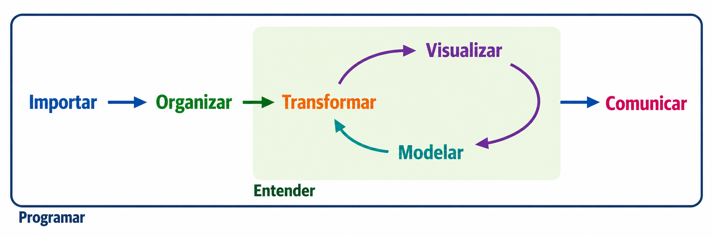
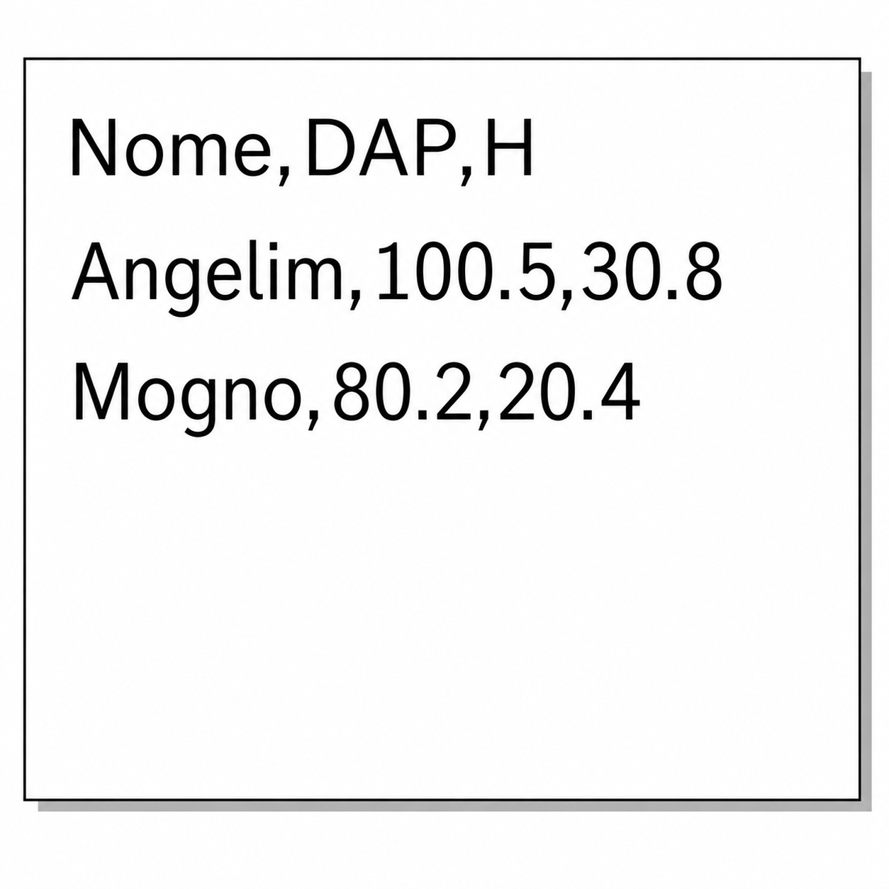
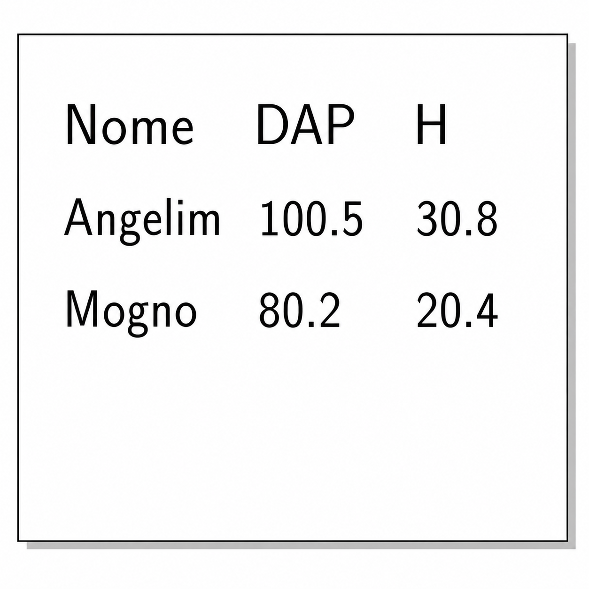
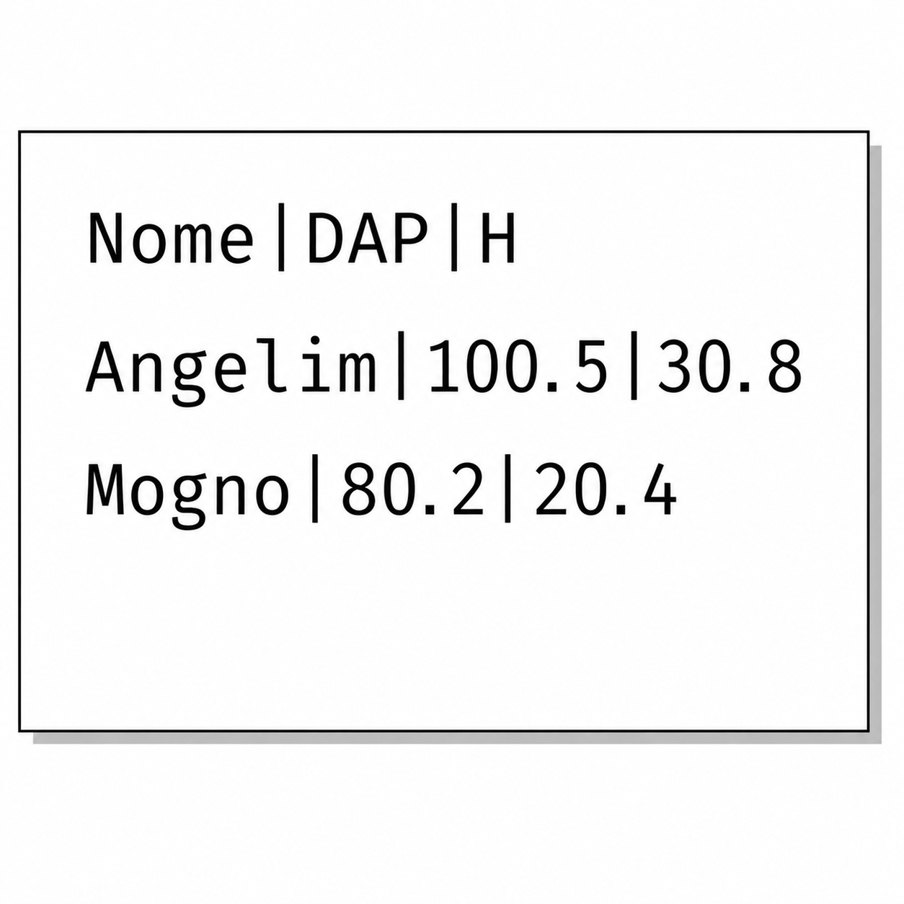
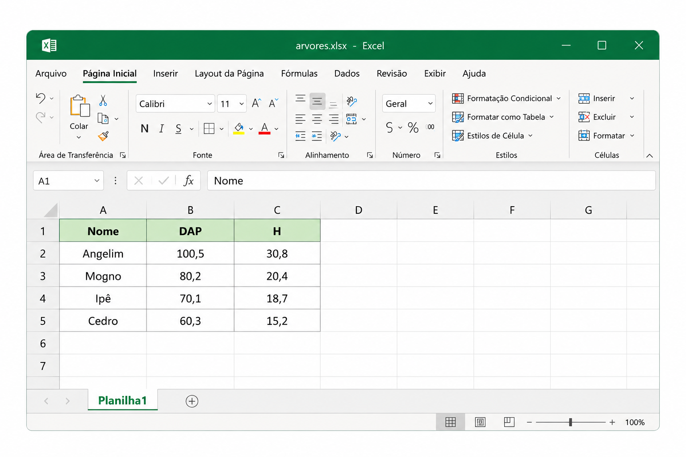

class: title-slide, center, middle
background-image: url(../assets/capa/capa.png)
background-position: center
background-size: cover
background-repeat: no-repeat

<div class="logo-lmftca"></div>
<div class="logo-ppgctif"></div>
<div class="logo-ppgbc"></div>

```{r setup, include=FALSE}
knitr::opts_chunk$set(
	error = FALSE,
	fig.align = "center",
	fig.showtext = TRUE,
	message = FALSE,
	warning = FALSE,
	cache = FALSE,
	collapse = TRUE,
	dpi = 600
)
```

```{r packages, include=FALSE}
library(readr)
```

```{r xaringan-logo, echo=FALSE}
library(xaringanExtra)

use_scribble()
use_share_again()
use_progress_bar()

use_extra_styles(
  hover_code_line = TRUE,
  mute_unhighlighted_code = TRUE
)

use_editable(expires = 1)
use_clipboard()
```

```{r icon, echo=FALSE}
# remotes::install_github("dill/emoGG")
# remotes::install_github("mitchelloharawild/icons")
# remotes::install_github('emitanaka/anicon')
# (icons)
# download_fontawesome()
# download_simple_icons()
```

<!-- title-slide -->
# Estatística Computacional com R <br> (PPGBC/UFPA e PPGCTIF/UFOPA)

## ᨒ <br> `r anicon::faa("pagelines", animate="horizontal", colour="green")` .font80[Importação e Exportação de Dados]`r anicon::faa("pagelines", animate="horizontal", colour="green")`
###### (Pacotes: readr, readxl e writexl)

##### 〰〰〰〰〰〰🌱〰〰〰〰〰〰
##### ᨒ
##### .font120[**Prof. Dr. Deivison Venicio Souza**]
##### Universidade Federal do Pará (UFPA)
##### Faculdade de Engenharia Florestal
##### Laboratório de Manejo Florestal, Tecnologias e Comunidades Amazônicas
##### E-mail: deivisonvs@ufpa.br
<br>
##### 1ª versão: 14/outubro/2022 <br> (Atualizado em: `r format(Sys.Date(),"%d/%B/%Y")`)

---

layout: true
class: with-logo logo-lmftca-fixed
<div class="my-header"></div>
<div class="my-footer"><span>Prof. Dr. Deivison Venicio Souza (E-mail: deivisonvs@ufpa.br)&emsp;&emsp;&emsp;&emsp;&emsp; <div3>Estatística Computacional com R</div3>/ <div2>Introdução ao Tidyverse (Módulo 2)</div2> </div>

---

## Objetivos

<br>

Esta aula (.blue[**Importação e Exportação de Dados**]) constitui a primeira parte do **Módulo 2**, dedicado ao estudo de alguns dos principais pacotes do ecossistema **Tidyverse**. 

<br>

Ao final desta aula, espera-se que os participantes sejam capazes de:

- Compreender a organização do ecossistema **Tidyverse**;
- Utilizar o pacote .orange[**readr**] para importar e exportar arquivos de texto;
- Importar planilhas do Microsoft Excel utilizando o pacote .orange[**readxl**];
- Exportar objetos do R para planilhas do Microsoft Excel utilizando o pacote .orange[**writexl**]; e
- Selecionar o pacote e a função mais adequados para cada formato de arquivo.

---

## Conteúdo

<br>

.green[**Parte 1 - Importação e Exportação de Dados**]

.font90[
1. **Conhecendo o ecossistema Tidyverse**
   - Pacotes e fluxo de trabalho em ciência de dados.

2. **Exportação de dados**
   - Pacotes **readr** e **writexl**;
   - Funções `write_csv()`, `write_csv2()`, `write_tsv()`, `write_delim()` e `write_xlsx()`.

3. **Importação de dados**
   - Pacotes **readr** e **readxl**;
   - Funções `read_csv()`, `read_csv2()`, `read_tsv()`, `read_delim()` e `read_excel()`.

4. **Inspeção dos dados importados**
   - Funções `class()`, `str()`, `glimpse()` e `View()`.

]

---

layout: false
class: inverse, top, right
background-image: url(../assets/capa/sec.png)
background-size: cover

<br>

.right[
.font100[
**.green[Módulo 2]** – Introdução ao Tidyverse
]
]

<br><br>

.right[
.font150[
**.green[Parte 1]** <br>
Importação e Exportação de Dados
]
]

<br><br>

.right[
.font180[
**Conhecendo o Tidyverse**
]
]

---

layout: true
class: with-logo logo-ufpa
<div class="my-header"></div>
<div class="my-footer"><span>Prof. Dr. Deivison Venicio Souza (E-mail: deivisonvs@ufpa.br)&emsp;&emsp;&emsp;&emsp;&emsp; <div3>Estatística Computacional com R</div3>/ <div2>Introdução ao Tidyverse (Módulo 2)</div2> </div>

---
name: workflow
## Fluxo de trabalho em Ciência de Dados com R

<br>

.center[
```{r echo=FALSE, out.width='70%', fig.align='center', fig.cap='', dpi=600}

```
]

<br>

.center[
.font110[
**Esta aula aborda a primeira etapa desse fluxo:**
]
]

.center[
.font120[
.alert2[
**Im(Ex)portar dados**
]
]
]

<br>

.center[
.font95[
.orange[**readr**] • .orange[**readxl**] • .orange[**writexl**]
]
]

---

## Ecossistema Tidyverse

- **Família de pacotes** que foram desenvolvidos para funcionar de maneira **integrada**, compartilhando a mesma **filosofia**, **sintaxe** e **estruturas de dados**.

<br>

.center[
.font120[
**Uma coleção integrada de pacotes para ciência de dados em R**
]
]

<br>

O Tidyverse fornece ferramentas para:

- 📥 Importação de dados;
- 🔧 Manipulação e transformação de dados;
- 📊 Visualização de dados;
- 📝 Comunicação de resultados; e
- ⚙️ Automação de tarefas.

---

## Tidyverse: Pacotes integrados
<br>

```{r echo=FALSE, out.width='60%', fig.align='center', fig.cap='', dpi=600}
knitr::include_graphics("fig/tidy.png")
```

.center[
.font65[
**Fonte**: Elaborado com auxílio do ChatGPT (OpenAI), com base na documentação oficial do Tidyverse.
]
]

---
name: import
## Importação de Dados no R

<br>

.font100[
- A importação de dados é uma das primeiras etapas de qualquer fluxo de análise.
- Os dados podem estar armazenados em:
  - arquivos locais;
  - servidores remotos;
  - bancos de dados; ou
  - serviços web.
- O método de importação depende da origem e do formato dos dados.
]

<br>

.center[
.font110[
**Exemplos de formatos:** .csv, .txt, .tsv, .xlsx, .ods, SAS e SPSS.
]
]

---

## Importação de Dados: R Base × Tidyverse

<br>

.font95[
O R-base disponibiliza funções do Pacote .orange[**utils**] como:

- .green[**read.csv()**]
- .green[**read.delim()**]
- .green[**read.table()**]

]

<br>

.font95[
O ecossistema .orange[**tidyverse**] incorpora o pacote
.orange[**readr**], que oferece:

- maior velocidade de leitura;
- mensagens mais informativas;
- melhor integração com os demais pacotes do Tidyverse.
]

---
name: readr
## O pacote readr

<br>

.font95[
- O pacote .orange[**readr**] faz parte do ecossistema .orange[**tidyverse**].
- Foi desenvolvido para facilitar a **leitura** e a **escrita** de **arquivos tabulares**.
- Possui funções específicas para diferentes formatos de dados.
]

<br>

.center[
.font120[
.alert2[**Importar**] → Manipular → Visualizar → Comunicar
]
]

<br>

.center[
.font110[
Nesta aula utilizaremos o pacote .orange[**readr**] para .blue[importação] e .blue[exportação] de dados.
]
]

---
name: install
## Instalando e carregando pacotes

<br>

Os pacotes do .orange[**Tidyverse**] podem ser instalados de duas formas:

.pull-left-4[

### Instalar todo o Tidyverse

.font90[

```{r, eval=FALSE}
# Instala todos os pacote do "tidyverse"
install.packages("tidyverse")

# Carrega todos os pacote do "tidyverse"
library(tidyverse)
```

<br>

.alert[
💡 Instale o pacote apenas uma vez. Em cada nova sessão do R, utilize .green[library()] para carregá-lo.
]

]
]

.pull-right-4[

### Instalar pacotes específicos

.font90[

```{r, eval=FALSE}
# Instala os pacotes
install.packages(
  c(
    "readr",
    "tibble",
    "readxl",
    "writexl"
  )
)

# Carrega os pacotes
library(readr)
library(tibble)
library(readxl)
library(writexl)
```

]
]

---

layout: false
class: inverse, top, right
background-image: url(../assets/capa/sec.png)
background-size: cover

<br>

.right[
.font100[
**.green[Módulo 2]** – Introdução ao Tidyverse
]
]

<br><br>

.right[
.font150[
**.green[Parte 1]** <br>
Importação e Exportação de Dados
]
]

<br><br>

.right[
.font180[
**Conhecendo o readr**: <br>
.green[Exportação de Dados - **Funções write_()**]
]
]

---

layout: true
class: with-logo logo-ufpa
<div class="my-header"></div>
<div class="my-footer"><span>Prof. Dr. Deivison Venicio Souza (E-mail: deivisonvs@ufpa.br)&emsp;&emsp;&emsp;&emsp;&emsp; <div3>Estatística Computacional com R</div3>/ <div2>Introdução ao Tidyverse (Módulo 2)</div2> </div>

---
name: fie
## Pacote readr (tidyverse)
<br>

### Funções de importação e exportação

.font80[
- O pacote .orange[**readr**] disponibiliza diversas funções para .blue[importação] e .blue[exportação] de dados.
]
<br>

.pull-left-4[
**Funções para importação de dados**
.font80[
```{r echo=T, eval=T}
ls("package:readr") |> 
  stringr::str_subset("^read_")
```
]
]

.pull-right-4[
**Funções para exportação de dados**
.font80[
```{r echo=T, eval=T}
ls("package:readr") |> 
  stringr::str_subset("^write_")
```
]
]

---
name: export
## Exportação de Dados

<br>

.center[
.font130[
.alert2[**Objetos do R** → .blue[**Arquivos**]]
]
]

<br>

.font95[
A **exportação** consiste em **gravar um objeto do R** em um **arquivo armazenado no disco**.

Após a exportação, esse arquivo poderá ser utilizado para:

- Compartilhar dados com outros usuários;
- Abrir os dados em diferentes softwares; ou
- Importar os dados novamente para o R.
]

<br>

.alert[
💡 Nesta aula, criaremos arquivos na pasta .blue[data/] utilizando as funções .green[write_*()].
]

---
name: write_csv
## Função write_csv()

<br>

### Arquivos separados por vírgula .black[(].blue[,].black[)]

.pull-left-4[

<br>

.font90[
- A função .green[**write_csv()**] é utilizada para exportar objetos do R no formato .blue[CSV].
- CSV significa *Comma-Separated Values*.
- Nesse formato, os campos são separados por .blue[vírgulas (,)].
]

<br>

.alert[
💡 O arquivo será gravado na pasta .blue[data/] do projeto.
]

]

.pull-right-4[

```{r echo=FALSE, out.width='70%', fig.align='center',fig.cap='', dpi=600}

```

]

---
name: write_csv_ex
## Exportando um arquivo CSV

<br>

.pull-left-4[

.font90[
A função .green[**write_csv()**] do pacote .orange[**readr**] possui dois argumentos principais:

- .blue[x]: objeto do R a ser exportado;
- .blue[file]: caminho do arquivo a ser criado.
]

<br>

.font75[

```{r echo=TRUE, eval=FALSE}
library(tibble)
library(readr)

arvores <- tibble(
  Nome = c("Angelim", "Mogno"),
  DAP  = c(100.5, 80.2),
  H    = c(30.8, 20.4)
)

write_csv(
  x    = arvores,
  file = "data/arvores.csv"
)
```

]
]

.pull-right-4[

```{r echo=FALSE, out.width='50%', fig.align='center',fig.cap='', dpi=600}

```

<br>

.alert[
💡 Uma **tibble** é uma versão **moderna** do **data frame** utilizada pelo Tidyverse.
]

]

---
name: write_csv2
## Função write_csv2()

<br>

### Arquivos separados por ponto e vírgula .black[(].blue[;].black[)]

.pull-left-4[

<br>

.font90[
- A função .green[**write_csv2()**] é utilizada para exportar objetos do R no formato .blue[CSV europeu].
- Nesse formato, os campos são separados por .blue[ponto e vírgula (;)].
- Os valores decimais utilizam .blue[vírgula (,)].
]

<br>

.alert[
💡 Formato amplamente usado em países que utilizam a vírgula como separador decimal.
]

]

.pull-right-4[

```{r echo=FALSE, out.width='65%', fig.align='center',fig.cap='', dpi=600}

```

]

---
name: write_csv2_ex
## Exportando um arquivo CSV europeu

<br>

.pull-left-4[

.font90[
A função .green[**write_csv2()**] possui os mesmos argumentos da função .green[**write_csv()**]:

- .blue[x]: objeto do R a ser exportado;
- .blue[file]: caminho do arquivo a ser criado.
]

<br>

.font75[

```{r echo=TRUE, eval=FALSE}

arvores <- tibble(
  Nome = c("Angelim", "Mogno"),
  DAP  = c(100.5, 80.2),
  H    = c(30.8, 20.4)
)

write_csv2(
  x    = arvores,
  file = "data/arvores2.csv"
)
```

]
]


.pull-right-4[

```{r echo=FALSE, out.width='50%', fig.align='center',fig.cap='', dpi=600}

```

<br>

.alert[
💡 No Brasil, é comum utilizar .blue[vírgula (,)] como separador decimal. Por isso, arquivos CSV nesse padrão usam .blue[ponto e vírgula (;)] como delimitador.
]

]

---
name: write_tsv
## Exportando um arquivo TSV

<br>

.pull-left-4[

.font90[
A função .green[**write_tsv()**] do pacote .orange[**readr**] possui os mesmos argumentos das funções anteriores:

- .blue[x]: objeto do R a ser exportado;
- .blue[file]: caminho do arquivo a ser criado.
]

<br>

.font75[

```{r echo=TRUE, eval=FALSE}
arvores <- tibble(
  Nome = c("Angelim", "Mogno"),
  DAP  = c(100.5, 80.2),
  H    = c(30.8, 20.4)
)

write_tsv(
  x    = arvores,
  file = "data/arvores.tsv"
)
```

]
]


.pull-right-4[

```{r echo=FALSE, out.width='50%', fig.align='center', fig.cap='', dpi=600}

```
<br>

.alert[
💡 Nos arquivos .blue[TSV], os campos são separados pelo caractere de .blue[tabulação (TAB)].
]

]

---
name: compare_write
## Comparando os formatos de exportação

<br>

.font95[
Até o momento, estudamos três funções para exportação de dados utilizando o pacote .orange[**readr**].
]

<br>

| Função | Extensão | Delimitador | Decimal |
|:--------|:--------:|:-----------:|:--------:|
| .green[**write_csv()**]  | .blue[.csv] | **`,`** | **`.`** |
| .green[**write_csv2()**] | .blue[.csv] | **`;`** | **`,`** |
| .green[**write_tsv()**]  | .blue[.tsv] | **TAB** | **`.`** |

<br>

.alert[
💡 A principal diferença está no **delimitador** e no **separador decimal**.
]

---
name: write_delim
## Exportando um arquivo com delimitador personalizado

<br>

.pull-left-4[

.font90[
A função .green[**write_delim()**] permite exportar arquivos utilizando um **delimitador definido pelo usuário**.

Além dos argumentos .blue[x] e .blue[file], essa função possui o argumento:

- .blue[delim]: caractere utilizado para separar os campos.
]

<br>

.font75[

```{r echo=TRUE, eval=FALSE}
arvores <- tibble(
  Nome = c("Angelim", "Mogno"),
  DAP  = c(100.5, 80.2),
  H    = c(30.8, 20.4)
)

write_delim(
  x     = arvores,
  file  = "data/arvores.txt",
  delim = "|"
)
```

]
]

.pull-right-4[

```{r echo=FALSE, out.width='50%', fig.align='center', fig.cap='', dpi=600}

```

<br>

.alert[
💡 A função .green[write_delim()] permite utilizar qualquer caractere como delimitador.
]
]

---
name: write_xlsx
## Exportando uma planilha Excel

<br>

.pull-left-4[

.font90[
💡 Planilhas do Microsoft Excel (.xlsx) podem ser exportadas com a função .green[write_xlsx()] do pacote .orange[writexl].

A função possui dois argumentos principais:

- .blue[x]: objeto do R a ser exportado;
- .blue[path]: caminho da planilha a ser criada.
]

.font75[

```{r echo=TRUE, eval=FALSE}
library(tibble)
library(writexl)

arvores <- tibble(
  Nome = c("Angelim", "Mogno"),
  DAP  = c(100.5, 80.2),
  H    = c(30.8, 20.4)
)

write_xlsx(
  x    = arvores,
  path = "data/arvores.xlsx"
)
```

]

]

.pull-right-4[

```{r echo=FALSE, out.width='90%', fig.align='center', fig.cap='', dpi=600}

```

<br>

.alert[
💡 A exportação para arquivos .blue[.xlsx] é realizada pelo pacote .orange[**writexl**].
]

]

---
name: export_summary
## Resumo das funções de exportação

<br>

.font95[
Até o momento, estudamos as principais funções para exportação de dados em R.
]

<br>

| Função | Tipo de arquivo | Extensão | Pacote |
|:--------|:---------------:|:--------:|:-------:|
| .green[**write_csv()**] | Texto | .blue[.csv] | .orange[readr] |
| .green[**write_csv2()**] | Texto | .blue[.csv] | .orange[readr] |
| .green[**write_tsv()**] | Texto | .blue[.tsv] | .orange[readr] |
| .green[**write_delim()**] | Texto | .blue[.txt] | .orange[readr] |
| .green[**write_xlsx()**] | Planilha Excel | .blue[.xlsx] | .orange[writexl] |

<br>

.alert[
💡 Para arquivos de texto use .orange[**readr**]. Planilhas Excel use .orange[**writexl**].
]

---

layout: false
class: inverse, top, right
background-image: url(../assets/capa/sec.png)
background-size: cover

<br>

.right[
.font100[
**.green[Módulo 2]** – Introdução ao Tidyverse
]
]

<br><br>

.right[
.font150[
**.green[Parte 1]** <br>
Importação e Exportação de Dados
]
]

<br><br>

.right[
.font180[
**Conhecendo o readr**: <br>
.green[Importação de Dados - **Funções read_()**]
]
]

---

layout: true
class: with-logo logo-ufpa
<div class="my-header"></div>
<div class="my-footer"><span>Prof. Dr. Deivison Venicio Souza (E-mail: deivisonvs@ufpa.br)&emsp;&emsp;&emsp;&emsp;&emsp; <div3>Estatística Computacional com R</div3>/ <div2>Introdução ao Tidyverse (Módulo 2)</div2> </div>

---
name: read_intro
## Importando dados para o R

<br>

.font95[
As funções .green[read_*()] do pacote .orange[**readr**] permitem importar dados de diferentes formatos para a memória do R.

Nesta seção, utilizaremos os arquivos criados anteriormente na pasta .blue[data/].
]

<br>

.center[
.font120[
.alert2[
**Arquivos** → **Objetos do R**
]
]
]

<br>

.alert[
💡 As funções .green[read_()] fazem o caminho inverso das funções .green[write_()].
]

---
name: read_csv
## Importando um arquivo CSV

<br>

.pull-left-4[

.font90[
A função .green[**read_csv()**] importa arquivos no formato .blue[CSV] para a memória do R.

O principal argumento é:

- .blue[file]: caminho do arquivo a ser importado.
]

<br>

```{r echo=TRUE, eval=FALSE}
arvores <- read_csv(
  file = "data/arvores.csv"
)
```

]

.pull-right-4[

```{r echo=FALSE, out.width='50%', fig.align='center', fig.cap='', dpi=600}

```

<br>

.alert[
💡 Utilize .green[read_csv()] para importar arquivos separados por .blue[vírgula (,)] e que usam .blue[ponto (.)] como separador decimal.
]

]

---
name: read_csv2
## Importando um arquivo CSV europeu

<br>

.pull-left-4[

.font90[
A função .green[**read_csv2()**] importa arquivos .blue[CSV] cujos campos são separados por .blue[ponto e vírgula (;)].

O principal argumento é:

- .blue[file]: caminho do arquivo a ser importado.
]

<br>

```{r echo=TRUE, eval=FALSE}
arvores <- read_csv2(
  file = "data/arvores2.csv"
)
```

]

.pull-right-4[

```{r echo=FALSE, out.width='50%', fig.align='center', fig.cap='', dpi=600}

```

<br>

.alert[
💡 Utilize .green[read_csv2()] para importar arquivos separados por .blue[ponto e vírgula (;)] e que usam .blue[vírgula (,)] como separador decimal.
]

]

---
name: read_tsv
## Importando um arquivo TSV

<br>

.pull-left-4[

.font90[
A função .green[**read_tsv()**] importa arquivos .blue[TSV] cujos campos são separados por .blue[tabulação (TAB)].

O principal argumento é:

- .blue[file]: caminho do arquivo a ser importado.
]

<br>

```{r echo=TRUE, eval=FALSE}
arvores <- read_tsv(
  file = "data/arvores3.tsv"
)
```

]

.pull-right-4[

```{r echo=FALSE, out.width='50%', fig.align='center', fig.cap='', dpi=600}

```

<br>

.alert[
💡 Utilize .green[read_tsv()] para importar arquivos separados por .blue[tabulação (TAB)].
]

]

---
name: read_delim
## Importando um arquivo com delimitador personalizado

<br>

.pull-left-4[

.font90[
A função .green[**read_delim()**] importa arquivos separados por um **delimitador personalizado**.

Os principais argumentos são:

- .blue[file]: caminho do arquivo a ser importado;
- .blue[delim]: caractere utilizado como delimitador.
]

<br>

```{r echo=TRUE, eval=FALSE}
arvores <- read_delim(
  file  = "data/arvores.txt",
  delim = "|"
)
```

]

.pull-right-4[

```{r echo=FALSE, out.width='50%', fig.align='center', fig.cap='', dpi=600}

```

<br>

.alert[
💡 Utilize .green[read_delim()] para importar arquivos separados por um .blue[delimitador personalizado].
]

]

---
name: read_excel
## Importando uma planilha Excel

<br>

.pull-left-4[

.font90[
Arquivos do Microsoft Excel (`.xlsx`) podem ser importados usando a função .green[**read_excel()**] do pacote .orange[**readxl**].

O principal argumento é:

- .blue[path]: caminho da planilha a ser importada.
]

<br>

```{r echo=TRUE, eval=FALSE}
library(readxl)

arvores <- read_excel(
  path = "data/arvores.xlsx"
)

```

]

.pull-right-4[

```{r echo=FALSE, out.width='90%', fig.align='center', fig.cap='', dpi=600}

```

<br>

.alert[
💡 Utilize .green[read_excel()] para importar planilhas do Microsoft Excel (.blue[.xlsx]).
]

]

---

name: import_summary
## Resumo das funções de importação

<br>

.font95[
Até o momento, estudamos as principais funções para importação de dados em R.
]

<br>

| Função | Tipo de arquivo | Extensão | Pacote |
|:--------|:---------------:|:--------:|:-------:|
| .green[**read_csv()**] | Texto | .blue[.csv] | .orange[readr] |
| .green[**read_csv2()**] | Texto | .blue[.csv] | .orange[readr] |
| .green[**read_tsv()**] | Texto | .blue[.tsv] | .orange[readr] |
| .green[**read_delim()**] | Texto | .blue[.txt] | .orange[readr] |
| .green[**read_excel()**] | Planilha Excel | .blue[.xlsx] | .orange[readxl] |

<br>

.alert[
💡 A escolha da função depende do formato do arquivo a ser importado.
]

---

layout: false
class: inverse, top, right
background-image: url(../assets/capa/sec.png)
background-size: cover

<br>

.right[
.font100[
**.green[Módulo 2]** – Introdução ao Tidyverse
]
]

<br><br>

.right[
.font150[
**.green[Parte 1]** <br>
Importação e Exportação de Dados
]
]

<br><br>

.right[
.font180[
**Conhecendo o readr**: <br>
.green[Argumentos das funções read_()]
]
]

---

layout: true
class: with-logo logo-ufpa
<div class="my-header"></div>
<div class="my-footer"><span>Prof. Dr. Deivison Venicio Souza (E-mail: deivisonvs@ufpa.br)&emsp;&emsp;&emsp;&emsp;&emsp; <div3>Estatística Computacional com R</div3>/ <div2>Introdução ao Tidyverse (Módulo 2)</div2> </div>

---
name: col_select
## Argumento `col_select`

<br>

.pull-left-4[

.font90[
O argumento .blue[**col_select**] permite importar apenas as colunas de interesse.

É útil quando o arquivo possui muitas variáveis.
]

<br>

```{r echo=TRUE, eval=FALSE}
arvores <- read_csv(
  file = "data/arvores.csv",
  col_select = c(
    Nome,
    DAP
  )
)
```

]

.pull-right-4[

<br>

.alert[
💡 Utilize .blue[col_select] para reduzir a quantidade de colunas importadas.
]

]

---
name: col_types
## Argumento `col_types`

<br>

.pull-left-4[

.font90[
O argumento .blue[**col_types**] permite definir a classe de cada variável durante a importação dos dados.
]

<br>

```{r echo=TRUE, eval=FALSE}
arvores <- read_csv(
  file = "data/arvores.csv",
  col_types = cols(
    Nome = col_character(),
    DAP  = col_double(),
    H    = col_double()
  )
)
```

]

.pull-right-4[

.font90[

**Principais tipos**

- `col_character()`
- `col_factor()`
- `col_double()`
- `col_integer()`
- `col_logical()`
- `col_date()`

]

<br>

.alert[
💡 Utilize .blue[**col_types**] quando desejar controlar a classe das variáveis durante a importação dos dados.
]

]

---
name: col_types_short
## Argumento `col_types`: forma abreviada

<br>

.pull-left-4[

.font90[
Além da sintaxe completa, o argumento .blue[**col_types**] pode ser especificado utilizando uma sequência de caracteres.

Cada letra representa a classe de uma variável, na mesma ordem em que as colunas aparecem no arquivo.
]

<br>

```{r echo=TRUE, eval=FALSE}
arvores <- read_csv(
  file = "data/arvores.csv",
  col_types = "cdd"
)
```

]

.pull-right-4[

.font90[

**Principais abreviações**

| Código | Classe |
|:------:|:--------|
| `c` | Character |
| `d` | Double |
| `i` | Integer |
| `l` | Logical |
| `f` | Factor |
| `D` | Date |

]

<br>

.alert[
💡 No exemplo, `"cdd"` indica que as três colunas serão importadas como **character**, **double** e **double**, respectivamente.
]

]

---

layout: false
class: inverse, top, right
background-image: url(../assets/capa/sec.png)
background-size: cover

<br>

.right[
.font100[
**.green[Módulo 2]** – Introdução ao Tidyverse
]
]

<br><br>

.right[
.font150[
**.green[Parte 1]** <br>
Importação e Exportação de Dados
]
]

<br><br>

.right[
.font180[
**Após a importação**: <br>
.green[Inspeção dos dados]
]
]

---

layout: true
class: with-logo logo-ufpa
<div class="my-header"></div>
<div class="my-footer"><span>Prof. Dr. Deivison Venicio Souza (E-mail: deivisonvs@ufpa.br)&emsp;&emsp;&emsp;&emsp;&emsp; <div3>Estatística Computacional com R</div3>/ <div2>Introdução ao Tidyverse (Módulo 2)</div2> </div>

---
name: tibble
## O resultado da importação

<br>

.font95[
As funções de importação dos pacotes .orange[**readr**] e .orange[**readxl**] retornam um objeto da classe .blue[**tibble**].
]

<br>

.center[
.font120[
.alert2[
**Arquivo** → **Tibble**
]
]
]

<br>

.font95[
Uma **tibble** é uma versão **moderna** do **data.frame**, desenvolvida para facilitar a manipulação e a visualização de dados no ecossistema .orange[**Tidyverse**].
]

<br>

.alert[
💡 A **tibble** será a principal estrutura de dados utilizada ao longo deste curso.
]

---
name: inspect
## Inspecionando os dados importados

<br>

.font95[
Após importar um conjunto de dados é importante verificar se a leitura ocorreu corretamente.
]

<br>

.pull-left-4[

```{r echo=TRUE, eval=FALSE}
class(arvores)

str(arvores)

glimpse(arvores)

View(arvores)
```

<br>

.alert[
💡 Essas funções auxiliam na conferência dos dados logo após a importação.
]

]

.pull-right-4[

| Função | Finalidade |
|:--------|:-----------|
| .green[**class()**] | Identifica a classe do objeto |
| .green[**str()**] | Exibe a estrutura do objeto |
| .green[**glimpse()**] | Resume a estrutura da tibble |
| .green[**View()**] | Visualiza os dados em formato de planilha |

]

---
name: importdata
## Usando o **Import Dataset** do RStudio

<br>

.font90[
- O RStudio disponibiliza uma **interface gráfica (GUI)** para importar dados sem escrever código.
- Acesse: **Environment** → .blue[**Import Dataset**] → **From Text (readr)**.
- Também é possível importar planilhas do Microsoft Excel por meio da opção **From Excel (readxl)**.
]

<br>

.alert[
💡 O **Import Dataset** gera automaticamente o código R correspondente à importação, facilitando o aprendizado das funções .green[read_*()].
]

---

layout: false
name: duvidas
class: inverse, middle, center
background-image: url(../assets/capa/sec.png)
background-size: cover

# .black[Dúvidas?]

<br>

## 💡 .black[Mensagem]

A importação e a exportação de dados constituem a primeira etapa de qualquer fluxo de análise no R. Dominar essas operações permite integrar o R a diferentes formatos de arquivos e torna o processo de análise mais organizado, eficiente e reprodutível.

<br>

## 🎯 .black[Próximo passo]

Aprender a **manipular e transformar dados** utilizando o pacote **dplyr**.

<br><br>

💬 Perguntas, comentários ou sugestões?

---
layout: false
name: etim
class: inverse, middle, center
background-image: url(../assets/capa/sec.png)
background-size: cover

## .font200[Obrigado!]

```{r, echo=FALSE, out.width='20%', fig.align='center', fig.cap='', dpi=600}
knitr::include_graphics('../assets/logos/LMFTCA.png')
```

👨🏻‍👩🏻‍👦🏻‍👦🏻 [@lmftca_ufpa](https://www.instagram.com/lmftca_ufpa/)

🌎 [https://www.lmftca.com.br/](https://www.lmftca.com.br/)
