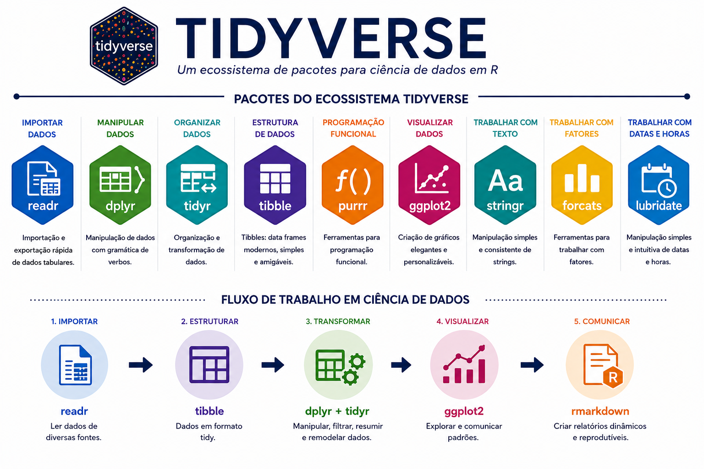
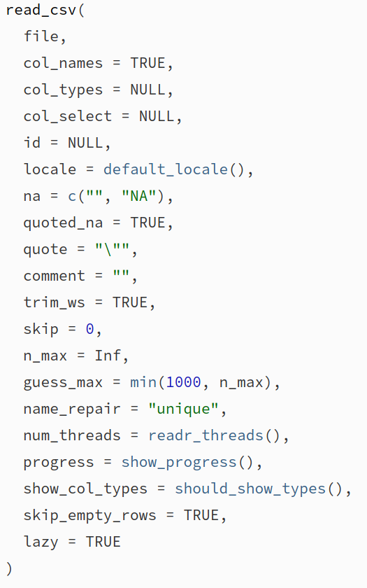
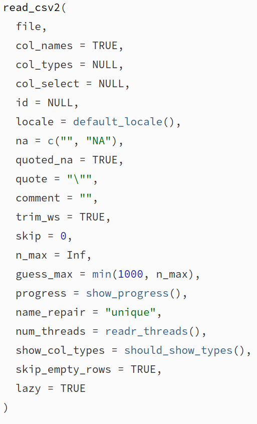
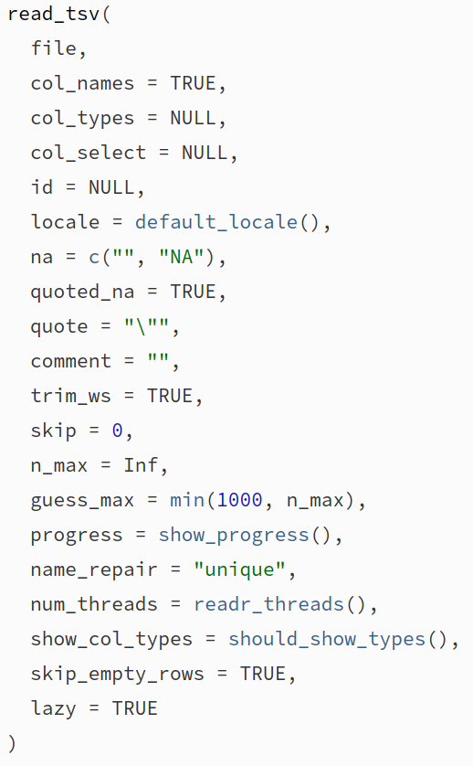
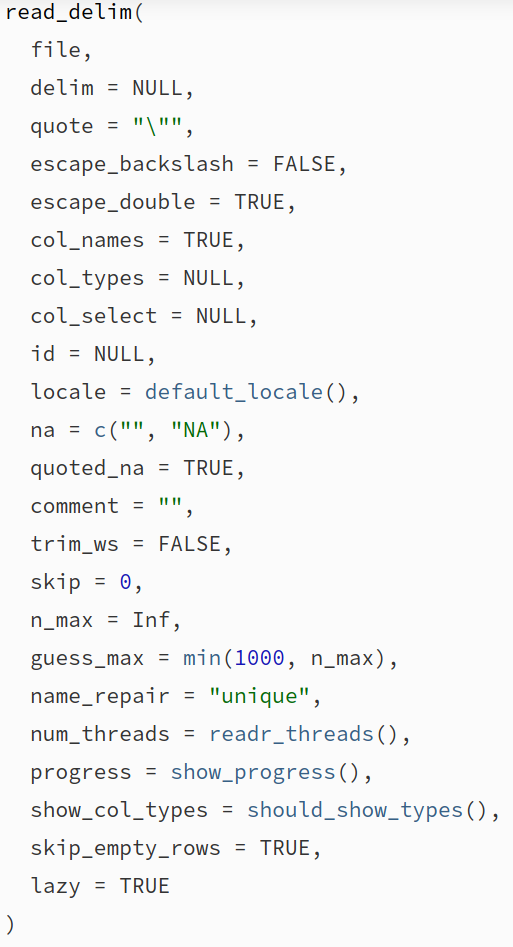

class: title-slide, center, middle
background-image: url(../assets/capa/capa.png)
background-position: center
background-size: cover
background-repeat: no-repeat

<div class="logo-lmftca"></div>
<div class="logo-ppgctif"></div>
<div class="logo-ppgbc"></div>

```{r setup, include=FALSE}
knitr::opts_chunk$set(
	error = FALSE,
	fig.align = "center",
	fig.showtext = TRUE,
	message = FALSE,
	warning = FALSE,
	cache = FALSE,
	collapse = TRUE,
	dpi = 600
)
```

```{r packages, include=FALSE}
library(readr)
```

```{r xaringan-logo, echo=FALSE}
library(xaringanExtra)

use_scribble()
use_share_again()
use_progress_bar()

use_extra_styles(
  hover_code_line = TRUE,
  mute_unhighlighted_code = TRUE
)

use_editable(expires = 1)
use_clipboard()
```

```{r icon, echo=FALSE}
# remotes::install_github("dill/emoGG")
# remotes::install_github("mitchelloharawild/icons")
# remotes::install_github('emitanaka/anicon')
# (icons)
# download_fontawesome()
# download_simple_icons()
```

<!-- title-slide -->
# Estatística Computacional com R <br> (PPGBC/UFPA e PPGCTIF/UFOPA)

## ᨒ <br> `r anicon::faa("pagelines", animate="horizontal", colour="green")` .font90[Importação e Exportação de Dados]`r anicon::faa("pagelines", animate="horizontal", colour="green")`
###### (Pacote readr)

##### 〰〰〰〰〰〰🌱〰〰〰〰〰〰
##### ᨒ
##### .font120[**Prof. Dr. Deivison Venicio Souza**]
##### Universidade Federal do Pará (UFPA)
##### Faculdade de Engenharia Florestal
##### Laboratório de Manejo Florestal, Tecnologias e Comunidades Amazônicas
##### E-mail: deivisonvs@ufpa.br
<br>
##### 1ª versão: 14/outubro/2022 <br> (Atualizado em: `r format(Sys.Date(),"%d/%B/%Y")`)

---

layout: true
class: with-logo logo-lmftca-fixed
<div class="my-header"></div>
<div class="my-footer"><span>Prof. Dr. Deivison Venicio Souza (E-mail: deivisonvs@ufpa.br)&emsp;&emsp;&emsp;&emsp;&emsp; <div3>Estatística Computacional com R</div3>/ <div2>Introdução ao Tidyverse (Módulo 2)</div2> </div>

---

## Objetivos

<br>

Esta aula (.blue[**Introdução ao Tidyverse: readr**]) constitui a primeira parte do **Módulo 2**, dedicado ao estudo de alguns dos principais pacotes do ecossistema **Tidyverse**.

<br>

Ao final desta aula, espera-se que os participantes sejam capazes de:

- Compreender a organização do ecossistema **Tidyverse**;
- Utilizar o pacote .orange[**readr**] para importar e exportar arquivos de texto;
- Importar planilhas do Microsoft Excel utilizando o pacote .orange[**readxl**];
- Exportar objetos do R para planilhas do Microsoft Excel utilizando o pacote .orange[**writexl**]; e
- Selecionar o pacote e a função mais adequados para cada formato de arquivo.


---

## Pacotes abordados

<br><br>

<div style="display:flex; justify-content:center; align-items:center; gap:35px; margin-top:40px;">
  
  
  
  
</div>

---

## Conteúdo

.pull-left-9[
.font90[
**Parte 1 - Importação e exportação de dados com .orange[readr]**

[1 - Importação de dados no R](#import)

[2 - O pacote readr](#fie)

&nbsp;&nbsp;&nbsp;&nbsp;[2.1 - Funções de importação e exportação](#fie)

[3 - Importação de dados usando o readr](#idur)

&nbsp;&nbsp;&nbsp;&nbsp;[3.1 - Arquivo de valores separados por vírgula](#csv)

&nbsp;&nbsp;&nbsp;&nbsp;[3.2 - Arquivo de valores separados por ponto e vírgula](#csv2)

&nbsp;&nbsp;&nbsp;&nbsp;[3.3 - Arquivo de valores separados por tabulação](#tsv)

&nbsp;&nbsp;&nbsp;&nbsp;[3.4 - Arquivo de valores separados por um delimitador incomum](#delim)

[4 - Importação de dados usando a GUI do Rstudio](#importdata)

]
]

---

layout: false
class: inverse, top, right
background-image: url(../assets/capa/sec.png)
background-size: cover

<br>

.right[
.font100[
**.green[Módulo 2]** – Introdução ao Tidyverse
]
]

<br><br>

.right[
.font150[
**.green[Parte 1]** <br>
Importação e Exportação de Dados
]
]

<br><br>

.right[
.font180[
**Conhecendo o Tidyverse**
]
]

---

layout: true
class: with-logo logo-ufpa
<div class="my-header"></div>
<div class="my-footer"><span>Prof. Dr. Deivison Venicio Souza (E-mail: deivisonvs@ufpa.br)&emsp;&emsp;&emsp;&emsp;&emsp; <div3>Estatística Computacional com R</div3>/ <div2>Introdução ao Tidyverse (Módulo 2)</div2> </div>

---

## Módulo 2 — Introdução ao Tidyverse

<br>

Após aprendermos os fundamentos da linguagem R, iniciaremos o estudo do ecossistema .orange[**Tidyverse**].

<br>

.center[
.font120[
**Uma coleção de pacotes para ciência de dados em R**
]
]

<br>

O Tidyverse fornece ferramentas para:

- 📥 Importação de dados;
- 🔧 Manipulação e transformação de dados;
- 📊 Visualização de dados;
- 📝 Comunicação de resultados; e
- ⚙️ Programação funcional.

---

## Tidyverse: coleção de pacotes R
<br>

```{r echo=FALSE, out.width='60%', fig.align='center', fig.cap='', dpi=600}

```

.center[
.font65[
**Fonte**: Elaborado com auxílio do ChatGPT (OpenAI), com base na documentação oficial do Tidyverse.
]
]

---
name: import
## Importação de Dados no R

<br>

.font100[
- A importação de dados é uma das primeiras etapas de qualquer fluxo de análise.
- Os dados podem estar armazenados em:
  - arquivos locais;
  - servidores remotos;
  - bancos de dados; ou
  - serviços web.
- O método de importação depende da origem e do formato dos dados.
]

<br>

.center[
.font110[
**Exemplos de formatos:** .csv, .txt, .tsv, .xlsx, .ods, SAS e SPSS.
]
]

---

## Importação de Dados: R Base × Tidyverse

<br>

.font95[
O R-base disponibiliza funções do Pacote .orange[**utils**] como:

- .green[**read.csv()**]
- .green[**read.delim()**]
- .green[**read.table()**]

]

<br>

.font95[
O ecossistema .orange[**tidyverse**] incorpora o pacote
.orange[**readr**], que oferece:

- maior velocidade de leitura;
- mensagens mais informativas;
- melhor integração com os demais pacotes do Tidyverse.
]

---
name: readr
## O pacote readr

<br>

.font95[
- O pacote .orange[**readr**] faz parte do ecossistema .orange[**tidyverse**].
- Foi desenvolvido para facilitar a **leitura** e a **escrita** de **arquivos tabulares**.
- Possui funções específicas para diferentes formatos de dados.
]

<br>

.center[
.font120[
.alert2[**Importar**] → Manipular → Visualizar → Comunicar
]
]

<br>

.center[
.font110[
Nesta aula utilizaremos o pacote .orange[**readr**] para .blue[importação] e .blue[exportação] de dados.
]
]

---
name: install
## Instalando e carregando pacotes

<br>

Os pacotes do .orange[**Tidyverse**] podem ser instalados de duas formas:

<br>

.pull-left-4[

### Instalar todo o Tidyverse

.font90[

```{r, eval=FALSE}
# Instala todos os pacote do "tidyverse"
install.packages("tidyverse")

# Carrega todos os pacote do "tidyverse"
library(tidyverse)
```

<br>

.alert[
💡 Instale o pacote apenas uma vez. Em cada nova sessão do R, utilize .green[library()] para carregá-lo.
]

]
]

.pull-right-4[

### Instalar pacotes específicos

.font90[
```{r, eval=FALSE}
# Instala o "readr" e "tibble"
install.packages(c("readr", "tibble"))

# Carrega o "readr" e "tibble"
library(readr)
library(tibble)
```

]
]

---

layout: false
class: inverse, top, right
background-image: url(../assets/capa/sec.png)
background-size: cover

<br>

.right[
.font100[
**.green[Módulo 2]** – Introdução ao Tidyverse
]
]

<br><br>

.right[
.font150[
**.green[Parte 1]** <br>
Importação e Exportação de Dados
]
]

<br><br>

.right[
.font180[
**Conhecendo o readr**: <br>
.green[Exportação de Dados]
]
]

---

layout: true
class: with-logo logo-ufpa
<div class="my-header"></div>
<div class="my-footer"><span>Prof. Dr. Deivison Venicio Souza (E-mail: deivisonvs@ufpa.br)&emsp;&emsp;&emsp;&emsp;&emsp; <div3>Estatística Computacional com R</div3>/ <div2>Introdução ao Tidyverse (Módulo 2)</div2> </div>

---
name: fie
## Pacote readr (tidyverse)
<br>

### Funções de importação e exportação

.font80[
- O pacote .orange[**readr**] disponibiliza diversas funções para .blue[importação] e .blue[exportação] de dados.
]
<br>

.pull-left-4[
**Funções para importação de dados**
.font80[
```{r echo=T, eval=T}
ls("package:readr") |> 
  stringr::str_subset("^read_")
```
]
]

.pull-right-4[
**Funções para exportação de dados**
.font80[
```{r echo=T, eval=T}
ls("package:readr") |> 
  stringr::str_subset("^write_")
```
]
]

---
name: export
## Exportação de Dados

<br>

.center[
.font130[
.alert2[**Objetos do R** → .blue[**Arquivos**]]
]
]

<br>

.font95[
A **exportação** consiste em **gravar um objeto do R** em um **arquivo armazenado no disco**.

Após a exportação, esse arquivo poderá ser utilizado para:

- Compartilhar dados com outros usuários;
- Abrir os dados em diferentes softwares; ou
- Importar os dados novamente para o R.
]

<br>

.alert[
💡 Nesta aula, criaremos arquivos na pasta .blue[data/] utilizando as funções .green[write_*()].
]

---
name: write_csv
## Função write_csv()

<br>

### Arquivos separados por vírgula .black[(].blue[,].black[)]

.pull-left-4[

<br>

.font90[
- A função .green[**write_csv()**] é utilizada para exportar objetos do R no formato .blue[CSV].
- CSV significa *Comma-Separated Values*.
- Nesse formato, os campos são separados por .blue[vírgulas (,)].
]

<br>

.alert[
💡 O arquivo será gravado na pasta .blue[data/] do projeto.
]

]

.pull-right-4[

```{r echo=FALSE, out.width='70%', fig.align='center',fig.cap='', dpi=600}
knitr::include_graphics("fig/file1.png")
```

]

---
name: write_csv_ex
## Exportando um arquivo CSV

<br>

.pull-left-4[

.font90[
A função .green[**write_csv()**] do pacote .orange[**readr**] possui dois argumentos principais:

- .blue[x]: objeto do R a ser exportado;
- .blue[file]: caminho do arquivo a ser criado.
]

<br>

.font75[

```{r echo=TRUE, eval=FALSE}
library(tibble)
library(readr)

arvores <- tibble(
  Nome = c("Angelim", "Mogno"),
  DAP  = c(100.5, 80.2),
  H    = c(30.8, 20.4)
)

write_csv(
  x    = arvores,
  file = "data/arvores.csv"
)
```

]
]

.pull-right-4[

```{r echo=FALSE, out.width='50%', fig.align='center',fig.cap='', dpi=600}
knitr::include_graphics("fig/file1.png")
```

<br>

.alert[
💡 Uma **tibble** é uma versão **moderna** do **data frame** utilizada pelo Tidyverse.
]

]

---
name: write_csv2
## Função write_csv2()

<br>

### Arquivos separados por ponto e vírgula .black[(].blue[;].black[)]

.pull-left-4[

<br>

.font90[
- A função .green[**write_csv2()**] é utilizada para exportar objetos do R no formato .blue[CSV europeu].
- Nesse formato, os campos são separados por .blue[ponto e vírgula (;)].
- Os valores decimais utilizam .blue[vírgula (,)].
]

<br>

.alert[
💡 Formato amplamente usado em países que utilizam a vírgula como separador decimal.
]

]

.pull-right-4[

```{r echo=FALSE, out.width='65%', fig.align='center',fig.cap='', dpi=600}
knitr::include_graphics("fig/file2.png")
```

]

---
name: write_csv2_ex
## Exportando um arquivo CSV europeu

<br>

.pull-left-4[

.font90[
A função .green[**write_csv2()**] possui os mesmos argumentos da função .green[**write_csv()**]:

- .blue[x]: objeto do R a ser exportado;
- .blue[file]: caminho do arquivo a ser criado.
]

<br>

.font75[

```{r echo=TRUE, eval=FALSE}

arvores <- tibble(
  Nome = c("Angelim", "Mogno"),
  DAP  = c(100.5, 80.2),
  H    = c(30.8, 20.4)
)

write_csv2(
  x    = arvores,
  file = "data/arvores2.csv"
)
```

]
]


.pull-right-4[

```{r echo=FALSE, out.width='50%', fig.align='center',fig.cap='', dpi=600}
knitr::include_graphics("fig/file2.png")
```

<br>

.alert[
💡 No Brasil, é comum utilizar .blue[vírgula (,)] como separador decimal. Por isso, arquivos CSV nesse padrão usam .blue[ponto e vírgula (;)] como delimitador.
]

]

---
name: write_tsv
## Exportando um arquivo TSV

<br>

.pull-left-4[

.font90[
A função .green[**write_tsv()**] do pacote .orange[**readr**] possui os mesmos argumentos das funções anteriores:

- .blue[x]: objeto do R a ser exportado;
- .blue[file]: caminho do arquivo a ser criado.
]

<br>

.font75[

```{r echo=TRUE, eval=FALSE}
arvores <- tibble(
  Nome = c("Angelim", "Mogno"),
  DAP  = c(100.5, 80.2),
  H    = c(30.8, 20.4)
)

write_tsv(
  x    = arvores,
  file = "data/arvores3.tsv"
)
```

]
]


.pull-right-4[

```{r echo=FALSE, out.width='50%', fig.align='center', fig.cap='', dpi=600}
knitr::include_graphics("fig/file3.png")
```
<br>

.alert[
💡 Nos arquivos .blue[TSV], os campos são separados pelo caractere de .blue[tabulação (TAB)].
]

]

---
name: compare_write
## Comparando os formatos de exportação

<br>

.font95[
Até o momento, estudamos três funções para exportação de dados utilizando o pacote .orange[**readr**].
]

<br>

| Função | Extensão | Delimitador | Decimal |
|:--------|:--------:|:-----------:|:--------:|
| .green[**write_csv()**]  | .blue[.csv] | **`,`** | **`.`** |
| .green[**write_csv2()**] | .blue[.csv] | **`;`** | **`,`** |
| .green[**write_tsv()**]  | .blue[.tsv] | **TAB** | **`.`** |

<br>

.alert[
💡 A principal diferença está no **delimitador** e no **separador decimal**.
]

---
name: write_delim
## Exportando um arquivo com delimitador personalizado

<br>

.pull-left-4[

.font90[
A função .green[**write_delim()**] permite exportar arquivos utilizando um **delimitador definido pelo usuário**.

Além dos argumentos .blue[x] e .blue[file], essa função possui o argumento:

- .blue[delim]: caractere utilizado para separar os campos.
]

<br>

.font75[

```{r echo=TRUE, eval=FALSE}
arvores <- tibble(
  Nome = c("Angelim", "Mogno"),
  DAP  = c(100.5, 80.2),
  H    = c(30.8, 20.4)
)

write_delim(
  x     = arvores,
  file  = "data/arvores4.txt",
  delim = "|"
)
```

]
]

.pull-right-4[

```{r echo=FALSE, out.width='50%', fig.align='center', fig.cap='', dpi=600}
knitr::include_graphics("fig/file4.png")
```

<br>

.alert[
💡 A função .green[write_delim()] permite utilizar qualquer caractere como delimitador.
]
]

---
name: write_xlsx
## Exportando uma planilha Excel

<br>

.pull-left-4[

.font90[
💡 Planilhas do Microsoft Excel (.xlsx) podem ser exportadas com a função .green[write_xlsx()] do pacote .orange[writexl].

A função possui dois argumentos principais:

- .blue[x]: objeto do R a ser exportado;
- .blue[path]: caminho da planilha a ser criada.
]

.font75[

```{r echo=TRUE, eval=FALSE}
library(tibble)
library(writexl)

arvores <- tibble(
  Nome = c("Angelim", "Mogno"),
  DAP  = c(100.5, 80.2),
  H    = c(30.8, 20.4)
)

write_xlsx(
  x    = arvores,
  path = "data/arvores.xlsx"
)
```

]

]

.pull-right-4[

```{r echo=FALSE, out.width='90%', fig.align='center', fig.cap='', dpi=600}
knitr::include_graphics("fig/file5.png")
```

<br>

.alert[
💡 A exportação para arquivos .blue[.xlsx] é realizada pelo pacote .orange[**writexl**].
]

]

---
name: export_summary
## Resumo das funções de exportação

<br>

.font95[
Até o momento, estudamos as principais funções para exportação de dados em R.
]

<br>

| Função | Tipo de arquivo | Extensão | Pacote |
|:--------|:---------------:|:--------:|:-------:|
| .green[**write_csv()**] | Texto | .blue[.csv] | .orange[readr] |
| .green[**write_csv2()**] | Texto | .blue[.csv] | .orange[readr] |
| .green[**write_tsv()**] | Texto | .blue[.tsv] | .orange[readr] |
| .green[**write_delim()**] | Texto | .blue[.txt] | .orange[readr] |
| .green[**write_xlsx()**] | Planilha Excel | .blue[.xlsx] | .orange[writexl] |

<br>

.alert[
💡 Para arquivos de texto use .orange[**readr**]. Planilhas Excel use .orange[**writexl**].
]

---

layout: false
class: inverse, top, right
background-image: url(../assets/capa/sec.png)
background-size: cover

<br>

.right[
.font100[
**.green[Módulo 2]** – Introdução ao Tidyverse
]
]

<br><br>

.right[
.font150[
**.green[Parte 1]** <br>
Importação e Exportação de Dados
]
]

<br><br>

.right[
.font180[
**Conhecendo o readr**: <br>
.green[Importação de Dados]
]
]

---

layout: true
class: with-logo logo-ufpa
<div class="my-header"></div>
<div class="my-footer"><span>Prof. Dr. Deivison Venicio Souza (E-mail: deivisonvs@ufpa.br)&emsp;&emsp;&emsp;&emsp;&emsp; <div3>Estatística Computacional com R</div3>/ <div2>Introdução ao Tidyverse (Módulo 2)</div2> </div>

---
name: idur
## Principais funções de importação

<br>

.font95[
Nesta aula estudaremos apenas algumas das principais funções do pacote .orange[**readr**].
]

<br>

| Função | Significado | Uso |
|---------|---------|---------|
| .green[**read_csv()**] | *Comma-Separated Values* | Arquivos separados por .blue[vírgula (,)] |
| .green[**read_csv2()**] | *Semicolon-Separated Values* | Arquivos separados por .blue[ponto e vírgula (;)] |
| .green[**read_tsv()**] | *Tab-Separated Values* | Arquivos separados por .blue[tabulação (TAB)] |
| .green[**read_delim()**] | *Delimited File* | Arquivos separados por um .blue[delimitador personalizado] |

---
name: csv
## Função read_csv()

<br>

### Arquivos separados por vírgula .black[(].blue[,].black[)]

.pull-left-4[

<br>

.font90[
- A função .green[**read_csv()**] é utilizada para importar arquivos no formato .blue[CSV].
- CSV significa *Comma-Separated Values*.
- Nesse formato, os campos são separados por .blue[vírgulas (,)].
]

<br>

.alert[
💡 Arquivos CSV são amplamente utilizados para armazenar e compartilhar dados tabulares.
]
]

.pull-right-4[

```{r echo=FALSE, out.width='70%', fig.align='center', fig.cap='', dpi=600}
knitr::include_graphics("fig/file1.png")
```
]

---
name: csv-import
## Importando arquivos CSV

### Função .green[read_csv()]

.pull-left-4[

.font90[
Primeiro, vamos criar o arquivo .blue[file1.csv] e salvá-lo na pasta .blue[data/].
]

.font75[
```{r echo=TRUE, eval=FALSE}
readr::write_file(x = "Nome,DAP,H\nAngelim,100,30\nMogno,80,20",
                  file = "data/file1.csv")
```
]

<br>

.alert[
💡 Em aplicações reais, os arquivos geralmente já existem e são produzidos por planilhas, bancos de dados ou sistemas externos.
]

]


---
name: csv
## Pacote readr (tidyverse)
<br>

### Arquivo de valores separados por vírgula .black[(].blue[,].black[)]

- **Função .black[read_csv()]** - Importar arquivos .csv

.pull-left-9[

```{r echo=FALSE, out.width='30%', fig.align='center', fig.cap='', dpi=600}
knitr::include_graphics("fig/file1.png")
```

.font80[
```{r echo=T, eval=F}
# Cria o arquivo "file1.csv" e salva em "data"
readr::write_file(x = "Nome,DAP,H\nAngelim,100,30\nMogno,80,20",
                  path = "data/file1.csv")
```
]
]

--

.pull-right-9[
.font80[
**O único argumento obrigatório (file) é o caminho para o arquivo.**

```{r file1, echo=T, eval=F}
# Importa o arquivo "file1"
(file1 <- readr::read_csv(file="data/file1.csv"))
```

```{r ref.label="file1", echo=F, eval=T, collapse=T}
```
]

]

---

## Pacote readr (tidyverse)
<br>

.pull-left-4[
.font80[
### Arquivo de valores separados por vírgula .black[(].blue[,].black[)]

- **Função .black[read_csv()]** - Importar arquivos .csv

A função possui inúmeros argumentos que podem ser especificados.

Execute o comando: **args(**read_csv**)**
]
]


.pull-right-4[
```{r echo=FALSE, out.width='55%', fig.align='center', fig.cap='', dpi=600}

```
]

---

## Pacote readr (tidyverse)
<br>

### Arquivo de valores separados por vírgula .black[(].blue[,].black[)]

- **Função .black[read_csv()]** - Importar arquivos .csv
.font80[
Vamos explorar outros argumentos da função read_csv()...(.green[**col_types**])
]

.pull-left-4[
.font80[
```{r file5, echo=T, eval=F}
# Importa o arquivo "file1"
(file1 <- readr::read_csv(file="data/file1.csv"))
```

```{r ref.label="file5", echo=F, eval=T, collapse=T}
```

**col_types** = É possível usar strings compactas em que cada caractere representa uma coluna.

**c** = character; **i** = integer; **n** = number; **d** = double; **l** = logical; **f** = factor; **D** = date

]
]


--

.pull-right-4[
.font80[
```{r file6, echo=T, eval=F}
# Importa o arquivo "file1"
(file1.mod2 <- readr::read_csv(file="data/file1.csv", 
                          col_types = "fdi")
 )
```

```{r ref.label="file6", echo=F, eval=T, collapse=T}
```
]
]


---

## Pacote readr (tidyverse)
<br>

### Arquivo de valores separados por vírgula .black[(].blue[,].black[)]

- **Função .black[read_csv()]** - Importar arquivos .csv
.font80[
Vamos explorar outros argumentos da função read_csv()...(.green[**col_select**])
]

.pull-left-4[
.font80[
```{r file7, echo=T, eval=F}
# Importa o arquivo "file1"
(file1 <- readr::read_csv(file="data/file1.csv"))
```

```{r ref.label="file7", echo=F, eval=T, collapse=T}
```
]
]

--

.pull-right-4[
.font80[
```{r file8, echo=T, eval=F}
# Importa o arquivo "file1"
(file1.mod3 <- readr::read_csv(
  file = "data/file1.csv", 
  col_select = c(Nome, DAP)
  )
 )
```
```{r ref.label="file8", echo=F, eval=T, collapse=T}
```
]
]

---
name: csv2
## Pacote readr (tidyverse)
<br>

### Arquivo de valores separados por ponto e vírgula .black[(].blue[;].black[)]

- **Função .black[read_csv2()]**
.font80[
Os arquivo separados por ponto e vírgula também têm a extensão .blue[.csv].
]

.pull-left-9[

```{r echo=FALSE, out.width='30%', fig.align='center', fig.cap='', dpi=600}
knitr::include_graphics("fig/file2.png")
```

.font80[
```{r echo=T, eval=F}
# Cria o arquivo "file2.csv" e salva em "data"
readr::write_file(x = "Nome;DAP;H\nAngelim;100;30\nMogno;80;20",
                  path = "data/file2.csv")
```
]
]

--

.pull-right-9[
.font80[
**O único argumento obrigatório (file) é o caminho para o arquivo.**

```{r filecsv2, echo=T, eval=F}
# Importa o arquivo "file2"
(file2 <- readr::read_csv2(file="data/file2.csv"))
```

```{r ref.label="filecsv2", echo=F, eval=T, collapse=T}
```
]

]

---

## Pacote readr (tidyverse)

.pull-left-4[
.font80[
### Arquivo de valores separados por ponto e vírgula .black[(].blue[;].black[)]
<br><br>

- **Função .black[read_csv2()]**

A função possui inúmeros argumentos que podem ser especificados.

Execute o comando: **args(**read_csv2**)**
<br><br>

`r anicon::faa("hand-point-right", animate="horizontal")` **Explore os demais argumentos!** `r anicon::faa("home", animate="horizontal")`

]
]

.pull-right-4[
```{r echo=FALSE, out.width='55%', fig.align='center', fig.cap='', dpi=600}

```
]


---
name: tsv
## Pacote readr (tidyverse)
<br>

### Arquivo de valores separados por tabulação .black[(].blue[\t].black[)]

- **Função .black[read_tsv()]** - Importar arquivos (.tsv, .txt)

.pull-left-9[

```{r echo=FALSE, out.width='30%', fig.align='center', fig.cap='', dpi=600}
knitr::include_graphics("fig/file3.png")
```

.font80[
```{r echo=T, eval=F}
# Cria o arquivo "file3.tsv" e salva em "data"
readr::write_file(x = "Nome\tDAP\tH\nAngelim\t100\t30\nMogno\t80\t20",
                  path = "data/file3.txt")
```
]
]

--

.pull-right-9[
.font80[
**O único argumento obrigatório (file) é o caminho para o arquivo.**

```{r filetsv, echo=T, eval=F}
# Importa o arquivo "file3"
(file3 <- readr::read_tsv(file="data/file3.txt"))
```

```{r ref.label="filetsv", echo=F, eval=T, collapse=T}
```
]

]

---

## Pacote readr (tidyverse)

.pull-left-4[
.font80[
### Arquivo de valores separados por tabulação .black[(].blue[\t].black[)]
<br><br>

- **Função .black[read_tsv()]** - Importar arquivos (.tsv, .txt)

A função possui inúmeros argumentos que podem ser especificados.

Execute o comando: **args(**read_tsv**)**
<br><br>

`r anicon::faa("hand-point-right", animate="horizontal")` **Explore os demais argumentos!** `r anicon::faa("home", animate="horizontal")`

]
]

.pull-right-4[
```{r echo=FALSE, out.width='55%', fig.align='center', fig.cap='', dpi=600}

```
]


---
name: delim
## Pacote readr (tidyverse)
<br>

### Arquivo de valores separados por um delimitador incomum

- **Função .black[read_delim()]** - Importar arquivos com delimitator de valores específicos

.pull-left-9[

```{r echo=FALSE, out.width='30%', fig.align='center', fig.cap='', dpi=600}
knitr::include_graphics("fig/file4.png")
```

.font80[
```{r echo=T, eval=F}
# Cria o arquivo "file4.txt" e salva em "data"
readr::write_file(x = "Nome|DAP|H\nAngelim|100|30\nMogno|80|20",
                  path = "data/file4.txt")
```
]
]

--

.pull-right-9[
.font80[
**O único argumento obrigatório (file) é o caminho para o arquivo.**

```{r filedelim, echo=T, eval=F}
# Importa o arquivo "file4"
(file4 <- readr::read_delim(
  file="data/file4.txt", 
  delim = "|")
 )
```

```{r ref.label="filedelim", echo=F, eval=T, collapse=T}
```
]

]

---

## Pacote readr (tidyverse)

.pull-left-4[
.font80[
### Arquivo de valores separados por um delimitador incomum
<br><br>

- **Função .black[read_delim()]** - Importar arquivos com delimitator de valores específicos

A função possui inúmeros argumentos que podem ser especificados.

Execute o comando: **args(**read_delim**)**
<br><br>

`r anicon::faa("hand-point-right", animate="horizontal")` **Explore os demais argumentos!** `r anicon::faa("home", animate="horizontal")`

]
]

.pull-right-4[
```{r echo=FALSE, out.width='55%', fig.align='center', fig.cap='', dpi=600}

```
]


---
name: importdata
## Pacote readr (tidyverse)
<br>

### Importação de dados usando a GUI do RStudio
<br><br>

.font90[
- Use a Interface Gráfica do Usuário (*Graphical User Interface* - GUI) para importar dados rapidamente.
- RStudio IDE $\rightarrow$ Environment $\rightarrow$ .blue[Import Dataset] $\rightarrow$ From Text (readr).
- É possível também usar funções do R-base e de outros pacotes, como **readxl** (para ler arquivos .blue[.xlsx]).

]

---
layout: false
name: etim
class: inverse, middle, center
background-image: url(../assets/capa/sec.png)
background-size: cover

## .font200[Obrigado!]

```{r, echo=FALSE, out.width='20%', fig.align='center', fig.cap='', dpi=600}
knitr::include_graphics('../assets/logos/LMFTCA.png')
```

👨🏻‍👩🏻‍👦🏻‍👦🏻 [@lmftca_ufpa](https://www.instagram.com/lmftca_ufpa/)

🌎 [https://www.lmftca.com.br/](https://www.lmftca.com.br/)
