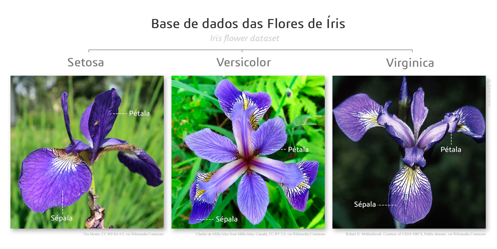
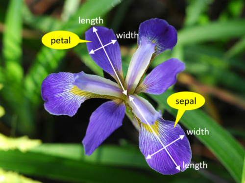

class: title-slide, center, middle
background-image: url(../assets/capa/capa.png)
background-position: center
background-size: cover
background-repeat: no-repeat

<div class="logo-lmftca"></div>
<div class="logo-ppgctif"></div>
<div class="logo-ppgbc"></div>

```{r setup, include=FALSE}
knitr::opts_chunk$set(
	error = FALSE,
	fig.align = "center",
	fig.showtext = TRUE,
	message = FALSE,
	warning = FALSE,
	cache = FALSE,
	collapse = TRUE,
	dpi = 600
)
```

```{r packages, include=FALSE}
library(readr)
library(dplyr)
library(ggplot2)
library(summarytools)
```

```{r xaringan-logo, echo=FALSE}
library(xaringanExtra)

use_scribble()
use_share_again()
use_progress_bar()

use_extra_styles(
  hover_code_line = TRUE,
  mute_unhighlighted_code = TRUE
)

# use_editable(expires = 1)
# use_clipboard()
```

```{r icon, echo=FALSE}
# remotes::install_github("dill/emoGG")
# remotes::install_github("mitchelloharawild/icons")
# remotes::install_github('emitanaka/anicon')
# (icons)
# download_fontawesome()
# download_simple_icons()
```

<!-- title-slide -->
# Estatística Computacional com R <br> (PPGBC/UFPA e PPGCTIF/UFOPA)

## ᨒ <br> `r anicon::faa("pagelines", animate="horizontal", colour="green")` .font80[Análise Exploratória de Dados no R]`r anicon::faa("pagelines", animate="horizontal", colour="green")`
###### (Pacotes: Tidyverse, summarytools)

##### 〰〰〰〰〰〰🌱〰〰〰〰〰〰
##### ᨒ
##### .font120[**Prof. Dr. Deivison Venicio Souza**]
##### Universidade Federal do Pará (UFPA)
##### Faculdade de Engenharia Florestal
##### Laboratório de Manejo Florestal, Tecnologias e Comunidades Amazônicas
##### E-mail: deivisonvs@ufpa.br
<br>
##### 1ª versão: 14/outubro/2022 <br> (Atualizado em: `r format(Sys.Date(),"%d/%B/%Y")`)

---

layout: true
class: with-logo logo-lmftca-fixed
<div class="my-header"></div>
<div class="my-footer">
<span>
Prof. Dr. Deivison Venicio Souza (deivisonvs@ufpa.br)
&emsp;&emsp;
<div2>Estatística Computacional com R</div2>
&bull;
<div3>Análise Exploratória de Dados (Módulo 3)</div3>
&bull;
<div4>Iris Dataset</div4>
</span>
</div>

---

## Objetivos
<br><br>
Ao final desta aula (.blue[Análise Exploratória de Dados]) espera-se que o discente seja capaz de...

* Recordar terminologias e conceitos básicos de estatística;
* Aprender a realizar uma análise exploratória de dados usando a linguagem R.

---

## Conteúdo

.pull-right-2[
.pull-down[
**AED - Iris Flower**

[1 - AED: Iris Flower](#iris)

[2 - Atividade prática](#ap)

]
]

---
layout: false
class: inverse, top, right
background-image: url(../assets/capa/sec.png)
background-size: cover

<br><br><br>

.right[
.font150[
**.green[Módulo 3]** <br>
Análise Exploratória de Dados
]
]

<br><br>

.right[
.font150[
**.green[Parte 1]** <br>
Dataset Iris Flower
]
]

<br>

.right[
.font120[
**Fisher (1936)**
]
]

---

layout: true
class: with-logo logo-lmftca-fixed
<div class="my-header"></div>
<div class="my-footer">
<span>
Prof. Dr. Deivison Venicio Souza (deivisonvs@ufpa.br)
&emsp;&emsp;
<div2>Estatística Computacional com R</div2>
&bull;
<div3>Análise Exploratória de Dados (Módulo 3)</div3>
&bull;
<div4>Iris Dataset</div4>
</span>
</div>

---

## Iris Flower Dataset

<br>

O conjunto de dados **Iris Flower** está disponível no **R** (objeto `iris`) e em diversos repositórios públicos, como o **UCI Machine Learning Repository**.

.alert2[
### .brown[Características do conjunto de dados]

- O conjunto de dados foi utilizado por **Ronald A. Fisher** no artigo *The Use of Multiple Measurements in Taxonomic Problems* (1936).
- **150 observações** (flores)
- **3 espécies** (*Setosa*, *Versicolor* e *Virginica*), com **50 observações** de cada espécie
- **5 variáveis**:
  - 4 quantitativas: `Sepal.Length`, `Sepal.Width`, `Petal.Length` e `Petal.Width`
  - 1 qualitativa: `Species`
]

---

## Iris Flower Dataset

```{r, echo=FALSE, out.width='70%', fig.align='center', fig.cap=''}

```

.center[
.font70[
[pt.wikipedia.org](https://pt.wikipedia.org/wiki/Conjunto_de_dados_flor_Iris)
]
]

<br>

.center[
.alert2[
**Quais características morfológicas permitem distinguir essas três espécies?**
]
]

---

## Iris Flower Dataset

<br>

```{r, echo=FALSE, out.width='45%', fig.align='center', fig.cap=''}

```

.center[.font70[**Fonte**: [https://www.integratedots.com](https://www.integratedots.com/determine-number-of-iris-species-with-k-means/)]]

---
layout: false
class: inverse, top, right
background-image: url(../assets/capa/sec.png)
background-size: cover

<br>

.right[
.font100[
**.green[Módulo 3]** - Análise Exploratória de Dados
]
]

<br><br>

.right[
.font150[
**.green[Parte 2]** <br>
AED: Iris Dataset
]
]

<br><br>

.right[
.font180[
**Usando Tidyverse**
]
]

---

layout: true
class: with-logo logo-lmftca-fixed
<div class="my-header"></div>
<div class="my-footer">
<span>
Prof. Dr. Deivison Venicio Souza (deivisonvs@ufpa.br)
&emsp;&emsp;
<div2>Estatística Computacional com R</div2>
&bull;
<div3>Análise Exploratória de Dados (Módulo 3)</div3>
&bull;
<div4>AED com Tidyverse</div4>
</span>
</div>

---

## Organização do Projeto

<br>

Antes de iniciar a análise exploratória, organize o projeto conforme a estrutura abaixo.

.pull-left[
```text
📁 Projeto
├── 📄 README.md
├── 📄 renv.lock
├── 📂 data
│   └── 📄 Iris.csv
├── 📂 script
│   └── 📜 01-AED.R
├── 📂 output
│   ├── 📂 figure
│   ├── 📂 table
│   └── 📂 report
└── Ⓡ Projeto.Rproj
```
]

.pull-right[
.font90[

📄 iris.csv

Conjunto de dados utilizado na análise.
Armazene-o na pasta **data/**.

<br>

📜 01-AED.R

Script onde será desenvolvida toda a análise exploratória.

<br>

Ⓡ Projeto.Rproj

Abra o projeto para utilizar caminhos relativos.

]
]

---

## Fluxo de Trabalho da Análise Exploratória de Dados

<br>

```{r, echo=FALSE, out.width='45%', fig.align='center', fig.cap=''}
#knitr::include_graphics('fig/fluxo.png')
```

.center[
.font70[**Fonte**:
]
]

---
name: import
## AED: Iris Flower Dataset

<br>

.font95[
**Passo 1 (Importação):**: Importar o arquivo **Iris.csv** armazenado na pasta **data/** do projeto.
]

<br>

```{r import, echo=TRUE, eval=TRUE}
library(readr)

data <- read_csv(
  file = "data/Iris.csv",
  col_types = "ddddf"
)
```

<br>

.alert2[
💡 O argumento `col_types = "ddddf"` define os tipos (classe) das 5 variáveis durante a importação, evitando conversões automáticas.
]

---
name: inspect
## AED: Iris Flower Dataset

<br>

.font95[
**Passo 2 (Inspeção):** Verificar a estrutura dos dados e confirmar se a importação foi realizada corretamente.
]

```{r inspect, echo=TRUE, eval=FALSE}
# Dimensão do conjunto de dados
dim(data)

# Estrutura das variáveis
glimpse(data)

# Nome das variáveis
names(data)

# Primeiras observações
head(data)
```

<br>

.alert2[
💡 Essas funções permitem inspecionar rapidamente a estrutura do conjunto de dados.
]

---

## AED: Iris Flower Dataset

<br>

**Passo 2 (Inspeção):** Qual a estrutura do conjunto de dados?

```{r, collapse = FALSE}
glimpse(data)
```

<br>

.alert2[
**Experimente:** `str()`, `ncol()`, `nrow()`, `tail()`, `is.na()`, ...
]

---
name: count
## AED: Iris Flower Dataset

<br>

.font95[
**Passo 3 (Análise Exploratória):** Obter a frequência das categorias da variável **Species**.
]

```{r count, echo=TRUE, eval=TRUE, collapse=FALSE}
data |>
  count(Species)
```

.alert2[
💡 O operador `|>` (Piper) envia o conjunto de dados para .orange[count()].

💡 A função .orange[count()] contabiliza as observações por categoria.
]

---
name: count_prop
## AED: Iris Flower Dataset

<br>

.font95[
**Passo 3 (Análise Exploratória):** Obter a frequência relativa das categorias da variável **Species**.
]

```{r count_prop, echo=TRUE, eval=TRUE, collapse=FALSE}
data |>
  count(Species) |>
  mutate(
    Percentual = 100 * n / sum(n)
  )
```

.alert2[
💡 A **frequência relativa** representa a proporção de observações em cada categoria.
]

---
name: summarise
## AED: Iris Flower Dataset

<br>

.font95[
**Passo 3 (Análise Exploratória):** Obter estatísticas descritivas das variáveis quantitativas.
]

```{r summarise, echo=TRUE, eval=TRUE, collapse=FALSE}
data |>
  summarise(
    across(
      .cols = where(is.numeric),
      .fns = mean,
      .names = "Média_{.col}"
    )
  )
```

.alert2[
💡 `summarise()` resume os dados, e `across()` aplica a mesma operação a múltiplas variáveis.
]

---
name: summarise2
## AED: Iris Flower Dataset

<br>

.font95[
**Passo 3 (Análise Exploratória):** Obter múltiplas estatísticas descritivas das variáveis quantitativas.
]

```{r summarise2, echo=TRUE, eval=FALSE, collapse=FALSE}
data |>
  summarise(
    across(
      .cols = where(is.numeric),
      .fns = list(
        Média  = mean,
        DP     = sd,
        Mínimo = min,
        Máximo = max
      )
    )
  )
```

.alert2[
💡 `across()` permite aplicar várias funções simultaneamente a múltiplas variáveis.
]

---
name: group_by
## AED: Iris Flower Dataset

<br>

.font95[
**Passo 3 (Análise Exploratória):** Obter estatísticas descritivas por espécie.
]

.font80[
```{r group_by, echo=TRUE, eval=TRUE, collapse=FALSE}
data |>
  group_by(Species) |>
  summarise(
    across(
      .cols = where(is.numeric),
      .fns = mean
    )
  )
```
]

.alert2[
💡 `group_by()` agrupa as observações e `summarise()` calcula as estatísticas para cada grupo.
]

---
name: barplot
## AED: Iris Flower Dataset

<br>

.font95[
**Passo 3 (Análise Exploratória):** Visualizar a distribuição das observações por espécie.
]

.pull-left-4[

```{r barplot, echo=TRUE, eval=FALSE}
ggplot(
  data,
  aes(x = Species)
) +
  geom_bar() +
  labs(
    x = "Espécie",
    y = "Frequência"
  ) +
  theme_minimal()
```

.alert2[
💡 `geom_bar()` constrói um gráfico de contagem para variáveis categóricas.
]

]

.pull-right-4[
```{r ref.label="barplot", echo=FALSE, eval=TRUE, fig.align='center', out.width='80%'}
```
]

---
name: boxplot
## AED: Iris Flower Dataset

<br>

.font95[
**Passo 3 (Análise Exploratória):** Comparar a distribuição de uma variável quantitativa entre as espécies.
]

.pull-left-4[
.font80[
```{r boxplot, echo=TRUE, eval=FALSE}
ggplot(
  data,
  aes(
    x = Species,
    y = Sepal_Length
  )
) +
  geom_boxplot() +
  labs(
    x = "Espécie",
    y = "Comprimento da Sépala (cm)"
  ) +
  theme_minimal()
```
]

.alert2[
💡 `geom_boxplot()` resume a distribuição dos dados por meio da mediana, quartis e valores extremos.
]

]

.pull-right-4[
```{r ref.label="boxplot", echo=FALSE, eval=TRUE,fig.align='center', out.width='80%'}
```
]

---
name: mean_sd

## AED: Iris Flower Dataset

<br>

.font95[
**Passo 3 (Análise Exploratória):** Comparar as médias e desvios-padrão entre as espécies.
]

.pull-left-4[
.font70[
```{r mean_sd, echo=TRUE, eval=FALSE}
data |>
  group_by(Species) |>
  summarise(
    Media = mean(Sepal_Length),
    DP = sd(Sepal_Length)
  ) |>
  ggplot(
    aes(
      x = Species,
      y = Media
    )
  ) +
  geom_col() +
  geom_errorbar(
    aes(
      ymin = Media - DP,
      ymax = Media + DP
    ),
    width = 0.2
  ) +
  labs(
    x = "Espécie",
    y = "Comprimento da Sépala (cm)"
  ) +
  theme_minimal()
```
]
]

.pull-right-4[
```{r ref.label="mean_sd", echo=FALSE, eval=TRUE,fig.align='center', out.width='80%'}
```
]

---
name: scatter
## AED: Iris Flower Dataset

<br>

.font95[
**Passo 3 (Análise Exploratória):** Avaliar a relação entre duas variáveis quantitativas.
]

.pull-left-4[
.font70[
```{r scatter, echo=TRUE, eval=FALSE}
ggplot(
  data,
  aes(
    x = Sepal_Length,
    y = Petal_Length,
    color = Species
  )
) +
  geom_point(
    size = 2
  ) +
  labs(
    x = "Comprimento da Sépala (cm)",
    y = "Comprimento da Pétala (cm)",
    color = "Espécie"
  ) +
  theme_minimal()
```
]

.alert2[
💡 `geom_point()` representa a relação entre duas variáveis quantitativas.
]

]

.pull-right-4[
```{r ref.label="scatter", echo=FALSE, eval=TRUE, fig.align='center', out.width='80%'}
```
]

---
layout: false
class: inverse, top, right
background-image: url(../assets/capa/sec.png)
background-size: cover

<br>

.right[
.font100[
**.green[Módulo 3]** - Análise Exploratória de Dados
]
]

<br><br>

.right[
.font150[
**.green[Parte 3]** <br>
AED Automatizada com pacotes especializados
]
]

<br><br>

.right[
.font180[
**Pacote: summarytools**
]
]

---

layout: true
class: with-logo logo-lmftca-fixed
<div class="my-header"></div>
<div class="my-footer">
<span>
Prof. Dr. Deivison Venicio Souza (deivisonvs@ufpa.br)
&emsp;&emsp;
<div2>Estatística Computacional com R</div2>
&bull;
<div3>Análise Exploratória de Dados (Módulo 3)</div3>
&bull;
<div4>AED com summarytools</div4>
</span>
</div>

---

## Pacote **summarytools**

<br>

.font95[
O pacote **summarytools** reúne funções para produzir, de forma rápida, tabelas e resumos estatísticos.
]

.alert2[
### .brown[Principais funcionalidades]

- 📋 Tabelas de frequências para variáveis categóricas.
- 📊 Estatísticas descritivas para variáveis numéricas.
- 📑 Resumos completos de conjuntos de dados.
- 🌐 Relatórios formatados para HTML, Markdown e outros formatos.
]

<br>

.font80[
**Autor:** Dominic Comtois

**Vignette:** `vignette("introduction", package = "summarytools")`
]

---
name: freq_summarytools

## AED Automatizada: Pacote **summarytools**

<br>

.font95[
**Tabela de frequências** utilizando a função `freq()`.
]

.pull-left-4[

```{r freq_summarytools, echo=TRUE, eval=FALSE}
library(summarytools)

data |>
  freq(
    var = Species,
    report.nas = FALSE,
    style = "rmarkdown",
    heading = FALSE
  )
```

.alert2[
💡 `freq()` produz uma tabela de frequências absoluta, relativa e acumulada.
]

]

.pull-right-4[

```{r ref.label="freq_summarytools", echo=FALSE, eval=TRUE, results='asis'}
```

]

---
name: descr

## AED Automatizada: Pacote **summarytools**

<br>

.font95[
**Estatísticas descritivas** utilizando a função `descr()`.
]

.pull-left-4[

```{r descr, echo=TRUE, eval=FALSE}
library(summarytools)

data |>
  descr(
    style = "rmarkdown",
    heading = FALSE
  )
```

.alert2[
💡 `descr()` produz um resumo estatístico das variáveis numéricas do conjunto de dados.
]

]

.pull-right-4[

.center[
.font110[
📊

**Resumo estatístico**

Média

Mediana

Desvio-padrão

Quartis

Mínimo

Máximo

...
]
]

]

---
name: descr_output
## AED Automatizada: Pacote **summarytools**

<br>

.font95[
Resultado produzido pela função `descr()`.
]

.font50[
```{r ref.label="descr", echo=FALSE, eval=TRUE, results='asis'}
```
]

<br>

.alert2[
💡 Um único comando produz um relatório estatístico completo das variáveis numéricas.
]

---
name: descr_stats

## AED Automatizada: Pacote **summarytools**

<br>

.font95[
A função `descr()` também permite selecionar quais estatísticas serão apresentadas.
]

.pull-left-13[

```{r descr_stats, echo=TRUE, eval=FALSE}
library(summarytools)

data |>
  descr(
    stats = c(
      "mean",
      "sd",
      "min",
      "max"
    ),
    style = "rmarkdown",
    heading = FALSE
  )
```

.alert2[
💡 Utilize o argumento `stats` para definir quais estatísticas descritivas serão exibidas.
]

]

.font80[
.pull-right-13[
<br<br>
```{r ref.label="descr_stats",echo=FALSE,eval=TRUE,results='asis'}
```

<br>

**Estatísticas disponíveis**: `"mean"`, `"median"`, `"sd"`, `"var"`, `"min"`, `"max"`, `"range"`, `"iqr"`, `"cv"`, `"skewness"`, `"kurtosis"`, `"n.valid"`, `"n.miss"`, ...

]
]

---
name: dfsummary
## AED Automatizada: Pacote **summarytools**

<br>

.font95[
A função `dfSummary()` produz um relatório completo do conjunto de dados.
]

.pull-left-13[

```{r dfsummary, echo=TRUE, eval=FALSE}
library(summarytools)

data |>
  dfSummary(
    style = "grid",
    headings = FALSE
  ) |>
  view()
```

.alert2[
💡 `dfSummary()` reúne, em um único relatório, informações sobre todas as variáveis do conjunto de dados.
]

]

.pull-right-13[

.center[
.font105[

📋 **Variáveis**

⬇️

🏷️ Classe

📊 Estatísticas

❓ Valores ausentes

📈 Distribuição

🔎 Valores distintos

...
]
]

]

---
name: stby
## AED Automatizada: Pacote **summarytools**

<br>

.font95[
A função `stby()` aplica uma função do **summarytools** separadamente para cada grupo de uma variável categórica.
]

```{r stby, echo=TRUE, eval=FALSE}
library(summarytools)

stby(
  data = data,
  INDICES = data$Species,
  FUN = descr,
  style = "rmarkdown",
  headings = FALSE
)
```

.alert2[
💡 `stby()` executa a função `descr()` para cada espécie do conjunto de dados.
]

---
name: ap
## Atividade Prática

.font90[
- Cada grupo (até 4 pessoas) deverá criar um Projeto (.Rproj) e desenvolver uma AED. Inicialmente, explore os pacotes estudados (**readr**, **dplyr**, **ggplot2**, **summarytools**, etc.). Fique a vontade para explorar outras bibliotecas especializadas em AED, como os Pacotes **DataExplorer**, **GGally**, **SmartEDA**, **psych**.
]

**As bases de dados são as seguintes:**

.font90[
- **Grupo 1**: [HCV Doador de Sangue](https://archive.ics.uci.edu/ml/datasets/HCV+data) - (contém valores laboratoriais de doadores de sangue e pacientes com hepatite C e valores demográficos como idade.)
- **Grupo 2**: [Vertebral Column](https://archive-beta.ics.uci.edu/dataset/212/vertebral+column) - (6 características biomecânicas usadas para classificar pacientes ortopédicos em 3 classes (normal, hérnia de disco ou espondilolistese) ou 2 classes (normal ou anormal))
- **Grupo 3**: [Wine](https://archive-beta.ics.uci.edu/dataset/109/wine) - (Usando a análise química determinar a origem dos vinhos)
- **Grupo 4**: [Seeds](https://archive.ics.uci.edu/ml/datasets/seeds) - (Medidas de propriedades geométricas de grãos pertencentes a três diferentes variedades de trigo.)
- **Grupo 5**: [Car Evaluation](https://archive.ics.uci.edu/ml/datasets/Car+Evaluation) - (Dados de avaliação de carros baseado em 6 atributos)
- **Grupo 6**: [Pinguins]() - (Medidas de pinguins adultos perto da Estação Palmer, Antártida (Palmer Station)) (`dados::pinguins`)
]


<!-- Slide XX -->
---

layout: true
class: with-logo logo-lmftca-fixed
<div class="my-header"></div>
<div class="my-footer">
<span>
Prof. Dr. Deivison Venicio Souza (deivisonvs@ufpa.br)
&emsp;&emsp;
<div2>Estatística Computacional com R</div2>
&bull;
<div3>Análise Exploratória de Dados (Módulo 3)</div3>
&bull;
<div4>Iris Dataset</div4>
</span>
</div>

<!--Slide XX -->
---

layout: false
class: inverse, middle, center
background-image: url(../assets/capa/sec.png)
background-size: cover

## .font200[Obrigado!]

```{r, echo=FALSE, out.width='20%', fig.align='center', fig.cap=''}
knitr::include_graphics('../assets/logos/LMFTCA.png')
```

👨🏻‍👩🏻‍👦🏻‍👦🏻 [@lmftca_ufpa](https://www.instagram.com/lmftca_ufpa/)

🌎 [https://www.lmftca.com.br/](https://www.lmftca.com.br/)
