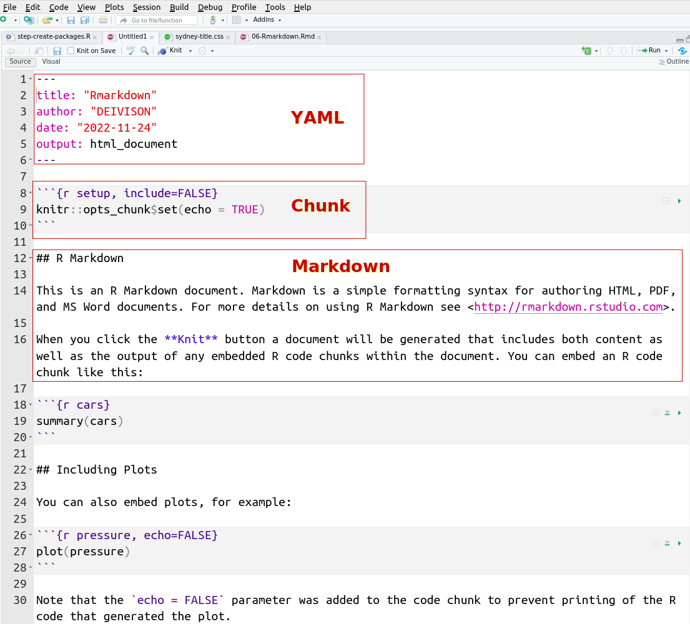
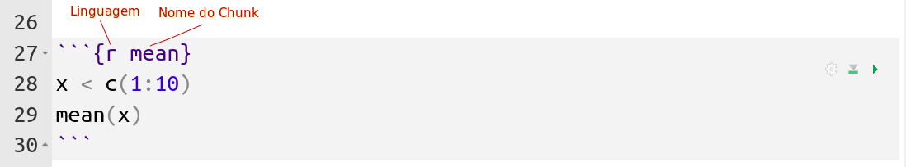

class: title-slide, center, middle
background-image: url(../assets/capa/capa.png)
background-position: center
background-size: cover
background-repeat: no-repeat

<div class="logo-lmftca"></div>
<div class="logo-ppgctif"></div>
<div class="logo-ppgbc"></div>

```{r setup, include=FALSE}
knitr::opts_chunk$set(
	error = FALSE,
	fig.align = "center",
	fig.showtext = TRUE,
	message = FALSE,
	warning = FALSE,
	cache = FALSE,
	collapse = TRUE,
	dpi = 600
)
```

```{r packages, include=FALSE}
library(readr)
library(dplyr)
library(ggplot2)
library(summarytools)
library(skimr)
library(DataExplorer)
```

```{r xaringan-logo, echo=FALSE}
library(xaringanExtra)

use_scribble()
use_share_again()
use_progress_bar()

use_extra_styles(
  hover_code_line = TRUE,
  mute_unhighlighted_code = TRUE
)

# use_editable(expires = 1)
# use_clipboard()
```

```{r icon, echo=FALSE}
# remotes::install_github("dill/emoGG")
# remotes::install_github("mitchelloharawild/icons")
# remotes::install_github('emitanaka/anicon')
# (icons)
# download_fontawesome()
# download_simple_icons()
```

<!-- title-slide -->
# Estatística Computacional com R <br> (PPGBC/UFPA e PPGCTIF/UFOPA)

## ᨒ <br> `r anicon::faa("pagelines", animate="horizontal", colour="green")` .font80[Relatórios Dinâmicos com R]`r anicon::faa("pagelines", animate="horizontal", colour="green")`
###### .font80[(Markdown e Rmarkdown)]

##### 〰〰〰〰〰〰🌱〰〰〰〰〰〰
##### ᨒ
##### .font120[**Prof. Dr. Deivison Venicio Souza**]
##### Universidade Federal do Pará (UFPA)
##### Faculdade de Engenharia Florestal
##### Laboratório de Manejo Florestal, Tecnologias e Comunidades Amazônicas
##### E-mail: deivisonvs@ufpa.br
<br>
##### 1ª versão: 14/outubro/2022 <br> (Atualizado em: `r format(Sys.Date(),"%d/%B/%Y")`)

---

layout: true
class: with-logo logo-lmftca-fixed
<div class="my-header"></div>
<div class="my-footer">
<span>
Prof. Dr. Deivison Venicio Souza (deivisonvs@ufpa.br)
&emsp;&emsp;
<div2>Estatística Computacional com R</div2>
&bull;
<div3>Relatórios Dinâmicos com R (Módulo 4)</div3>
&bull;
<div4>Rmarkdown</div4>
</span>
</div>

---

## Objetivos
<br><br>
Ao final desta aula (.blue[R markdown: Relatórios Dinâmicos]) espera-se que o discente seja capaz de...

* Empregar a sintaxe básica da linguagem de marcação .green[Markdown].
* Construir um relatório estatístico usando o pacote .green[rmarkdown].

```{r, echo=FALSE, out.width='25%', fig.align='center', fig.cap='', dpi=600}
knitr::include_graphics("https://bookdown.org/yihui/rmarkdown/images/hex-rmarkdown.png")
```

---

## Conteúdo

.pull-left-4[
**Parte 1 - Markdown: Linguagem de Marcação**
.font90[
[1 - Motivação](#mot)

[2 - Markdown](#mark)

&nbsp;&nbsp;&nbsp;&nbsp;[2.1 - Níveis de Título](#nt)

&nbsp;&nbsp;&nbsp;&nbsp;[2.2 - Parágrafos](#par)

&nbsp;&nbsp;&nbsp;&nbsp;[2.3 - Quebras de linha](#ql)

&nbsp;&nbsp;&nbsp;&nbsp;[2.4 - Ênfases](#enf)

&nbsp;&nbsp;&nbsp;&nbsp;[2.5 - Subscrito e sobrescrito](#sub)

&nbsp;&nbsp;&nbsp;&nbsp;[2.6 - Listas](#lo)

&nbsp;&nbsp;&nbsp;&nbsp;[2.7 - Links](#lin)

&nbsp;&nbsp;&nbsp;&nbsp;[2.8 - Imagens](#img)

&nbsp;&nbsp;&nbsp;&nbsp;[2.9 - Tabelas](#tab)

&nbsp;&nbsp;&nbsp;&nbsp;[2.10 - Emoji](#emj)
]
]

.pull-right-2[
.pull-down[
**Parte 2 - R Markdown: Markdown + Código**

.font90[
[1 - O que é?](#oq)

[2 - Componentes básicos](#cb)

&nbsp;&nbsp;&nbsp;&nbsp;[2.1 - YAML](#yaml)

&nbsp;&nbsp;&nbsp;&nbsp;[2.2 - Chunk](#chunk)

&nbsp;&nbsp;&nbsp;&nbsp;[2.3 - Markdown](#mark)

[3 - Formatos de saída](#fs)

[4 - R Markdown: Iris Flower](#iris)

[5 - Pacote prettydoc](#prettydoc)

[6 - Pacote rmdformats](#rmdformats)

]
]
]

---

## Leitura complementar
<br>

.pull-left-4[
**Livro recomendado**
<br><br>

Yihui Xie, J. J. Allaire, Garrett Grolemund. [R Markdown: The Definitive Guide](https://bookdown.org/yihui/rmarkdown/). 2022
<br><br>
]

.pull-right-4[
```{r, echo=FALSE, out.width='60%', fig.align='center', fig.cap='', dpi=600}
knitr::include_graphics('https://bookdown.org/yihui/rmarkdown/images/cover.png')
```
]

---

## Leitura complementar
<br>

.pull-left-4[
**Livro recomendado**
<br><br>

Yihui Xie, Christophe Dervieux, Emily Riederer. [R Markdown Cookbook](https://bookdown.org/yihui/rmarkdown-cookbook/). 2022
<br><br>
]

.pull-right-4[
```{r, echo=FALSE, out.width='60%', fig.align='center', fig.cap='', dpi=600}
knitr::include_graphics('https://bookdown.org/yihui/rmarkdown-cookbook/images/cover.png')
```
]

---

layout: false
class: inverse, middle, center
background-image: url(../assets/capa/sec.png)
background-size: cover

<br><br><br>

.right[.font150[**.green[Módulo 4] <br> Relatórios Dinâmicos com R**]]

<br><br>

.right[.font150[**.green[Parte 1] - Markdown: Linguagem de Marcação**]]
<br>

.right[.brown[.font120[Sintaxe básica]]]

<!-- Slide XX -->
---

layout: true
class: with-logo logo-lmftca-fixed
<div class="my-header"></div>
<div class="my-footer">
<span>
Prof. Dr. Deivison Venicio Souza (deivisonvs@ufpa.br)
&emsp;&emsp;
<div2>Estatística Computacional com R</div2>
&bull;
<div3>Relatórios Dinâmicos com R (Módulo 4)</div3>
&bull;
<div4>Markdown: Linguagem de Marcação</div4>
</span>
</div>

---
name: porque_markdown
## Por que utilizar uma linguagem de marcação?

<br>

**🤔 Em qual documento a estrutura do texto está explicitamente indicada para o computador?**

.pull-right-15[
.pull-left[

.center[
**Documento A**
]

.content-box-purple[

Relatório de Biomassa

Introdução

A biomassa é um importante indicador ecológico.

Métodos

Foram avaliadas 120 árvores.

Resultados

]
]

.pull-right[

.center[
**Documento B**
]

.content-box-green[

<span style="color:#d95f02;font-weight:bold;">#</span> Relatório de Biomassa

<span style="color:#d95f02;font-weight:bold;">##</span> Introdução

A biomassa é um importante indicador ecológico.

<span style="color:#d95f02;font-weight:bold;">##</span> Métodos

Foram avaliadas 120 árvores.

<span style="color:#d95f02;font-weight:bold;">##</span> Resultados

]
]
]

---
name: marcacao
## O que muda entre os dois documentos?

<br>

.font95[
Os dois documentos possuem exatamente o mesmo conteúdo.
]

<br>

.center[
.font120[
**Introdução**
]
]

.center[
.font120[
⬇
]
]

.center[
.font120[
.orange[`## Introdução`]
]
]

<br>

.font95[
- O símbolo .orange[`##`] não faz parte do título.
- Ele é uma **marcação** que informa ao computador que aquele texto representa um **título de seção**.
]

.alert[
💡 Uma **linguagem de marcação** informa ao computador a **estrutura do documento**.
]

---
name: markdown
## O que é Markdown?

<br>

.font95[
**Markdown** é uma **linguagem de marcação leve** que utiliza **símbolos** simples para **descrever a estrutura** de um documento.
]

<br>

.shadow3[
.font95[
- **Leve:** utiliza uma sintaxe simples e fácil de escrever;
- **Legível:** o texto permanece compreensível mesmo sem formatação;
- **Portável:** pode ser convertido para diferentes formatos de saída.
]
]

<br>

.alert[
💡 Aprender **Markdown** é o primeiro passo para utilizar o **R Markdown**.
]

---
name: mark
## Markdown: Linguagem de marcação
<br>

.shadow3[
### **Markdown**
- **Linguagem de marcação:** Criado por John Gruber em 2004;
- **Aplicação:** É usada como ferramenta de **conversão de texto para html** (páginas da web).
- **Editores:** [Dillinger](https://dillinger.io/) (online)
- **Consulte:** [Markdown Guide](https://www.markdownguide.org/getting-started/)
]

<br>

.center[**A melhor maneira de aprender é praticando!**]

---
name: sb
## Markdown: Sintaxe básica

<br>

O Markdown utiliza **símbolos simples** para indicar a estrutura e a formatação de um documento.

<br>

.alert[
.center[
<span class="black"><code>&#35;</code></span>
&nbsp;&nbsp;
<span class="black"><code>&#42;</code></span>
&nbsp;&nbsp;
<span class="black"><code>&#42;&#42;</code></span>
&nbsp;&nbsp;
<span class="black"><code>&#45;</code></span>
&nbsp;&nbsp;
<span class="black"><code>&#91;&#93;&#40;&#41;</code></span>
&nbsp;&nbsp;
<span class="black"><code>&#33;&#91;&#93;&#40;&#41;</code></span>
]
]

<br>

Cada símbolo possui uma função específica, como criar **títulos**, **listas**, **ênfase**, **links** e **imagens**.

<br>

.alert[
💡 A seguir, aprenderemos cada uma dessas marcações com exemplos práticos.
]

---
name: nt
## Markdown: Sintaxe básica

<br>

### 1. Títulos

.pull-left-4[
.font95[
- Utilize o símbolo .red[`#`] antes do texto para criar um título.
- Quanto maior o número de .red[`#`], menor o nível do título.
]

<br>

.alert[
💡 Utilize os níveis de título para organizar a hierarquia do documento.
]

]

.pull-right-4[
.center[
.font90[
| **Markdown** | **Saída Renderizada** |
|:------------:|:-------------:|
| `# Título nível 1` | <h1>Título nível 1</h1> |
| `## Título nível 2` | <h2>Título nível 2</h2> |
| `### Título nível 3` | <h3>Título nível 3</h3> |
]
]
]

---
name: par
## Markdown: Sintaxe básica

<br>

### 2. Parágrafos

.pull-left-4[
.font95[
- Utilize uma **linha em branco** para separar parágrafos.
- Não utilize espaços ou tabulações para iniciar um parágrafo.
]

<br>

.alert[
💡 Uma linha em branco indica o início de um novo parágrafo.
]

]

.pull-right-4[
.center[
.font90[
| **Markdown** | **Saída Renderizada** |
|:------------:|:---------------------:|
| `Viva a Amazônia.`<br><br>`Majestosa floresta...` | <p>Viva a Amazônia.</p><p>Majestosa floresta...</p> |
]
]
]

---
name: ql
## Markdown: Sintaxe básica

<br>

### 3. Quebras de linha

.pull-left-13[
.font95[
- Utilize a tag .red[`<br>`] para inserir uma quebra de linha.
- O texto permanece no **mesmo parágrafo**, apenas em uma nova linha.
]

<br>

.alert[
💡 Uma quebra de linha (.red[`<br>`]) não cria um novo parágrafo.
]

]

.pull-right-13[
.center[
.font80[
| **Markdown** | **Saída Renderizada** |
|:------------:|:---------------------:|
| `Viva a Amazônia.<br>Majestosa floresta...` | Viva a Amazônia.<br>Majestosa floresta... |
]
]
]

---
name: enf
## Markdown: Sintaxe básica
<br>
### **4 - Ênfase**:

.font90[
- **Itálico**: Use .orange[1 asterisco] (.red[*]) ou sublinhado (.red[_]) antes e depois de uma palavra ou frase.
- **Negrito**: Use .orange[2 asterisco] (.red[**]) ou sublinhado (.red[__]) antes e depois de uma palavra ou frase.
- **Negrito-Itálico**: Use .orange[3 asterisco] ou sublinhado antes e depois de uma palavra ou frase.

|              **Markdown**              |                          **HTML**                         |          **Saída Renderizada**         |
|:--------------------------------------:|:---------------------------------------------------------:|:--------------------------------------:|
| Esse é um texto `*Itálico*`.             | Esse é um texto `<em>Itálico</em>.`                         | Esse é um texto *Itálico*.               |
| Esse é um texto `**Negrito**`.           | Esse é um texto `<strong>Negrito</strong>.`                 | Esse é um texto **Negrito**.           |
| Esse é um texto `***Negrito-Itálico***`. | Esse é um texto `<em><strong>Negrito-Itálico</strong></em>.` | Esse é um texto ***Negrito-Itálico***. |
]

---
name: sub
## Markdown: Sintaxe básica
<br>
### **5 - Subscrito e sobrescrito**:

.font90[
- **Subscrito**: Use til (.red[~]) antes e depois dos caracteres.
- **Sobrescrito**: Use circunflexo (.red[^]) antes e depois dos caracteres.

| **Markdown** | **HTML** | **Saída Renderizada** |
|:---:|:---:|:---:|
| `H~2~O` | `H<sub>2</sub>O` | H<sub>2</sub>O |
| `X^2^` | `X<sup>2</sup>` | X<sup>2</sup> |
]

---
name: lo
## Markdown: Sintaxe básica
<br>
### **6 - Listas Ordenadas**:

.font90[
- Use **números seguidos de pontos**. 
- A lista deve começar no **número 1**.
- Os números não precisam estar em ordem numérica.<br><br>

| **Markdown** | **HTML** | **Saída Renderizada** |
|:---:|:---|:---:|
| 1. Primeiro item  <br> 2. Segundo item<br>   3. Terceiro item | `<ol>`<br> &nbsp;&nbsp;   `<li>Primeiro item</li>`<br> &nbsp;&nbsp;   `<li>Segundo item</li>`<br>  &nbsp;&nbsp;  `<li>Terceiro item</li>`<br>  `</ol>` | 1. Primeiro item<br> 2. Segundo item<br> 3. Terceiro item |

]

---

## Markdown: Sintaxe básica
<br>
### **6 - Listas Ordenadas** (cont.):

.font80[
- Use **números seguidos de pontos**. 
- A lista deve começar no **número 1**.
- Os números não precisam estar em ordem numérica.<br><br>

| **Markdown** | **HTML** | **Saída Renderizada** |
|:---:|:---|:---:|
| 1. Primeiro item  <br> 2. Segundo item<br>  3. Terceiro item<br> &nbsp;&nbsp;&nbsp; 1.  Item recuado<br> &nbsp;&nbsp;&nbsp; 2. Item recuado | `<ol>`<br> &nbsp;&nbsp;   `<li>Primeiro item</li>`<br> &nbsp;&nbsp;   `<li>Segundo item</li>`<br>  &nbsp;&nbsp;  `<li>Terceiro item`<br>  &nbsp;&nbsp;&nbsp;&nbsp; `<ol>`<br> &nbsp;&nbsp;&nbsp;&nbsp;&nbsp;&nbsp;&nbsp;&nbsp;`<li>Item recuado</li>`<br> &nbsp;&nbsp;&nbsp;&nbsp;&nbsp;&nbsp;&nbsp;&nbsp; `<li>Item recuado</li>`<br> &nbsp;&nbsp;&nbsp;&nbsp;&nbsp;`</ol>` <br> &nbsp;&nbsp;&nbsp;&nbsp;`</li>` <br> `</ol>`| 1. Primeiro item<br> 2. Segundo item<br> 3. Terceiro item <br> &nbsp;&nbsp;&nbsp; 1.  Item recuado<br> &nbsp;&nbsp;&nbsp; 2. Item recuado|
]

---

## Markdown: Sintaxe básica
<br>
### **6 - Listas Não Ordenadas**:

.font90[
- Use traços (.red[-]), asteriscos (.red[*]) ou sinal de mais (.red[+]) na frente dos itens da lista.
- Recue um ou mais itens para criar uma lista aninhada.

| **Markdown** | **HTML** | **Saída Renderizada** |
|:---:|:---|:---:|
| - Primeiro item  <br> - Segundo item<br>  - Terceiro item<br> &nbsp;&nbsp;&nbsp; -  Item recuado<br> &nbsp;&nbsp;&nbsp; - Item recuado | `<ul>`<br> &nbsp;&nbsp;   `<li>Primeiro item</li>`<br> &nbsp;&nbsp;   `<li>Segundo item</li>`<br>  &nbsp;&nbsp;  `<li>Terceiro item`<br>  &nbsp;&nbsp;&nbsp;&nbsp; `<ul>`<br> &nbsp;&nbsp;&nbsp;&nbsp;&nbsp;&nbsp;&nbsp;&nbsp;`<li>Item recuado</li>`<br> &nbsp;&nbsp;&nbsp;&nbsp;&nbsp;&nbsp;&nbsp;&nbsp; `<li>Item recuado</li>`<br> &nbsp;&nbsp;&nbsp;&nbsp;&nbsp;`</ul>` <br> &nbsp;&nbsp;&nbsp;&nbsp;`</li>` <br> `</ul>`| <ul>    <li>Primeiro item</li>    <li>Segundo item</li>    <li>Terceiro item      <ul>        <li>Item recuado</li>        <li>Item recuado</li>      </ul>    </li>  </ul>|

]

---
name: lin
## Markdown: Sintaxe básica
<br>
### **7 - Inserção de Links**:

- Use o comando: .magenta[`[Nome do link]`]`(URL)` para inserir um link.
- Use o comando < .magenta[link] > para converter um URL ou endereço de e-mail rapidamente.
<br><br>

.shadow3[
**Entrada**: .magenta[`[Análises Ecológicas no R]`]`(https://analises-ecologicas.com/)`

**Saída**: [Análises Ecológicas no R](https://analises-ecologicas.com/)

*****************

**Entrada**: < .magenta[`https://analises-ecologicas.com/`] >

**Saída**: <https://analises-ecologicas.com/>
]


---
name: img
## Markdown: Sintaxe básica
<br>
### **8 - Inserção de Imagens**:

.pull-left-5[
- Use o comando: !.magenta[[`Nome do link`]]`(URL)` para inserir uma imagem.
- A sintaxe Markdown para imagens não permite a especificação de largura e altura.
]

.pull-right-5[
.font80[
**Entrada**: !.magenta[[`Girassol`]]`(https://cdn.britannica.com/84/73184-004-E5A450B5/Sunflower-field-Fargo-North-Dakota.jpg)` <br>
**Saída**: {width=100px}
]
]

---
name: tab
## Markdown: Sintaxe básica
<br>
### **9 - Inserção de Tabelas**:

- Use a **barra vertical** (.red[|]) para definir colunas e linhas.
- Use três ou mais **hifens** (.red[`---`]) para criar o cabeçalho de cada coluna.
- Use **dois pontos** (.red[:]) o lado dos hífens na linha do cabeçalho para alinhar texto.

.pull-left-10[
.center[**Entrada**:]
```
| Espécie🌳  | diâmetro  | altura  |
| :--------: | :---------| -------:|
| Mogno      | 50        | 20      |
| Ipê        | 70        | 25      |
```

.font90[
**💡Use aplicações web**: [Markdown Tables Generator](https://www.tablesgenerator.com/markdown_tables)
]
]

.pull-right-10[
.center[**Saída**:]

| Espécie🌳  | diâmetro  | altura  |
| :--------: | :---------| -------:|
| Mogno      | 50        | 20      |
| Ipê        | 70        | 25      |
]

---
name: emj
## Markdown: Sintaxe básica
<br>
### **10 - Inserção de Emoji**:

- **Existem duas possibilidades:**

> 1) Copiar e colar o emoji:
[emojipedia](https://emojipedia.org/) 😎

> 2) Usar códigos de acesso de emoji: [rxaviers](https://gist.github.com/rxaviers/7360908) :sunglasses:

---

layout: false
class: inverse, middle, center
background-image: url(../assets/capa/sec.png)
background-size: cover

<br><br><br>

.right[.font150[**.green[Módulo 4] <br> R markdown: Relatórios Dinâmicos**]]

<br><br>

.right[.font120[**.green[Parte 2] - R Markdown = .brown[Markdown] + Código**]]
<br>

.right[.brown[.font120[Estrutura, Sintaxe ...]]]

<!-- Slide XX -->
---

layout: true
class: with-logo logo-lmftca-fixed
<div class="my-header"></div>
<div class="my-footer">
<span>
Prof. Dr. Deivison Venicio Souza (deivisonvs@ufpa.br)
&emsp;&emsp;
<div2>Estatística Computacional com R</div2>
&bull;
<div3>Relatórios Dinâmicos com R (Módulo 4)</div3>
&bull;
<div4>Rmarkdown</div4>
</span>
</div>

---
name: oq
## R Markdown

.shadow3[
### **O que é R Markdown?**
- É um pacote/biblioteca disponível na linguagem R, que permite o uso da linguagem de marcação .brown[Markdown] e Códigos (R, Python, ...). ([Ciência de Dados em R](https://livro.curso-r.com/9-2-r-markdown.html)).
- É ideal para criar documentos reprodutíveis.

```r
install.packages("rmarkdown")
```
<br>

.shadow2[
.center[**.magenta[R Markdown] = .brown[Markdown] + Código (R, Python, ...)**]
]

<br>
]

---
name: mot
## R markdown

.shadow3[
### **Motivação**

Transformar análises de dados em documentos, relatórios, apresentações e dashboards de alta qualidade (estático ou dinâmico). Também permite criar websites, construir livros, vignettes, etc.
]

<br>**Algumas da possibilidade:**

.font80[
- 1) **Documentos**: Um único arquivo .magenta[R Markdown] (.Rmd) pode ser renderizado para diversos formatos (html, pdf, word, etc.);
- 2) **Documentos interativos**: É possível combinar o .magenta[R Markdown] com htmlwidgets ou Shiny para criar documentos interativos;
- 3) **Dashboards**: .magenta[R Markdown] + flexdashboard para construção de dashboards;
- 4) **Apresentações**: Construa apresentações elegantes com auxílio do .magenta[R Markdown];
- 5) **Livros**: .magenta[R Markdown] + bookdown para criar livros; ([Análises Ecológicas no R](https://analises-ecologicas.com/); [Bookdown](https://bookdown.org/yihui/bookdown/))
- 6) **Websites**: O .magenta[R Markdown] facilita a criação de páginas web diretamente de arquivos .Rmd; (Páginas pessoais, blogs, projetos,...) ([Site rmarkdown](https://rmarkdown.rstudio.com/))
]

---

## R Markdown

.pull-left-1[
.font90[
> **Criando um novo documento R Markdown:** <br><br>

> **No Rstudio acesse**: <br> 
File > New File > R Markdown (Extensão: .red[`.Rmd`])

> - **Escolha a modalidade:** <br> (Document, Presentation, Shiny, From Template) <br><br>
> - **Escolha o formato de saída:** <br> (HTML, PDF ou Word)
]
]

.pull-right-2[
```{r echo=FALSE, out.width='90%', fig.align='center', fig.cap='', dpi=600}

```
]
---
name: cb
## R Markdown: Componentes básicos
<br>

- **Um arquivo .red[`.Rmd`] (R Markdown) possui 3 componentes básicos:**
<br><br>

.shadow3[
.font200[
.center[**YAML + CHUNK + MARKDOWN**]
]
]

---
name: yaml
## R Markdown: Componentes básicos
<br>

.shadow3[
.font90[
**1) YAML**

- .blue[Metadados do documento], introduzidos usando a sintaxe da linguagem [YAML](https://pt.wikipedia.org/wiki/YAML). Em geral, as informações são inseridas no cabeçalho do arquivo .red[`.Rmd`] entre o par de três traços (`---`). Em geral, várias configurações podem ser realizadas, as básicas são: .blue[título, subtítulo, autor(res), data, formato de saída].
]
]

```yaml
---
title: "Análise Exploratória de Dados"
subtitle: "Iris Flower Dataset"
author: 
- name: "Deivison Venicio Souza"
- name: "Anne Kerci Zahluth Shimon Celestino"
date: "`r Sys.Date()`"
output: html_document
---
```

---

## R Markdown: Componentes básicos
<br>

.shadow3[
.font90[
**1) YAML**

- É possível especificar diversos outros parâmetros no **YAML** para tornar o documento HTML mais elegante e sofisticado, por exemplo:

**1) theme**: especificar temas Bootstrap (**opções:** .green[bootstrap, cerulean, cosmo, darkly, flatly, journal, lumen, paper, readable, sandstone, simplex, spacelab, united, and yeti])

**2) highlight**: especifica o estilo de destaque da sintaxe (**opções:** .green[tango, pygments, kate, monochrome, espresso, zenburn, haddock, breezedark, and textmate])

**3) toc**: adicione um sumário usando `toc: true`.

**4) toc_depth**: especifica a profundidade do sumário usando `toc_depth: valor`. Por exemplo, se `toc_depth: 2`, um sumário será construído usando cabeçalhos de até nível 2 (default = 3).

]
]

---

## R Markdown: Componentes básicos
<br>

**Um exemplo de cabeçalho YAML com mais metadados...**
<br>

```yaml
---
title: "Análise Exploratória de Dados"
subtitle: "Iris Flower Dataset"
author: 
- name: "Deivison Venicio Souza"
- name: "Anne Kerci Zahluth Shimon Celestino"
date: "`r Sys.Date()`"
output:
  html_document:
    theme: united
    highlight: tango
    toc: true
    toc_depth: 2
---
```

.font90[
**💡Consulte**: [R Markdown: The Definitive Guide](https://bookdown.org/yihui/rmarkdown/)
]

---
name: chunk
## R Markdown: Componentes básicos
<br>

.shadow3[
.font90[
**2) Chunks**: São .blue[blocos de código] em R (ou outra linguagem).

- Os chunks são delimitados por .blue[três crases].
- A linguagem e as opções de renderização devem ser especificadas entre .blue[chaves \{ \}].
- **Inserção**: Insert a new code chunk ou (**atalho**: Ctrl + Alt + I)
]
]
<br>

```{r echo=FALSE, out.width='90%', fig.align='center', fig.cap='', dpi=600}

```

---

## R Markdown: Componentes básicos

**Opções de Chunk...**

.font80[
- Os chunks de códigos (`{r, ...}`) possuem uma série de opções que configuram o comportamento do bloco de código.

| **Opção** | **Padrão** | **Descrição** |
|---|---|---|
| eval | TRUE | O código deve ser executado? |
| include | TRUE | O código deve ser exibido no documento final? Os resultados não serão apresentados. |
| collapse | FALSE | O código e os resultados do chunk devem ser colapsados em um bloco único? |
| echo | FALSE | O código deve ser exibido no documento final? Os resultados serão apresentados. |
| results | markup | - **hide**: os resultados não serão exibidos. <br> - **hold**: os resultados serão exibidos ao final do chunk. <br> - **asis**: os resultados não serão formatados, sendo mostrados os resultados “brutos” (código html, tex, …). |
| warning | TRUE | Os avisos gerados pelo código devem ser exibidos? |
| fig.cap | NULL | Use para atribuir um título de figura referente ao chunk. |
| fig.height | 7 | Altura para gráficos criados pelo código (em polegadas). |
| fig.width | 7 | Largura para gráficos criados pelo código (em polegadas). |

**💡Consulte**: [knitr options](https://yihui.org/knitr/options/#plots)
]

---
name: mark
## R Markdown: Componentes básicos
<br>

**3) Markdown**: São adicionados ao longo do .red[`.Rmd`], em regiões fora das demarcações .blue[YAMl] e .blue[Chunks].

<br>

> 1) **Dica**: .blue[Visual R Markdown] 😎 <br><br>
> **Exibe alterações em tempo real e fornece suporte para redação técnica.**

---
name: iris
## R Markdown: Iris Flower
<br>

- Vamos .blue[**brincar**] de desenvolver um R Markdown com os resultados da AED dos dados de **Iris Flower**.

```{r echo=FALSE, out.width='30%', fig.align='center', fig.cap='', dpi=600}
knitr::include_graphics("https://media2.giphy.com/media/scZPhLqaVOM1qG4lT9/giphy.gif")
```

---
name: prettydoc
## Pacote .orange[prettydoc]: Belos templates para HTML
<br>

.shadow3[
- O pacote .orange[[**prettydoc**](https://github.com/yixuan/prettydoc/)] é uma excelente alternativa para produzir documentos R Markdown elegantes e sofisticados.

```r
install.packages("prettydoc")
```
]

<br>

.font90[
> **No Rstudio acesse**: <br>
File > New File > R Markdown > From Template > Lightweight and Pretty Document (HTML)
]

---

## Pacote .orange[prettydoc]: Belos templates para HTML
<br>

- Em **output** (formato de saída) do cabeçalho **YAML** deve-se  especificar o uso de .blue[`prettydoc::html_pretty`] ao invés de .blue[`rmarkdown::html_document`].
- As novas opções para `theme` são: .green[cayman, tactile, architect, leonids, hpstr].
<br>

```yaml
---
title: "Análise Exploratória de Dados - Iris Flower"
author: "Deivison Venicio Souza"
date: "`r Sys.Date()`"
output:
  prettydoc::html_pretty:
    theme: architect
    highlight: github
---
```

.font90[
**💡Experimente cada um dos temas**!
]

---

## Pacote .orange[rmdformats]: mais opções de temas...
<br>

- O pacote .orange[rmdformats] também possui opcões de temas elegantes.
- Os temas disponíveis são: .green[material, readthedown, html_clean, html_docco].
- Use o seguinte comando no YAML: `output: rmdformats::<nome do template>`

```yaml
---
title: "Análise Exploratória de Dados - Iris Flower"
author: "Deivison Venicio Souza"
date: "`r Sys.Date()`"
output: rmdformats::readthedown
---
```

.font90[
**💡Experimente cada um dos temas**!]

---
name: ap
## .font80[Atividade Prática 2 (Transforme seu script .R em .Rmd)]

.font90[
- Na aula 5 (.blue[Análise Exploratória de Dados]) grupos foram definidos para desenvolver uma AED de uma das bases de dados abaixo. Agora, a missão do grupo será desenvolver um relatório da sua respectiva AED usando o R Markdown.
]

**As bases de dados são as seguintes:**

.font90[
- **Grupo 1**: [HCV Doador de Sangue](https://archive.ics.uci.edu/ml/datasets/HCV+data) - (contém valores laboratoriais de doadores de sangue e pacientes com hepatite C e valores demográficos como idade.)
- **Grupo 2**: [Vertebral Column](https://archive-beta.ics.uci.edu/dataset/212/vertebral+column) - (6 características biomecânicas usadas para classificar pacientes ortopédicos em 3 classes (normal, hérnia de disco ou espondilolistese) ou 2 classes (normal ou anormal))
- **Grupo 3**: [Wine](https://archive-beta.ics.uci.edu/dataset/109/wine) - (Usando a análise química determinar a origem dos vinhos)
- **Grupo 4**: [Seeds](https://archive.ics.uci.edu/ml/datasets/seeds) - (Medidas de propriedades geométricas de grãos pertencentes a três diferentes variedades de trigo.)
- **Grupo 5**: [Car Evaluation](https://archive.ics.uci.edu/ml/datasets/Car+Evaluation) - (Dados de avaliação de carros baseado em 6 atributos)
- **Grupo 6**: [Pinguins]() - (Medidas de pinguins adultos perto da Estação Palmer, Antártida (Palmer Station)) (`dados::pinguins`)
]

<!-- Slide XX -->
---

layout: true
class: with-logo logo-lmftca-fixed
<div class="my-header"></div>
<div class="my-footer">
<span>
Prof. Dr. Deivison Venicio Souza (deivisonvs@ufpa.br)
&emsp;&emsp;
<div2>Estatística Computacional com R</div2>
&bull;
<div3>Relatórios Dinâmicos com R (Módulo 4)</div3>
&bull;
<div4>Rmarkdown</div4>
</span>
</div>

<!--Slide XX -->
---
layout: false
class: inverse, middle, center
background-image: url(../assets/capa/sec.png)
background-size: cover

## .font200[Obrigado!]

```{r, echo=FALSE, out.width='20%', fig.align='center', fig.cap=''}
knitr::include_graphics('../assets/logos/LMFTCA.png')
```

👨🏻‍👩🏻‍👦🏻‍👦🏻 [@lmftca_ufpa](https://www.instagram.com/lmftca_ufpa/)

🌎 [https://www.lmftca.com.br/](https://www.lmftca.com.br/)
